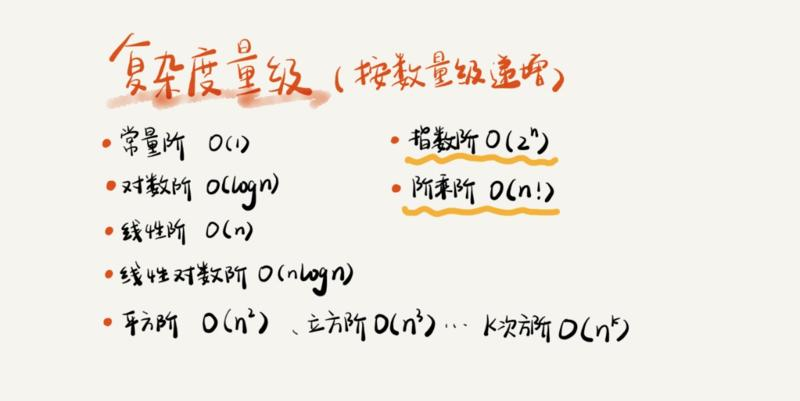

# 1 - 复杂度

学习数据结构和算法要从复杂度分析说起。算法复杂度包括时间复杂度和空间复杂度，两者中又以时间复杂度相对重要，因为就 Web 应用而言，我们常见的性能优化策略都是以空间换时间，比如缓存系统就是如此。

时间复杂度表示代码执行时间随数据规模增长的变化趋势，表示方法图所示：

 即大O表示法，我们在分析时间复杂度的时候往往遵循以下原则：

1. 只关注循环执行次数最多的一段代码；
2. 加法法则：总复杂度等于量级最大的那段代码的复杂度；
3. 乘法法则：嵌套代码的复杂度等于嵌套内外代码复杂度的乘积。

因此，如果分析某个算法的时间复杂度是 `T(n) = O(2n+2) / T(n) = O(2n^2 +2n+3)`，则公式中的低阶、常量、系数三部分都可以忽略，即：`T(n) = O(n) / T(n) = O(n^2)`

常见时间复杂度：

 时间复杂度里细分起来又有最好、最坏、平均情况时间复杂度之分：

1. 最好情况时间复杂度就是在最理想的情况下，执行这段代码的时间复杂度；
2. 最坏情况时间复杂度就是在最糟糕的情况下，执行这段代码的时间复杂度；
3. 平均情况时间复杂度顾名思义就是结合概率论分析从最好到最坏每种情况平均下来的加权平均时间复杂度

> 一般而言，我们关注复杂度就够了，只有特别严苛条件下或者复杂度相同的情况下，我们才会进一步区分最好、最坏、平均复杂度

# 2 - 网站介绍

[VisuAlgo - 数据结构和算法动态可视化 (Chinese)](https://visualgo.net/zh)

各种数据结构和算法的动态演示图