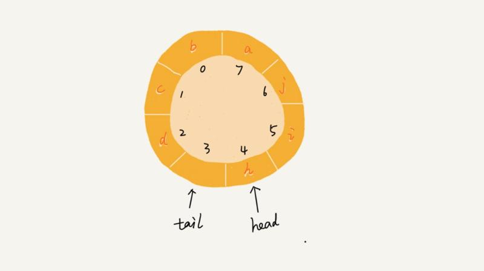

# 数据结构与算法入门


# PHP 版本


## 1 - 数组（Array）

数组是一种线性表数据结构，它用一组连续的内存空间，来存储一组具有相同类型的数据。

在 PHP 这种动态语言中，因为数组底层是通过散列表（后面我们会介绍这个数据结构）实现的，所以功能异常强大。

这段常规的数组定义在 PHP 中并不成立，PHP 的数组可以存储任何类型的数据，如果与 Java 对比，PHP 的数组集成了 Java 的数组、List、Set、Map 于一身，提高了代码效率。

抛开 PHP 或 JavaScript 这种动态语言，对于传统的数组，比如 C 语言和 Java 中的数组，在使用之前都需要声明数组存储数据的类型和数组的大小，数组的优点是可以通过下标值随机访问数组内的任何元素，算法复杂度是 O(1)，非常高效，但是缺点是删除/插入元素比较费劲，以删除为例，需要在删除某个元素后，将后续元素都往前移一位，如果是插入，则需要将插入位置之后的元素都往后移，所以对数组的插入/删除而言，算法复杂度是 O(n)，当然了，这个是针对 C / Java 这种语言而言，PHP 不受此约束，因为它不是传统一样上的数组嘛。


## 2 - 链表

和数组不同，链表不需要一块连续的内存空间，它通过 “指针” 将一组零散的内存块串联起来使用，如图：


因为 PHP 中没有指针，我们可以借助数组的 next、current、key 等函数模拟实现链表结构：

```php
<?php

/**
 * 通过 PHP 数组模拟实现单链表
 */
class LinkedList
{
    private $list = [];

    // 获取链表指定位置的元素值，从0开始
    public function get($index)
    {
        $value = NULL;
        while (current($this->list)) {
            if (key($this->list) == $index) {
                $value = current($this->list);
            }
            next($this->list);
        }
        reset($this->list);
        return $value;
    }

    // 在链表指定位置插入值，默认插到链表头部
    public function add($value, $index = 0)
    {
        array_splice($this->list, $index, 0, $value);
    }

    // 从链表指定位置删除元素
    public function remove($index)
    {
        array_splice($this->list, $index, 1);
    }

    public function isEmpty()
    {
        return !next($this->list);
    }

    public function size()
    {
        return count($this->list);
    }
}
```

```php
$linkedList = new LinkedList();
$linkedList->add(4);
$linkedList->add(5);
$linkedList->add(3);
print $linkedList->get(1);   # 输出5
$linkedList->add(1, 1);      # 在结点1的位置上插入1
print $linkedList->get(1);   # 输出1
$linkedList->remove(1);      # 移除结点1上的元素
print $linkedList->get(1);   # 输出5
print $linkedList->size();   # 输出3
```

写下这段代码主要帮助你理解链表的实现思路，在 PHP 中，数组集成了所有数据结构，如数组、List、散列表、Map等，而且由于 PHP 不支持指针，所以不能实现真正的链表，比如在插入、删除的时候指针指向的变动无法实现，只能笼统通过 array_splice 函数实现元素插入和删除，也就无法区别实现单向链表、双向链表和循环链表。不过 PHP 底层提供的 SPL 库中包含了一个双向链表的实现：[http://php.net/manual/zh/class.spldoublylinkedlist.php](http://php.net/manual/zh/class.spldoublylinkedlist.php%EF%BC%8C%E6%84%9F%E5%85%B4%E8%B6%A3%E7%9A%84%E5%8F%AF%E4%BB%A5%E5%8E%BB%E7%9C%8B%E7%9C%8B)，有兴趣可以去看一看。


> 前面我们了解了数组与链表，从逻辑角度来说，它们都是线性结构，从存储角度来说，一个是顺序存储，一个是链式存储，各有利弊：数组需要预先申请连续内存，超出限制会溢出，但是明确知道规模的小型数据集而言，使用数组效率会更高，随机访问的特性也更加方便数组读取，但插入和删除性能要差一些；链表没有空间限制，但是需要额外空间存储指针，插入、删除效率很高，但是不支持随机访问。

> 下面我们来介绍两种特殊的线性结构：栈和队列


## 3 - 堆栈

栈又叫堆栈，是限定只能在一端进行插入和删除操作的线性表，并且满足先进先出（FIFO）的特点。我们把允许插入和删除的一端叫做栈顶，另一个端叫做栈底，不含任何数据的栈叫做空栈。

栈支持通过数组/链表实现，通过数组实现的通常叫做顺序栈，通过链表实现的叫做链栈。下面我们简单演示下如何在 PHP 中通过数组实现一个简单的顺序栈：

```php
/**
 * 通过 PHP 数组实现简单的顺序栈
 */
class SimpleStack {

    private $_stack = [];
    private $_size = [];

    public function __construct($size = 10)
    {
        $this->_size = $size;
    }

    // 获取栈顶元素
    public function pop()
    {
        // 空栈
        if (count($this->_stack) == 0) {
            return false;
        }
        return array_pop($this->_stack);
    }

    // 推送元素到栈顶
    public function push($value)
    {
        // 满栈
        if (count($this->_stack) == $this->_size) {
            return false;
        }
        array_push($this->_stack, $value);
        return true;
    }

    public function isEmpty()
    {
        // 是否是空栈
        return current($this->_stack) == false;
    }

    public function size()
    {
        return count($this->_size);
    }
}

$stack = new SimpleStack(15);
var_dump($stack->isEmpty());  # true
$stack->push(111);
$stack->push('lalala');
var_dump($stack->pop());  # lalala
var_dump($stack->size());  # 1
```


## 4 - 队列

另一种我们使用很广泛的特殊线性表结构——队列，队列是在一端插入，另一端删除，就跟我们平常排队一样的道理，从队尾入队，在队头出去，所以队列的特性是先入先出（FIFO），允许插入的一端叫队尾，允许删除的一端叫队头。一张图可以形象的体现两者的差别：


栈一样，队列也可以通过数组和链表实现，通过数组实现的叫顺序队列，通过链表实现的叫做链式队列，栈只需要一个栈顶指针就可以了，因为只允许在栈顶插入删除，但是队列需要两个指针，一个指向队头，一个指向队尾。我们先来看通过 PHP 数组实现的顺序队列代码：

```php
<?php
/**
 * 通过 PHP 数组实现的队列
 */
class SimpleQueue
{
    private $_queue = [];
    private $_size = 0;

    public function __construct($size = 10)
    {
        $this->_size = $size;
    }

    // 入队
    public function enqueue($value)
    {
        if (count($this->_queue) > $this->_size) {
            return false;
        }
        array_push($this->_queue, $value);
    }

    // 出队
    public function dequeue()
    {
        if (count($this->_queue) == 0) {
            return false;
        }
        return array_shift($this->_queue);
    }

    public function size()
    {
        return count($this->_queue);
    }
}

$queue = new SimpleQueue(5);
$queue->enqueue(1);
$queue->enqueue(3);
$queue->enqueue(5);
var_dump($queue->dequeue());  # 1
var_dump($queue->size());  # 2
```

通过数组实现的顺序队列有一个问题，就是随着队列元素的插入和删除，队尾指针和队头指针不断后移，而导致队尾指针指向末尾无法插入数据，这时候有可能队列头部还是有剩余空间的，如下图所示：


 我们当然可以通过数据搬移的方式把所有队列数据往前移，但这会增加额外的时间复杂度，如果频繁操作数据量很大的队列，显然对性能有严重损耗，对此问题的解决方案是循环队列，即把队列头尾连起来：



这样一来就不会出现之前的问题了，此时判断队列是否为空的条件还是tail==head，但是判断队列是否满的条件就变成了 (tail+1) % maxsize == head，maxsize 是数组的长度，浪费一个空间是为了避免混淆判断空队列的条件。当然如果通过链表来实现队列的话，显然没有这类问题，因为链表没有空间限制。

 队列的应用也非常广泛，比如我们常见的消息队列就是队列的典型应用场景。


> 介绍完数组和链表，以及两个特殊的线性结构栈和队列后，已经算是迈入了数据结构的门了，后面很多其他更复杂的数据结构都会基于数组和链表来实现，比如散列表、树、图等，有些甚至需要结合数组和链表来实现，在继续介绍后续复杂的数据结构之前，我们穿插进来一些常见的排序算法和查找算法，在系统介绍这些算法之前，我们先来一道前菜：递归。


## 5 - 递归

递归算不上任何数据结构和算法，但确实是一种很重要的编程技巧，很多算法也会用到递归来实现，比如归并排序、快速排序、二分查找等。

 递归，简单来讲就是在函数定义中调用函数自身，从我们之前学习数学解题经验来讲，就是将一个大的问题拆分成多个小问题，逐一击破后最后归并结果。我们判断一个问题是否可以通过递归来解决，主要看它是否满足以下三个条件：

1. 一个问题的解可以分解为几个子问题的解
2. 这个问题与分解之后的子问题，除了数据规模不同，求解思路完全一样
3. 存在递归终止条件

> 递归一定要有终止条件，否则会导致函数被无限调用最终致使内存溢出。

通过以上分析，我们可以整理出递归代码的编写思路：写出递归公式，找到终止条件。有句话叫做「人理解迭代，神理解递归」，说的就是递归代码可读性不好，理论上看，递归代码都是可以转化成迭代实现的，但是递归代码更简洁，更显逼格，我们在通过递归实现代码的时候，切忌试图通过人脑去分解每个步骤，那样会把自己搞晕的，这种重复迭代的事情交给计算机去做，我们要做的就是抽象出规律，写递归公式，找终止条件，再把它们转化为递归代码，就完事了。

后通过一个案例来帮助你去理解和实际运用。递归的应用案例很多，比如经典的汉诺塔、斐波那契数列等，我们以斐波那契数列来演示下递归代码的编写，斐波那契数列是这样一组数列：0, 1, 1, 2, 3, 5, 8, 13, 21, 34, 55, 89, 144, …(你可以去网上搜一下了解下这个数列的现实由来），求第n个数列的值。

按照我们前面列出的递归问题解题思路，首先抽象出这组数列的一般规律，将其整理成递归公式，会得出如下结论（索引从0开始，即第零项）：

```
F0 = 0
F1 = 1
...
F(n) = F(n-1) + F(n-2)
```

这样，我们同时有了终止条件和递归公式，接下来，就是将其转化为递归代码了：

```php
<?php
/**
 * 通过递归实现斐波那契数列
 */
function fibonacci($n)
{
    if ($n == 0) {
        return 0;
    }
    if ($n == 1) {
        return 1;
    }
    return fibonacci($n - 2) + fibonacci($n - 1);
}


print fibonacci(5);  # 5
print fibonacci(8);  # 21
```

通过递归，我们用非常简洁的代码就实现了复杂的斐波那契数列的求解，如果要用迭代来实现这个逻辑，不定要写多少代码呢

编写递归代码时有两个注意事项，一个是警惕堆栈溢出，为此要设定好终止条件和合理的递归层数，另一个是防止重复计算，因此，递归公式要经过认证求证，不能凭感觉贸然下手编码，不然真的会失之毫厘，谬以千里。


## 6 - 冒泡排序

基于选择的排序算法，常见基于选择的排序算法有冒泡排序、插入排序、选择排序、归并排序和快速排序，我们在选择排序算法的时候，通常会根据以下几个维度来考虑：

1. 时间复杂度
2. 空间复杂度（对内存空间的消耗）
3. 算法的稳定性（如果待排序的序列中存在值相等的元素，经过排序之后，相等元素之间原有的先后顺序不变）

冒泡排序只会操作相邻的两个数据。每次冒泡操作都会对相邻的两个元素进行比较，看是否满足大小关系要求，如果不满足就让它俩互换。一次冒泡会让至少一个元素移动到它应该在的位置，重复 n 次，就完成了 n 个数据的排序工作。

 光看定义有点抽象，我们用图来演示，假设待排序数字是 4、5、6、3、2、1，第一次排序的流程是这样的：


看这个图的时候要结合定义一起看，否则也比较懵逼，当然如果你去 VisuAlgo 上看动态图的话就更形象了：[VisuAlgo - 排序（冒泡排序, 选择排序, 插入排序, 归并排序, 快速排序, 计数排序, ...](https://visualgo.net/zh/sorting)，经过 n 次冒泡，最终完成排序（所谓冒泡，以升序来看，就是每次把待排序序列中的最大值插到已排序序列的最前面，这个过程就像冒泡一样）：


重要的是理解冒泡排序的原理，懂了原理就是把这个排序过程翻译成代码而已，以下是 PHP 代码实现的冒泡排序：

```php
<?php

/**
 * 冒泡排序实现函数（PHP）
 * @param $nums
 * @return mixed
 */
function bubble_sort($nums) {
    if (count($nums) <= 1) {
        return $nums;
    }

    for ($i = 0; $i < count($nums); $i++) {
        $flag = false;
        for ($j = 0; $j < count($nums) - $i - 1; $j++) {
            if ($nums[$j] > $nums[$j+1]) {
                $temp  = $nums[$j];
                $nums[$j] = $nums[$j+1];
                $nums[$j+1] = $temp;
                $flag = true;
            }
        }
        if (!$flag) {
            break;
        }
    }

    return $nums;
}

$nums = [4, 5, 6, 3, 2, 1];
$nums = bubble_sort($nums);
print_r($nums);
```

可以看到我们对冒泡排序有个小小的优化，就是当某一次遍历的时候发现没有需要交换的元素，则认为整个序列已经排序完成。最后我们来看下冒泡排序的性能和稳定性：

1. 时间复杂度： O(n^2) （n的平方）
2. 空间复杂度：只涉及相邻元素的交换，是原地排序算法
3. 算法稳定性：元素相等不会交换，是稳定的排序算法

时间复杂度是 O(n^2)，看起来性能并不是很好，所以我们在实践中基本不会选用冒泡算法。


## 7 - 插入排序

插入排序的原理是：我们将数组中的数据分为两个区间，已排序区间和未排序区间。初始已排序区间只有一个元素，就是数组的第一个元素。插入算法的核心思想是取未排序区间中的元素，在已排序区间中找到合适的插入位置将其插入，并保证已排序区间数据一直有序。重复这个过程，直到未排序区间中元素为空，算法结束。如下图所示：


在这里搭配动态图查看效果更佳：[VisuAlgo - 排序（冒泡排序, 选择排序, 插入排序, 归并排序, 快速排序, 计数排序, ...](https://visualgo.net/zh/sorting)

插入排序也比较简单，实现代码如下：

```php
<?php
    
    /**
     * 插入排序实现函数（PHP）
     * @param $nums
     * @return mixed
     */
    function insertion_sort($nums) {
        if (count($nums) <= 1) {
            return $nums;
        }
    
        for ($i = 0; $i < count($nums); $i++) {
            $value = $nums[$i];
            $j = $i - 1;
            for (; $j >= 0; $j--) {
                if ($nums[$j] > $value) {
                    $nums[$j+1] = $nums[$j];
                } else {
                    break;
                }
            }
            $nums[$j+1] = $value;
        }
    
        return $nums;
    }
    
    $nums = [4, 5, 6, 3, 2, 1];
    $nums = insertion_sort($nums);
    print_r($nums);
```

插入排序需要两个嵌套的循环，时间复杂度是O(n^2)；没有额外的存储空间，是原地排序算法；不涉及相等元素位置交换，是稳定的排序算法。

插入排序的时间复杂度和冒泡排序一样，也不是很理想，但是插入排序不涉及数据交换，从更细粒度来区分，性能要略优于冒泡排序。


## 8 - 选择排序

实现思路类似于插入排序，也分为已排序区间进而未排序区间，但是选择排序每次会从未排序区间中找到最小的元素，将其放到区间的末尾：


同样，可以在 VisuAlgo 上看动态图：[VisuAlgo - 排序（冒泡排序, 选择排序, 插入排序, 归并排序, 快速排序, 计数排序, ...](https://visualgo.net/zh/sorting)

选择排序的PHP实现代码如下：

```php
<?php
    
    /**
     * 选择排序算法实现
     */
    function selection_sort($nums)
    {
        if (count($nums) <= 1) {
            return $nums;
        }
    
        for ($i = 0; $i < count($nums); $i++) {
            $min= $i;
            for ($j = $i + 1; $j < count($nums); $j++) {
                if ($nums[$j] < $nums[$min]) {
                    $min = $j;
                }
            }
            if ($min != $i) {
                $temp = $nums[$i];
                $nums[$i] = $nums[$min];
                $nums[$min] = $temp;
            }
        }
    
        return $nums;
    }
    
    $nums = [4, 5, 6, 3, 2, 1];
    $nums = selection_sort($nums);
    print_r($nums);
```

很显然，选择排序的时间复杂度也是 O(n^2)；由于不涉及额外的存储空间，所以是原地排序；由于涉及非相邻元素的位置交换，所以是不稳定的排序算法。


> 综合比较前面介绍的三个排序算法，时间复杂度都是一样的，也都是原地排序，但是选择排序是不稳定的排序算法，此外，插入排序和冒泡排序相比较，我们在将插入排序的时候讲到，插入排序只需要一条语句，而冒泡排序需要三条，在同等条件下，或者数据量很大的情况下，插入排序性能是要优于冒泡排序的，所以综合比较下来，三者的优先级是插入排序 > 冒泡排序 >> 选择排序。但是三者的时间复杂度都是 O(n^2)，数据量很大的情况下性能表现并不是很理想，那有没有性能更好的排序算法呢？


## 9 - 归并排序

比前面三个排序算法性能更好的排序算法，归并排序。所谓归并排序，指的是如果要排序一个数组，我们先把数组从中间分成前后两部分，然后对前后两部分分别排序，再将排好序的两部分合并在一起，这样整个数组就都有序了。

归并排序使用了分治思想，分治，顾名思义，就是分而治之，将一个大问题分解成小的子问题来解决。说到这里，可能你就能联想起我们之前讲到的一个编程技巧 —— 递归，没错，归并排序就是通过递归来实现的。这个递归的公式是每次都将传入的待排序数组一分为二，直到不能分割，然后将排序后序列合并，最终返回排序后的数组。原理图如下所示：


 由于涉及到递归，所以归并排序从理解上要比前面三个排序要困难一些，还是建议通过这个动态图帮助理解：[VisuAlgo - 排序（冒泡排序, 选择排序, 插入排序, 归并排序, 快速排序, 计数排序, ...](https://visualgo.net/zh/sorting)，在界面顶部选择归并排序，然后在左下角点击执行即可。

 归并排序的 PHP 实现代码如下：

```php
<?php
    function merge_sort($nums)
    {
        if (count($nums) <= 1) {
            return  $nums;
        }
    
        merge_sort_c($nums, 0, count($nums) - 1);
        return $nums;
    }
    
    function merge_sort_c(&$nums, $p, $r)
    {
        if ($p >= $r) {
            return;
        }
    
        $q = floor(($p + $r) / 2);
        merge_sort_c($nums, $p, $q);
        merge_sort_c($nums, $q + 1, $r);
    
        merge($nums, ['start' => $p, 'end' => $q], ['start' => $q + 1, 'end' => $r]);
    }
    
    function merge(&$nums, $nums_p, $nums_q)
    {
        $temp = [];
        $i = $nums_p['start'];
        $j = $nums_q['start'];
        $k = 0;
        while ($i <= $nums_p['end'] && $j <= $nums_q['end']) {
            if ($nums[$i] <= $nums[$j]) {
                $temp[$k++] = $nums[$i++];
            } else {
                $temp[$k++] = $nums[$j++];
            }
        }
    
        if ($i <= $nums_p['end']) {
            for (; $i <= $nums_p['end']; $i++) {
                $temp[$k++] = $nums[$i];
            }
        }
    
        if ($j <= $nums_q['end']) {
            for (; $j <= $nums_q['end']; $j++) {
                $temp[$k++] = $nums[$j];
            }
        }
    
        for ($x = 0; $x < $k; $x++) {
            $nums[$nums_p['start'] + $x] = $temp[$x];
        }
    }
    
    $nums = [4, 5, 6, 3, 2, 1];
    $nums = merge_sort($nums);
    print_r($nums);
```

 最后我们来总结下，归并排序不涉及相等元素位置交换，是稳定的排序算法，时间复杂度是 O(nlogn)，要优于 O(n^2)，但是归并排序需要额外的空间存放排序数据，不是原地排序，最多需要和待排序数组同样大小的空间，所以空间复杂度是 O(n)。


## 10 - 快速排序

归并排序算法虽好，但是不是原地排序算法，需要消耗额外的内存空间，今天我们要介绍的是常规排序里综合排名最高的排序算法：快速排序，江湖人称「快排」。快排的核心思想是这样的：

如果要排序数组中下标从 p 到 r 之间的一组数据，我们选择 p 到 r 之间的任意一个数据作为 pivot（分区点）。

我们遍历 p 到 r 之间的数据，将小于 pivot 的放到左边，将大于 pivot 的放到右边，将 pivot 放到中间。经过这一步骤之后，数组 p 到 r 之间的数据就被分成了三个部分，前面 p 到 q-1 之间都是小于 pivot 的，中间是 pivot，后面的 q+1 到 r 之间是大于 pivot 的。


根据分治、递归的处理思想，我们可以用递归排序下标从 p 到 q-1 之间的数据和下标从 q+1 到 r 之间的数据，直到区间缩小为 1，就说明所有的数据都有序了，而且你可以看到我们不需要像归并排序那样做合并操作，也就不需要额外的内存空间，在算法复杂度和归并排序一样的情况下，有着更好的空间复杂度表现。

归并排序首先要找到分区点 pivot，一般我们会将数组最后一个元素或者第一个元素作为 pivot，比如我们以最后一个元素作为分区点，然后通过两个变量 i 和 j 作为下标来循环数组，当下标 j 对应数据小于 pivot 时，交换 i 和 j 对应数据，并且将 i 往前移动一位，否则 i 不动，小标 j 始终是往前移动的，j 到达终点后，将 pivot 与下标 i 对应数据交换，这样最终将 pivot 置于数组中间，[0...i-1]区间的数据都比 pivot  小，[i+1...j]之间的数据都比pivot大，我们以递归的方式处理该流程，最终整个数组都会变成有序的，对应的算法操作流程如下：


PHP 代码：

```php
<?php
    
    function quick_sort($nums)
    {
        if (count($nums) <= 1) {
            return $nums;
        }
    
        quick_sort_c($nums, 0, count($nums) - 1);
        return $nums;
    }
    
    function quick_sort_c(&$nums, $p, $r)
    {
        if ($p >= $r) {
            return;
        }
    
        $q = partition($nums, $p, $r);
        quick_sort_c($nums, $p, $q - 1);
        quick_sort_c($nums, $q + 1, $r);
    }

		// 寻找pivot
    function partition(&$nums, $p, $r)
    {
        $pivot = $nums[$r];
        $i = $p;
        for ($j = $p + 1; $j < $r; $j++) {
            // 原理：将比$pivot小的数丢到[$p...$i-1]中，剩下的[$i..$j]区间都是比$pivot大的
            if ($nums[$j] < $pivot) {
                $temp = $nums[$i];
                $nums[$i] = $nums[$j];
                $nums[$j] = $temp;
                $i++;
            }
        }
    
        // 最后将 $pivot 放到中间，并返回 $i
        $temp = $nums[$i];
        $nums[$i] = $pivot;
        $nums[$r] = $temp;
    
        return $i;
    }
    
    $nums = [4, 5, 6, 3, 2, 1];
    $nums = quick_sort($nums);
    print_r($nums);
```

正如我们前面所说的，快速排序是原地排序算法，时间复杂度和归并排序一样，也是 O(nlogn)，这个时间复杂度数据量越大，越优于 O(n^2)，但是快速排序也有其缺点，因为涉及到数据的交换，有可能破坏原来相等元素的位置排序，所以是不稳定的排序算法，尽管如此，凭借其良好的时间复杂度表现和空间复杂度的优势，快速排序在工程实践中应用较多，比如 PHP 数组的 sort 函数底层就是基于快速排序来实现的，下次我们就来一起探究下 PHP 底层 sort 函数是如何实现的。

* 通过递归实现斐波那契数列
  */
  function fibonacci($n)
  {
  if ($n == 0) {
  return 0;
  }
  if ($n == 1) {
  return 1;
  }
  return fibonacci($n - 2) + fibonacci($n - 1);
  }
  print fibonacci(5);  # 5
  print fibonacci(8);  # 21
  通过递归，我们用非常简洁的代码就实现了复杂的斐波那契数列的求解，如果要用迭代来实现这个逻辑，不定要写多少代码呢


## 11 - 二分查找

在介绍二分查找之前，对于基于数字索引的数组元素的查找，我们可能第一反应都是遍历这个数组，直到给定数组元素值和待查找的值相等时，返回索引值并退出，否则一直遍历到最后一个元素，如果还是没有找到则返回-1，这样的查找虽然是简单粗暴了点，但是对于规模不大的数据集，也是没什么问题的，但是很明显，对于n个元素的数组，这种查找的时间复杂度是 O(n)，随着数据规模的增加，性能会越来越差，设想如果数据集的长度是 40 亿（约2的32次方），那么最差的情况需要遍历数组 40 亿次，简直不敢想象需要花费多长时间！那有没有性能好的算法来解决这个问题呢？

进一步探讨这个问题之前，我们先来看一个生活中的例子。我们日常生活中，很多人应该有这种经历，朋友、同学或者同事淘了个宝贝，神秘兮兮的过来让大家猜多少钱，在约定一个价格范围之后（比如10-100），大家会七嘴八舌的猜起价格来：

「50」
「高了」
「30」
「低了」
「40」
「高了」
「36」
「对了」

如果我们用顺序遍历的逻辑，最差需要91次，才能猜到价格，现实生活中，没人会这么干，我们采用上面这种逻辑，只需要4次就猜到价格了，快了几十倍，而且数据量越大，优势越明显。基于这种思路，我们的算法科学家提炼出了二分查找算法帮助我们在给定数据集中快速定位要查找的元素。

所谓二分查找，针对的是一个有序的数据集合（这点很重要），查找思想有点类似分治思想。每次都通过跟区间的中间元素对比，将待查找的区间缩小为之前的一半，直到找到要查找的元素，或者区间被缩小为 0。注意到二分查找针对的必须是已经排序过的有序数组，否则不能使用该算法。图示如下：


思路比较简单，我们将其通过 PHP 代码实现如下：

```php
<?php
    
    function binary_search($nums, $num)
    {
        return binary_search_internal($nums, $num, 0, count($nums) - 1);
    }
    
    function binary_search_internal($nums, $num, $low, $high)
    {
        if ($low > $high) {
            return -1;
        }
    
        $mid = floor(($low + $high) / 2);
        if ($num > $nums[$mid]) {
            return binary_search_internal($nums, $num, $mid + 1, $high);
        } elseif ($num < $nums[$mid]) {
            return binary_search_internal($nums, $num, $low, $mid - 1);
        } else {
            return $mid;
        }
    }
    
    $nums = [1, 2, 3, 4, 5, 6];
    $index = binary_search($nums, 5);
    print $index;
```

很显然，二分查找的时间复杂度是 O(logn)。这是一个非常恐怖的数量级，有时候甚至比 O(1) 还要高效，比如我们要在开头提到的 40 亿个数字中查找某一个元素，也只需要32次（2的32次方是40亿数量级），这真的是非常高效了，正因如此二分查找在线性表结构中的应用非常广泛。但是使用二分查找需要注意一个前提，那就是针对有序数组，换言之，二分查找适用于变动不是很频繁的静态序列集，如果序列集变动很频繁，经常进行插入删除操作，那么就要不断维护这个序列集的排序，这个成本也很高，因此，这种情况下就不适用二分查找了，比如我们的数据库查询，增删改查很频繁，显然不是通过二分查找来进行查询的，后面我们会讨论，如何针对动态变化的序列集进行查询操作。


## 12 - 二分查找进阶

第一个常见的变形版本，就是在一个给定排序序列中查找第一个等于给定值的元素。

其实关键节点就在于在序列中找到值等于待查找元素值时的处理。如果此时 $mid 位置已经到了序列的最左边，不能再往左了，或者序列中索引小于 $mid 的上一个元素值不等于待查找元素值，那么此时 $mid 就是第一个等于待查找元素值的位置；否则还要继续往前找。

```php
<?php
    
    /**
     * 二分查找变形版：查找第一个值等于给定值的元素（数组中包含重复数据）
     */
    function binary_search($nums, $num)
    {
        if (count($nums) <= 1) {
            return 0;
        }
        return binary_search_internal($nums, $num, 0, count($nums) - 1);
    }
    
    function binary_search_internal($nums, $num, $low, $high)
    {
        if ($low > $high) {
            return -1;
        }
    
        $mid = floor(($low + $high) / 2);
        if ($num < $nums[$mid]) {
            return binary_search_internal($nums, $num, $low, $mid - 1);
        } elseif ($num > $nums[$mid]) {
            return binary_search_internal($nums, $num, $mid + 1, $high);
        } else {
            if ($mid == 0 || $nums[$mid-1] != $num) {
                return $mid;
            } else {
                return binary_search_internal($nums, $num, $low, $mid - 1);
            }
        }
    }
    
    $nums = [1, 2, 3, 3, 4, 5, 6];
    $index = binary_search($nums, 3);
    print $index;
```

既然有第一个等于给定值的查询，自然就有最后一个等于给定值的查询，这就是二分查找的第二个变形版本：在给定已排序序列中查找最后一个等于给定值的元素。实现逻辑和上面类似，只需要改动 $num == $nums[$mid] 时的处理逻辑，只是这时的条件变成了 $mid 位置到了序列的最右边，不能再往后了，或者索引大于 $mid 的后一个元素值不等于带查找元素，才返回 $mid，否则，还要继续往后找。在我给出实现代码之前，你能自行实现这段代码吗？不防动手写一下，或者头脑中构思下。

查找最后一个等于给定值的实现代码：

```php
	  function binary_search_internal($nums, $num, $low, $high)
    {
        if ($low > $high) {
            return -1;
        }
    
        $mid = floor(($low + $high) / 2);
        if ($num < $nums[$mid]) {
            return binary_search_internal($nums, $num, $low, $mid - 1);
        } elseif ($num > $nums[$mid]) {
            return binary_search_internal($nums, $num, $mid + 1, $high);
        } else {
            if ($mid == count($nums) - 1 || $nums[$mid + 1] != $num) {
                return $mid;
            } else {
                return binary_search_internal($nums, $num, $mid + 1, $high);
            }
        }
    }
```


# JavaScript 的数据结构