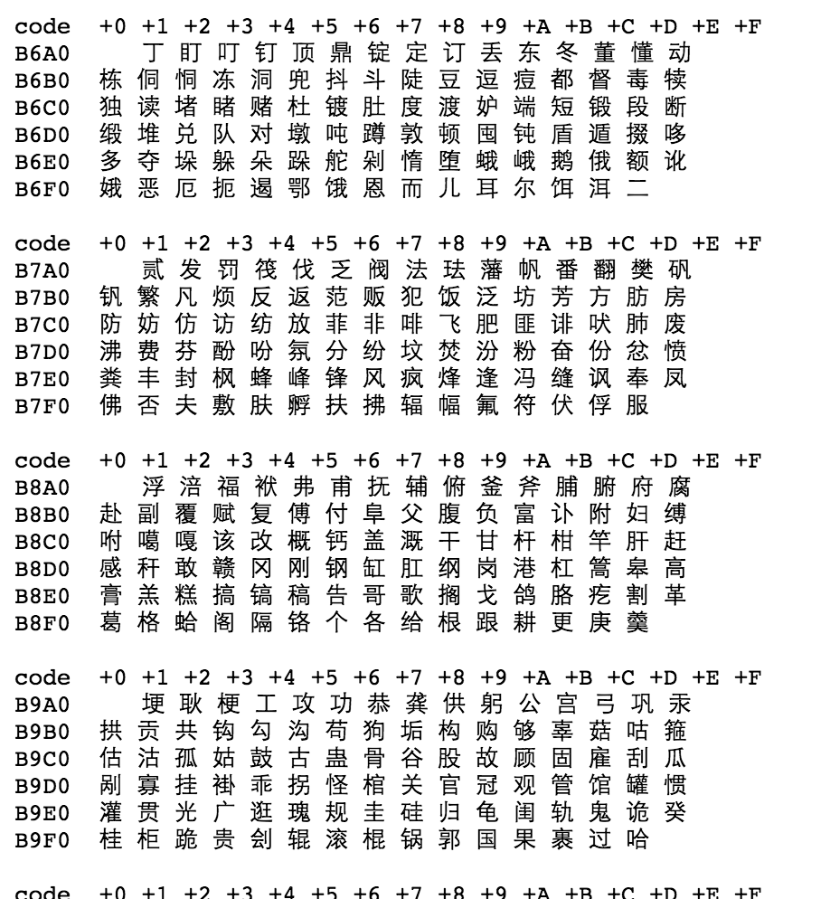
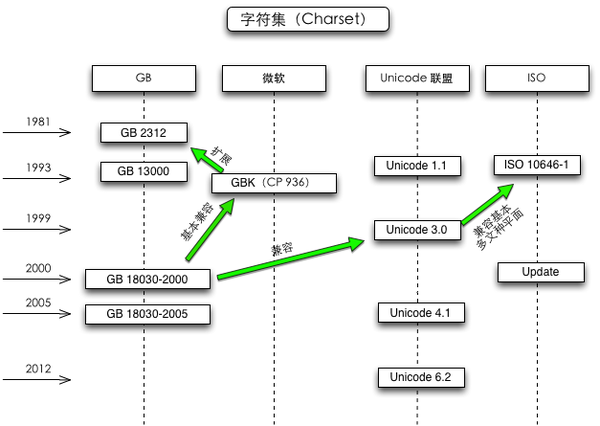

# 编程基础

[TOC]

## 为什么要学编程基础

> 因为你首先是程序员，其次才是前端。

一个程序员需要知道

1. 硬件与软件：计算机的运行原理（《[编码](https://book.douban.com/subject/4822685/)》）
2. 最大的软件：操作系统（[维基百科](https://zh.wikipedia.org/wiki/%E6%93%8D%E4%BD%9C%E7%B3%BB%E7%BB%9F)）看不下去，千万别买
3. 自己写软件：数据结构 & 算法（《[数据结构与算法分析](https://book.douban.com/subject/1139426/)》）逼着自己看看吧
4. 多人写软件：软件工程（[代码大全](https://book.douban.com/subject/1477390/)）必看

工作之余有时间我们可以从这些基本功上去提升自己。

当你工作到一定年限的时候，你会发现一个问题，新进来的后辈新技术可能用得更溜，而你所学到的知识不够深入，你的编程基础不够。

作为程序员要时刻提升自己的内功，也就是上面四个方向。

算法入门：把所有排序算法背一遍

协同作业：看软件工程，需求分析啊，代码复用啊，此类此类。

个人性格：代码和性格会互相影响~~神奇吧

## 前端为什么学编程基础

- `操作系统` 运行于 `硬件` 之上
- `浏览器` 运行于 `操作系统` 之上
- HTML / CSS / JS 运行于 `浏览器` 之上
- HTML / CSS / JS 和 `数据` 都来源于 `服务器`

> 防止成为井底之蛙

## 计算机：二进制的世界

1110 0100 1011 1101 1010 0000 1110 0101 1010 0101 1011 1101

上面一行数字就是 【你好】 在计算机里的表示方式。

想知道过程吗？

### 第一步：（内存）如何存储 0 和 1？

https://jrg-team.github.io/jrg-tasks/lessons/%E7%BC%96%E7%A8%8B%E5%88%9D%E7%BA%A7/ram.gif

存储

- 1 就是 充电
- 0 就是 不充电

读取

- 电量大于 50%，就是 1
- 电量小于 50%，就是 0

计算机是八位八位一存数据

### 第二步：如何存储数字

十进制变二进制

37（10） == 100101（2）

-37（10） == -100101（2）

0.75（10） == 0.11（2）

计算机只存 0 和 1

> 知识补充：
>
> ​	负数会以补码的形式存储
>
> ​	小数会以浮点数的形式存储
>
> 请自定了解

### 第三步：如何存储字符

#### 将每个字符编号

[ASCII 美国信息交换标准代码](https://zh.wikipedia.org/wiki/ASCII)

如果你想储存 a，那么就储存 97（10）对应的二进制

a -> 0110 0001（2） -> 61（16）

如果你想储存 1，那么就储存 49（10） 对应的二进制

1 -> 0011 0001（2） -> 31（16）

### 第四步：如何存储中文

### [GB 2312 中国国家标准简体中文字符集](https://zh.wikipedia.org/wiki/GB_2312)

GB2312 共收录 **6763 个汉字**，同时收录了包括拉丁字母、希腊字母、日文平假名及片假名字母、俄语西里尔字母在内的 **682 个字符**。

后来为了存储生僻字、繁体字、日语、朝鲜语等，微软推出了 [GBK 字符集](https://zh.wikipedia.org/wiki/%E6%B1%89%E5%AD%97%E5%86%85%E7%A0%81%E6%89%A9%E5%B1%95%E8%A7%84%E8%8C%83)（国标扩展字符集）

### 第五步：如何存储所有字符

#### 将全球字符编号

[Unicode 字符集](https://zh.wikipedia.org/wiki/Unicode)

包括中日韩文字、藏文、盲文、楔形文字、 [颜文字](https://zh.wikipedia.org/wiki/%E8%A1%A8%E6%83%85%E7%AC%A6%E8%99%9F%E5%88%97%E8%A1%A8#ref_U1F600_as_of_Unicode_version)`:-)`、 绘文字😂

2016年6月时，Unicode 总共有 128237 个字符

### 第六步：如何将 Unicode 存到计算机里

#### 以一种高性价比的方式

------

低性价比

a -> 00000000 00000000 00000000 011000012 = 006116

你 -> 00000000 00000000 01001111 011000002 = 4F6016

高性价比 UTF-8

a -> 01100001

你-> **111**00100 **1**0111101 **1**0100000 （E4BDA0）

#### UTF-8

##### UTF-8 是一种编码方式，不是字符集

------

00000000 00000000 00000000 011111112 即 0000007F16 以下 
0XXXXXXX

------

00000000 00000000 00000111 111111112 即 000007FF16 以下 
110XXXXX 10XXXXXX

------

00000000 00000000 11111111 111111112 即 0000FFFF16 以下 
1110XXXX 10XXXXXX 10XXXXXX

------

00000000 00011111 11111111 111111112 即 001FFFFF16 以下 
11110XXX 10XXXXXX 10XXXXXX 10XXXXXX

更多

### 现实问题

#### 字符集问题

为什么有些中文软件喜欢用 GBK，不用 Unicode

因为消息封闭，过几年采用 Unicode

### 现实问题

#### 编码问题

**JavaScript 使用了 Unicode 字符集，但是没有使用 UTF-8 编码**

> JavaScript 用了 UCS-2 编码！ 
> 因为 1995 年 UTF-16 还没被发明出来， JavaScript 也不想使用 UTF-32

[具体看这里](http://www.ruanyifeng.com/blog/2014/12/unicode.html)

**后果**

> ES5 无法表示 \uFFFF 之后的字符（如 \u1D306），某些情况下会出 bug

[更多](http://www.alloyteam.com/2016/12/javascript-has-a-unicode-sinkhole/)

