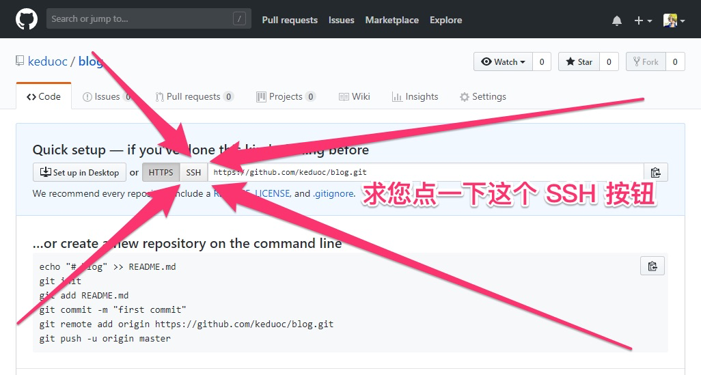

# 软件安装

[TOC]

## 课程简介

### 入门：软件安装

新人在这一课会有很多问题，请大家记住下面两条：

1. 请不要只看视频，请把文章教程也全部看一遍！
2. 视频中会出现下面页面，当你进入下面页面的时候，一定要点击 SSH 按钮，不要问为什么！（我录视频的时候忘了提醒你点，现在我很后悔，因为新人全部都不知道要点 SSH 按钮）



### 目录

#### Windows 上安装软件的教程（详见视频）

- 安装 VSCode- 安装 Git Bash- 安装 ColorPix- 安装 QQ（想必你已经安装了）
- 安装 WebStorm- 安装网络代理软件
- 注册 GitHub、V2ex
- 收藏一些博客（阮一峰、酷壳）

#### Windows 还是 Linux

先说结论：本课程用 Windows 学习是没有问题的。
理论上，这门课适用于任何操作系统，包括 Windows、Linux 和 MacOS。

不过如果你活到现在还只用过 Windows， 那么我强烈建议你去尝试尝试尝试尝试一下 Linux 系统，原因

1. 以下教程在 Windows 上总是出现各种奇怪的问题，如乱码、卡住，我也不知道怎么解决
2. 作为程序员，你不应该一辈子只使用 Windows 一个操作系统
   1. [Linux 虚拟机安装教程](https://xiedaimala.com/tasks/11ad5683-7e18-4883-879d-8425e6a6ceb7)
   2. 上面教程不需要现在就看，等你命令行用熟练了再看


## Git Bash 安装

1. 从官网下载（算了，太慢了），嘛，其实还行
2. 百度网盘：链接: <https://pan.baidu.com/s/1nu99KWp> 密码: jfdf

双击安装，注意每一步的选项要参考下面的图（如果没有对应的图，就直接下一步）


下面的路径可以随便填：


好了，安装完成。

### 配置

安装成功之后，需要设置一下外观：


关闭重启 Git Bash 即可。

### 使用

#### 第一种使用方式

找一个目录，在目录上右键点击，然后选中「Git Bash Here」，即可用 Git Bash 打开这个目录。

试试输入 `touch 1.txt`，回车后看看目录里是不是多了一个文件。

#### 第二种使用方式

直接打开 Git Bash，输入 `cd ~/Desktop` 即可来到桌面所在的目录。

试试输入 `touch 1.txt`，回车后看看桌面上是不是多了一个文件。

#### 更多命令

下节课我们会专门学习命令行，你可以试试下面几个简单的命令：

- 创建目录：`mkdir my-dir`
- 删除目录：`rm -r my-dir`
- 创建文件：`echo "hello" > newFile.txt`
- 删除文件：`rm newFile.txt`

### 链接

[解决git bash无法复制和黏贴](https://jingyan.baidu.com/article/1876c8529390eb890b1376b6.html)


## 可持续上网

这个内容很敏感，所以我就用 FQ 代替了。

### 安装

一般来说，FQ 软件的官网是要 FQ 之后才能访问的……所以这像是一个死循环：

> 如果我不能 FQ，就无法下载 FQ 软件。
> 如果我可以 FQ，那我还要下载 FQ 软件干啥？！

非也，一般来说我们可以先下载一个免费的 FQ，然后去购买一个收费的 FQ。

下载蓝色的灯：链接: <https://pan.baidu.com/s/1mij3Gdq> 密码: xanq 解压密码：jirengu
下载哇塞的风：链接: <https://pan.baidu.com/s/1bpGqe7d> 密码: c4a8 解压密码：jirengu

安装上面两个软件之后你就可以免费 FQ，不过免费的一般不稳定，你可以购买收费的。

### 购买收费的 SS 软件

SS 的全称我就不写了，以防和谐。

1. 下载 SS 客户端：链接: <https://pan.baidu.com/s/1YOpWbui0aIRYGfVbLe_aaQ> 密码: fz6n 解压密码：jirengu
2. 如果你不想花钱买 SS 服务器，可以在群里问方方要免费的 SS 服务器（抱歉，已经被封了，还是推荐购买收费的）
3. 按照 [这篇教程](https://jscode.me/t/topic/582) 购买一百块一年的 SS 服务器开启系统代理（仅对SS适用，VPN不需要这一步）
4. 按照 [这篇教程](https://jscode.me/t/proxy-switchyomega/751) 开启更灵活的浏览器代理（仅对SS适用，VPN不需要这一步）
5. 按照 [这篇教程](https://jscode.me/t/windows/789) 开启命令行代理（仅对SS适用，VPN不需要这一步）


## Node.js 的安装与配置

### 安装

1. 从[官网](https://nodejs.org/)下载安装包
2. 百度网盘下载：链接: <https://pan.baidu.com/s/1cMxJcU> 密码: xfyj

安装了之后

- **千万别** 点击 Node.js 的图标
- **千万别** 点击 Node.js 的图标
- **千万别** 点击 Node.js 的图标

别问为什么，别点就是了。

### 配置

打开 Git Bash，依次输入以下命令，按回车：

```
npm config set registry https://registry.npm.taobao.org/
npm config set loglevel http
npm config set progress false
```

npm 的配置被存储在 `~/.npmrc`，你可以随时改。

### 使用

#### npm 安装命令行小工具

装了 Node.js 之后我们就可以在 Git Bash 里面使用 node 和 npm 这两个命令了，试试看：

```
which node
which npm
node -v
npm -v
```

依次输出看看你得到什么结果。

接下来跟大家展示一下 npm 的威力。我们可以用 npm 的翻译工具做一个随时可用的小字典，这个小工具的名字叫做 fanyi。

运行 `npm i -g fanyi` 即可安装 fanyi，安装完成之后，输入 `fanyi frontend` 就可以看到对应的中文释义了！

是不是很帅呢？！

#### node 的使用

1. 进入 Git Bash
2. 输入 `node`，回车，就可以进入 node 运行环境，这个时候我们就可以写 JS 了
3. 试试写最简单的 JS 语句，比如 `1+2`，回车
4. `2 * 8`，回车

这就是 node 的第一种使用方式

#### node 的另一种使用方式

我们可以先创建一个 JS 文件，然后让 node 运行

1. 来到桌面：`cd ~/Desktop`
2. 新建一个目录用来玩耍：`mkdir hello-node`
3. 进入这个目录：`cd hello-node`
4. 新建一个有内容的 JS 文件：`echo "console.log('Hi, Node.js')" > main.js`，那么 main.js 就新建成功了
5. 输入 `node main.js`，回车，node 就会执行这个 main.js 文件，你会看到「Hi, Node.js」字样
6. 玩完了，删除 hello-node：`cd .. ; rm -rf hello-node`


## Git 的安装与配置

## 注意

Git 的使用是下节课的重点，这节课只需要稍微了解即可，下节课《命令行基础》将深入学习 git。

## 安装

不需要安装，Git Bash 内置了 Git 命令，Git Bash 还内置了以下命令：

- ls
- mkdir
- cp
- mv

等等，大概有几十个命令，Git Bash 其实是一个 Bash，不是 Git。

Git Bash 给我们提供了一个虚拟的 Linux 环境，这样我们就不用忍受 Windows 里面垃圾一般的命令行体验了。

## 配置

请在命令行运行这五句话！！！一定要运行这五句话，不然 git 就不能用了

```shell
# (把xxxxxx替换成你的英文名字随便什么都行)
git config --global user.name xxxxxx
# (把xxxxxx替换成你的邮箱跟github一致或者不一致也行) 
git config --global user.email xxxxxx    
# 本来我写的是 matching，不过想了想可能 simple 更好
git config --global push.default simple                                           
# 防止文件名变成数字
git config --global core.quotepath false                                         # 使用vim编辑提交信息  
git config --global core.editor "vim"                                             
```

另外很重要的一点！你自己运行 git 的时候注意一下：git remote add origin 后面的地址，不允许使用 https 开头的地址，见下图


记得点击 SSH


[加个脏话，以示严重性](https://video.jirengu.com/FqwCPrlSDc5Js7LpF7pENh13cxlD)


## VSCode 的安装与配置

### 安装

从[官网下载](https://code.visualstudio.com/)安装包

安装时把以下选项选中：


图片


### 使用

1. 找个地方新建一个目录（目录名不要中文），假设目录名为 vs-demo
2. 右键点击该目录，open with code
3. 使用 Ctrl+Shift+E 打开资源管理器，在 vs-demo 目录里新建 HTML 文件，文件名为 index.html
4. 在 index.html 依次输入：英文感叹号、<kbd>回车</kbd> 键，即可看到一个完整的 HTML 页面
   - 由于 vscode 时常更新，如果 <kbd>回车</kbd> 键不行，就试试 <kbd>Tab</kbd> 键

这种快捷写法叫做 Emmet，目前所有的前端编辑器都支持 Emmet。换句话说，如果一个编辑器没有默认支持 Emmet，你就可以卸载这款编辑器了（比如 Sublime Text 括弧笑）。

关于 Emmet 的更多快捷写法，见：

1. [官网的视频介绍](https://docs.emmet.io/)
2. [Emmet 作弊表](https://docs.emmet.io/cheat-sheet/)

### 配置

VSCode 的配置方式就写编辑一个配置文件，打开「文件 - 首选项 - 设置」，对应快捷键为 <kbd>Ctrl</kbd> + <kbd>,</kbd>


图片


左侧为系统默认配置项，右侧为你要覆盖的配置项。把你要修改的项从左边拷贝到右边，然后保存，即可生效。

### 设置字体与字号

在右侧文件中添加一行（注意末尾要有英文逗号）

```
"editor.fontSize": 18,
```

保存，字号就变大了。

设置字体也是类似，添加

```
"editor.fontFamily": "Consolas, 'Courier New', monospace",
```

即可将字体设置为你想要的。这里推荐「[10大最适合编程的字体推荐下载](http://www.iplaysoft.com/top10-programming-fonts.html)」，够你玩一上午了。我用的编程字体一般是 Source Code Pro 和 M Plus 这两款。

其实 VSCode 默认的配置就挺好的。

### 插件安装

VSCode 自带 Emmet、Git 继承和 JS 调试功能（后续会讲到），已经十分完善了，但是还是有一些特殊的需求，这个时候我们就可以安装第三方插件了。由于第三方插件不是微软生产的，所以质量良莠不齐，请注意甄别。

如果你发现 VSCode 没有 Git 功能：


截图


那么你只需要在项目目录运行 git init 来激活 git 功能即可。

### 安装 open in browser

按 Ctrl + Shift + X 打开扩展面板，然后输入 open in browser，点击第一个结果的「安装」按钮，稍等片刻就安装好了（相比之下 Sublime 的插件安装体验就差很多）。

然后你在任意 HTML 文件右键，就可以看到 Open In Default Browser 这个按钮了，点就试试看。

### Git 操作

要在 VSCode 里面操作 Git，前提是你已经配置好了 Git，如果你没有配置过，那么就在 Git Bash 里输入以下命令：

```
git config --global user.name 你的英文名
git config --global user.email 你的邮箱
git config --global push.default matching 
git config --global core.quotepath false
git config --global core.editor "vim"
```

然后你就可以像视频里面一样，愉快地使用 VSCode 的 Git 功能了。

如果你还希望用 VSCode 将代码推送到 GitHub，那么……待续