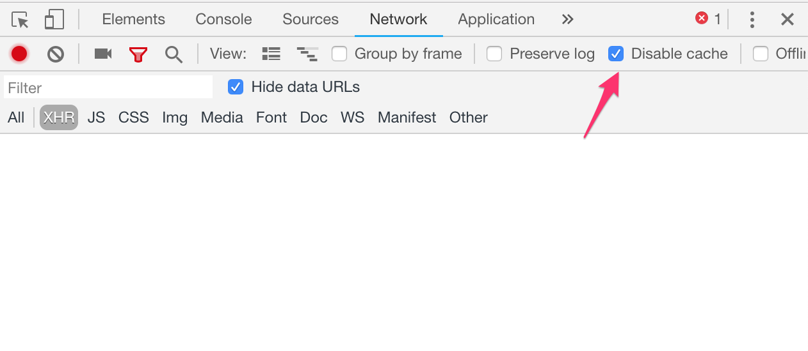

# CSS 代码

> 注意：如果你改了代码，却发现页面没有更新

这是你应该：

1. 打开当前页面的开发者工具
2. 点开 Network
3. 勾选 Disable Cache
4. 只要你不关闭开发者工具，那么缓存就会被禁用



关闭缓存


## 知识点

1. 如何做横向布局（float + clearfix）
2. 如何取色、量尺寸、预览字体（Word）
3. 如何使用开发者工具查看样式、继承样式
4. 四中引入 CSS 样式的方式：
   - style 属性
   - style 标签
   - css link
   - css import
5. 常见的 CSS 属性
   - font-family、font-size、font-weight
   - ul、body 的默认 margin 和 padding
   - color、background-color、margin、padding
   - line-height


## 黑暗的历史

在 html 诞生之后，css 出现之前，是怎么规定样式的呢？

```html
<body bgcolor="grey"></body>
<center></center>
```

CSS 诞生之后，所有的样式都由 style 来规定


### 行内式

```html
<h1 style="color:red;">hello</h1>
```

### 嵌入式

```html
<style>
  body {
    background: red;
    font-size: 14px;
  }
</style>
```

### 链接式

```html
<link rel="stylesheet" href="/style.css">
```

### 导入式

```html
<style type="text/css">
	@import"mystyle.css"; 此处要注意.css文件的路径
</style>
```

常用于在一个样式文件中引入另一个样式文件。


### float 样式 BUG

只要写了 float，那就一定有 bug，必须在父元素上加上 .clearfix

