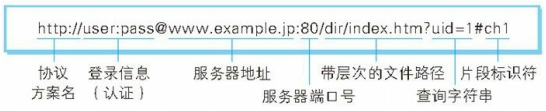

# 图解 HTTP 导读 + URI 与 URL

## 什么是 web？

我们打开一个网站，一个是客户端，一个是服务器。客户端并不都是浏览器，还有 app、微信什么的。

我们输入一个 url，然后展现页面加载数据，这里面遵循了什么样的协议呢？就是 HTTP。

## HTTP 版本

最早的正式版本就是 1.0，主流的是 1.1，以后还有 2.0

## TCP / IP

> 重点，下一章

## URL 和 URI

URI（Uniform Resource Identifier）统一资源标志符

URL（Uniform Resource Locator）统一资源定位符

URI 相比于 URL 概念更加的宽泛，比如它可以定位到 FTP 上的资源、邮件资源、电话，已经超出了网页的范畴。

