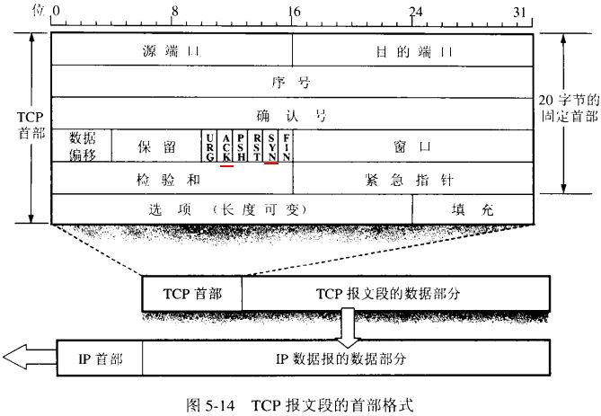

# TCP 三步握手和四步挥手

- 什么是 TCP 协议的三步握手？
- 什么是 TCP 协议多的四步挥手？
- 为什么握手要三步，挥手却是四步？

## 关于 TCP 协议

TCP（Transmission Control Protocol，传输控制协议）是一种面向连接的、**可靠的**、基于字节流的**传输层**通信协议。与之对应的是 UDP（User Datagram Protocol，用户数据报协议），是**不可靠**的传输协议。

## 三步握手

可以想象两人用对讲机交谈。

A：我准备好了你准备好了吗，收到请回答。
B：收到收到，我也准备好了，收到请回答。
A：收到收到

SYN 将每个询问加上一个序号，确保每次询问都能区别开来。

ACK 就是回答的序号。

1. 客户端发送 SYN报文给服务器端，序列号是n，进入 SYN_SEND 状态。
2. 服务器端收到 SYN 报文，回应一个ACK（序列号是n+1）同时发一个 SYN （序列号是m），进入 SYN_RECV 状态。
3. 客户端收到服务器端的 SYN 报文，回应一个 ACK(序列号是m+1）报文，进入 Established 状态。

## 四步挥手

1. 客户端发送一个 FIN ，告诉服务器想关闭连接。
2. 服务器收到这个 FIN ，发回一个 ACK。
3. 服务器通知应用程序关闭网络连接，应用程序关闭后通知服务器。服务器发送一个 FIN 给客户端 。
4. 客户端发回 ACK 报文确认。

## 为什么挥手要四步

这是因为服务端的 LISTEN 状态下的 SOCKET 当收到客户端建立连接请求的SYN 报文后，它可以把 ACK 和 SYN （ ACK 起应答作用，而 SYN 起同步作用）放在一个报文里来发送。但关闭连接时，当服务器收到客户端的 FIN 报文通知时，服务器只能发一个回应报文ACK：“哦，我知道了”，然后通知应用程序。应用程序完成全部数据发送并确定可以终止了，服务器才能发送FIN告诉客户端可以真正断开连接了。所以这一步ACK报文和FIN报文需要分开发送，因此多了一个步骤。

## TCP 报文格式

- ACK ： TCP协议规定，只有ACK=1时有效，也规定连接建立后所有发送的报文的ACK必须为1。
- SYN(SYNchronization) ： 在连接建立时用来同步序号。当SYN=1而ACK=0时，表明这是一个连接请求报文。对方若同意建立连接，则应在响应报文中使SYN=1和ACK=1. 因此, SYN置1就表示这是一个连接请求或连接接受报文。
- FIN （finis）即完，终结的意思， 用来释放一个连接。当 FIN = 1 时，表明此报文段的发送方的数据已经发送完毕，并要求释放连接。

## UDP

UDP 是不可靠的传输，没这么多花里花哨的，直接发送出去就行了。

