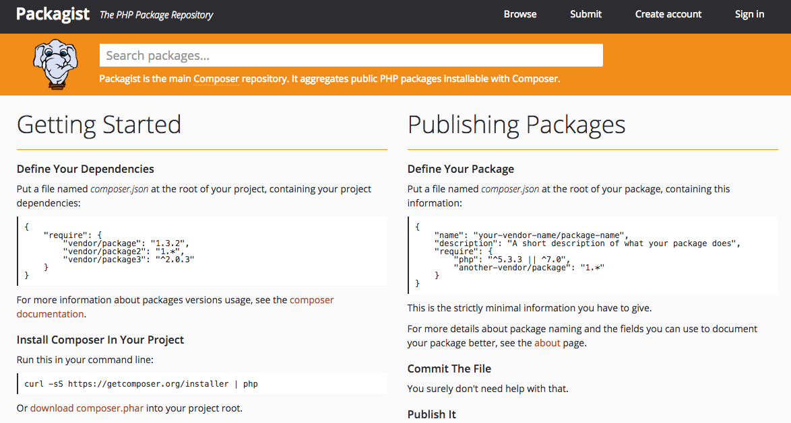
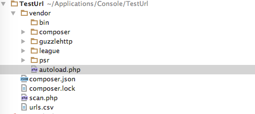
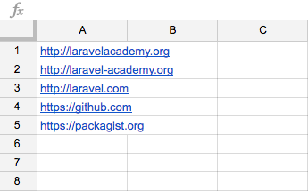

# 知识储备（一）—— Composer 


## 1、什么是组件

组件是一组打包的代码，是一系列相关的类、接口和 Trait，用于帮助沃恩解决 PHP 应用中某个具体问题、例如，你的 PHP 应用需要收发 HTTP 请求，可以使用现成的组件如 `guzzle/guzzle` 实现。我们使用组件不是为了重新实现已经实现的功能，而是把更多时间花在长远目标上。

优秀的 PHP 组件应该具备以下特性：

- 作用单一：专注于解决一个问题，而且使用简单的接口封装功能
- 小型：小巧玲珑，只包含解决某个问题所需的最少代码
- 合作：PHP 组件之间可以良好合作，组合在一起实现大型项目
- 测试良好：本身提供测试，而且有充足的测试覆盖度
- 文档完善：应该提供完善的文档，能让开发者轻易安装、理解和使用


## 2、组件 vs 框架

我们选择框架时，要为这个框架的工具投入很多，框架通常会提供大量工具，但却没有提供我们所需的某个工具时，痛苦就转嫁到我们头上，我们要寻找并集成自定义的 PHP 库。把第三方代码集成到框架中是件难事，因为第三方代码和框架可能没有使用相同的接口。

选择框架时，我们看中的是框架的未来，但是谁又能保证某个框架始终是完成某项工作最好的工具呢？存在多年的大型项目必须有好的表现，而且要时刻做好调整，如果选错了PHP框架，可能无法做到这一点。较旧的 PHP 框架可能由于缺乏社区支持而变慢或过时，这些旧框架通常使用过程式代码编写，而没有使用新式的面向对象代码以及 PHP 的一些新特性，总之，决定是否使用 PHP 框架时，要考虑的事情很多。

庆幸的是，Laravel 在这些担忧方面表现良好，因此才能在众多 PHP 框架中脱颖而出，从某种意义上来说，Laravel 也是个基于组件开发的框架（核心组件是自身的Illuminate库，功能实现上则大量依赖第三方组件），相比 Symfony 而言，上手又比较简单，所以兼具了扩展性和易用性。但是，Laravel 也存在一些不足，比如 Laravel 自身的组件不能轻易解耦，用于 Laravel 框架之外（但是相信这种状况会有好转，比如其数据库和队列组件就可以解耦出去）。综合来看，Laravel 仍是一个出色的框架，能帮组我们快速创建强大的应用。

那我们应该使用组件还是框架呢？答案是，使用正确的工具做正确的事，如果能通过一些 PHP 组件快速实现小型项目，那就使用组件，如果有多个团队成员开发大型项目，而且能从框架提供的约定准则和结构中受益，那就使用框架（如果是在纠结使用什么框架，那么选择 Laravel 吧，它不会让你失望），使用框架能够引导并加速项目的开发。

> PS：这句话也适用于语言之争，用正确的语言做正确的事，没事少BB，这是学院君对语言之争的态度和立场。


## 3、使用组件

### Packagist

我们在 Packagist 中查找 PHP 组件，这个网站用于收集 PHP 组件，最好的 PH P组件在 Packagist 中都能找到。



比如我们想使用一个 http 组件用于收发 HTTP 消息，在搜索框中搜索 http，得到的第一个结果就是 Guzzle，就用它吧。


### Composer

Packagist 是查找 PHP 组件的社区，Composer 则是安装 PHP 组件的工具。Composer 是 PHP 的依赖管理器，运行在命令行中，你告诉 Composer 需要哪些组件，Composer 会下载并把这些组件自动加载到你的项目中，就这么简单。

Composer 和 Packagist紧密合作，如果你告诉 Composer 想要使用 `guzzlehttp/guzzle `组件，Composer 会从 Packagist 中获取 `guzzlehttp/guzzle` 组件，找到这个组件的仓库地址，确定要使用哪个版本，还能找出这个组件的依赖，然后把 `guzzlehttp/guzzle` 组件及其依赖下载到你的项目中。

此外，Composer 会为项目中的所有PHP组件自动生成符合PSR标准的自动加载器，有效地抽象了依赖管理和自动加载，所以，对PHP社区来说，Composer是最重要的附加工具，没有之一，想想之前我们要使用诸如include、require、spl_autoload_register来手动实现自动加载的痛苦日子，这一点也不为过。

关于 Composer 的安装和使用，这里不赘述，请参考 [Composer中文网](http://www.phpcomposer.com/)。


## 4、示例项目

下面我们通过一个示例项目来演示如何使用 Composer 和组件来开发一个PHP应用，这个应用的作用是扫描一个 CSV 文件中的 URL，找出死链，该应用会向每个 URL 发 HTTP 请求，如果返回的 HTTP 状态码大于等于 400，就把这个死链发给标准输出。这是一个命令行应用，开发好之后，我们会执行这个脚本，传入 csv 文件的路径，在标准输出中显示死链列表。

### 安装组件

开始之前，先看看哪些任务可以使用现有的 PHP 组件解决：我们需要一个可以迭代处理 csv 文件数据的组件，此外还要向 csv 文件中的每个 URL 发送 HTTP 请求，因此还需要一个可以发送 HTTP 请求并检查 HTTP 响应的组件。

浏览 Packagist 后，我们找到 `guzzlehttp/guzzle` 和 `league/csv` 两个组件，前者用于处理 HTTP 消息，后者用于处理 CSV 数据。下面我们在项目最顶层运行如下命令：

```shell
composer require guzzlehttp/guzzle
composer require league/csv
```

Composer 会依赖安装到根目录的 `vendor` 目录下，安装完成后，会在根目录下生成 `composer.json` 和 `composer.lock` 文件：



### 自动加载

接下来我们来编写应用代码，在根目录下创建一个 scan.php 文件，然后在该文件顶部使用 `require` 导入 Composer 创建的自动加载器：

```php
<?php
require 'vendor/autoload.php';
```

Composer 创建的自动加载器其实就是个名为 autoload.php 的文件，保存在 `vendor` 目录中，Composer 下载各个 PHP 组件时，会检查每个组件的 `composer.json` 文件，确定如何加载该组件，得到这个信息后，Composer 会在本地为该组件创建一个符合 PSR 标准的自动加载器。这样我们就可以实例化项目中的任何 PHP 组件，这些组件按需自动加载。

### 编写代码

下面我们正式使用 Guzzle 和 CSV 组件编写`scan.php`代码：

```
<?php
// 使用 composer 自动加载器
require 'vendor/autoload.php'

// 实例 Guzzle http 客户端
$client = new GuzzleHttp\Client();

// 打开并迭代处理 csv
$csv = League\Csv\Reader::createFromPath($argv[1]);
foreach ($csv as $csvRow) {
  try {
    // 发送 HTTP GET 请求
    $httpResponse = $client->get($csvRow[0]);
    
    //检查HTTP响应的状态码
    if ($httpResponse->getStatusCode() >= 400) {
    	throw new Exception();
    }
  } catch (Exception $e) {
    // 把死链发给标准输出
    echo $csvRow[0] . PHP_EOL;
  }
}
```

下面我们在 `urls.csv` 中添加一些 URL，一行一个，而且至少有一个是死链：



然后打开终端，执行 `scna.php` 脚本：

```shell
php scan.php urls.csv
```

我们传入了两个参数，第一个是脚本文件 `scan.php` 的路径，另一个是 CSV 文件的路径。输出如下：


下一节我们将探讨私有的 PHP 组件以及如何创建自己的 PHP 组件并上传到 Packagist。


