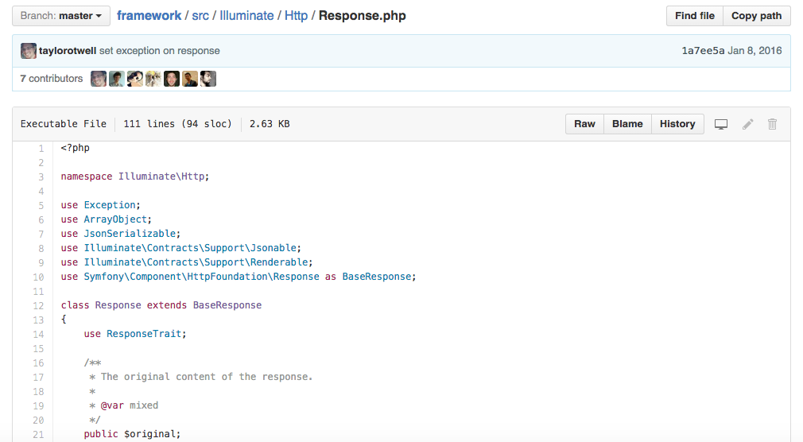

# 知识储备（二）—— 命名空间


## 1、什么是命名空间

如果你只需要知道现代 PHP 特性中的一个，那就应该是命名空间。命名空间在 PHP 5.3.0 中引入，其作用是按照一种虚拟的层次结构组织 PHP 代码，这种层次结构类似操作系统中文件系统的目录结构。命名空间是现代 PHP 组件生态的基础，现代的 PHP 组件框架代码都是放在各自全局唯一的厂商命名空间中，以免和其他厂商使用的常见类名冲突。

下面我来看看真实的 PHP 组件是如何使用命名空间的。Laravel 框架中的 HTTP 组件用于管理 HTTP 请求和响应，这个组件用到了常见类名，例如 Request、Response，很多其他 PHP 组件也用到了这样的类名，既然其他 PHP 的代码也用到了相同的类名，那么怎么使用这个组件呢？其实我们可以放心使用，因为这个组件的代码放在了唯一的厂商命名空间 `Illuminate` 中。打开这个组件在GitHub 中的仓库（<https://github.com/laravel/framework/blob/master/src/Illuminate/Http/Response.php>），找到 `Response.php` 文件：



我们可以看到这行代码：

```php
namespace Illuminate\Http;
```

这一行是 PHP 命名空间声明语句，声明命名空间的代码始终应该放在 `<?php` 标签后的第一行。通过这个命名空间的声明语句我们可以看到 `Response` 位于厂商命名空间 `Illuminate` 中（最顶层命名空间），我们还看到 `Response` 类在子命名空间 `Http` 中 ，你可以看下和 `Response.php` 文件在同一层级的其他文件，都能发现类似的命名空间声明语句。

命名空间的作用是封装和组织相关的 PHP 类，就像在文件系统中把相关的文件放在用一个目录中一样。PHP 命名空间和操作系统的物理文件系统不一样，这是一个虚拟概念，没必要和文件系统中的目录结构完全相同，虽然如此，但是大多数 PHP 组件为了兼容广泛使用的 PSR-4 自动加载标准，会把命名空间放到对应文件系统的子目录中。


## 2、为什么使用命名空间

前面已经提到，我们的代码可能和其他开发者的代码使用相同类名、接口名、函数或者常量名，如果不使用命名空间，名称会起冲突，导致 PHP 执行出错。而使用命名空间将代码放到唯一的厂商命名空间，我们的代码就可以和其他开发者使用相同的类名、接口名、函数或者常量名。

当然如果你开发的是小型项目，只有少量的依赖，类名冲突可能不是问题，但是如果在团队合作中，开发用了大量第三方依赖的大型项目，就要认真对待命名冲突问题，因为你无法控制项目依赖在全局命名空间中引入的类、接口、函数和常量，这也是为什么要使用命名空间的原因。


## 3、声明命名空间

每个 PHP 类、接口、函数和常量都在命名空间中，声明命名空间很简单，在 `<?php` 标签后的第一行声明，声明语句以 `namespace` 打头，随后空格，接命名空间的名称，最后以 `;` 结尾。

命名空间经常用于设置顶层厂商名，比如我们设置厂商名为 `LaravelAcademy`：

```php
<?php
namespace LaravelAcademy
```

在这个命名空间声明语句后声明的所有PHP类、接口、函数和常量都在 `LaravelAcademy `命名空间中，而且和 Laravel 学院有某种关系。如果我们想组织学院用到的代码该怎么做呢？答案是使用子命名空间。

子命名空间的声明方式和前面的示例完全一样，唯一的区别是我们要使用 `\` 符号把命名空间和子命名空间分开，例如：

```php
<?php
namespace LaravelAcademy\ModernPHP;
```

这个命名空间后的所有类、接口、函数和常量都位于  `LaravelAcademy\ModernPHP`中。

在同一个命名空间中的类没必要在同一个PHP文件中声明，可以在PHP文件的顶部指定一个命名空间或子命名空间，此时，这个文件的代码就是该命名空间或子命名空间的一部分。因此我们可以在不同文件中编写属于同一个命名空间的多个类。

> 注：厂商命名空间是最顶层的命名空间，也是最重要的命名空间，用于识别品牌或组织，必须具有全局唯一性。子命名空间相对而言没那么重要，但是可以用于组织项目的代码。


## 4、导入和别名

在命名空间出现之前，PHP 开发者使用 Zend 风格的类名解决命名冲突问题，这是一种类的命名方案，因 Zend 框架而流行，这种命名方案在 PHP 类名中使用下划线的方式表示文件系统的目录分隔符。这种约定有两个作用：其一，确保类名是唯一的；其二，原生的自动加载器会把类名中的下划线替换成文件系统的目录分隔符，从而确定文件的路径。例如，`Zend_Cloud_DocumentService_Adapter_WindowsAzure_Query` 类对应的文件是`Zend/Cloud/DocumentService/Adapter/WindowsAzure/Query.php`。可以看出，这种命名有个缺点：类名特别长。

现代的 PHP 命名空间也有这个问题，例如上述 `Response` 类完整的全名是 `Illuminate\Http\Response`，幸好，我们可以通过导入以及创建别名的方式来改变这一状况。

导入的意思是指，在每个 PHP 文件中告诉 PHP 想使用哪个命名空间、类、接口、函数和常量，导入后就不用使用全名了：

```
<?php
use Illuminate\Http\Response;

$response = new Response(‘Oops’, 400);
$response->send();
```

我们通过 `use` 关键字告诉PHP，我们想使用 `Illuminate\Http\Response` 类，我们只需要输入一次完全限定的类名，随后实例化 `Response` 的时候，无需使用完整的类名。

如果觉得这样的类名还是长，可以创建别名。创建别名指的是告诉PHP我要使用简单的名称引用导入的类、接口、函数或常量：

```php
<?php

use Illuminate\Http\Response as Res;

$res = new Res(‘Oops’, 400);
$res->send();
```

从PHP 5.6开始还可以导入函数和常量，不过要调整use关键字的句法，如果要导入函数，需要使用`use func`：

```php
<?php
use func Namespace\functionName

functionName();
```

如果想导入常量，可以使用 `use constant`：

```php
<?php
use constant Namespace\CONST_NAME;

echo CONST_NAME;
```

当然也支持别名，创建方式和类一样。


## 5、使用技巧

### 多重导入

如果想要在PHP文件中导入多个类、接口、函数或常量，需要在PHP文件的顶部使用多个use语句，PHP支持用简短的语法把多个use语句写成一行：

```php
<?php
use Illuminate\Http\Request,
Illuminate\Http\Response;
```

但是为了可读性，建议不要这么写，还是一行写一个use语句比较好：

```php
<?php
use Illuminate\Http\Request;
use Illuminate\Http\Response;
```

### 一个文件使用多个命名空间

PHP允许在一个文件中定义多个命名空间：

```php
<?php
namespace Foo {
    //声明类、接口、函数、常量
}

namespace Bar {
    //声明类、接口、函数、常量
}
```

但这么做不好，违背了“一个文件一个类”的良好实践，因此不建议这么做。

### 全局命名空间

如果引用的类、接口、函数和常量没有指定命名空间，PHP假定引用的类、接口、函数和常量在当前的命名空间中。如果要使用其他命名空间的类、接口、函数或常量，需要使用完全限定的 PHP 类名（命名空间+类名）。

有些代码在全局命名空间中，没有命名空间，比如原生的 Exception 类就是这样。在命名空间中引用全局的代码时，需要在类、接口、函数或常量前加 `\` 符号：

```php
<?php
namespace My\App;

class Foo {
    public function doSomething() {
        throw new \Exception();
    }
}
```

### 自动加载

命名空间还为 PHP-FIG 制定的 PSR-4 自动加载标准奠定了坚实的基础，大多数现代的 PHP 组件都使用了这种自动加载模式，使用依赖管理器 Composer 可以自动加载项目的依赖，后续我们还会详细介绍 Composer 和 PHP-FIG，现在你只需要知道没有命名空间，就没有现代的 PHP 生态系统和基于组件的新型架构，由此可见命名空间的重要性。