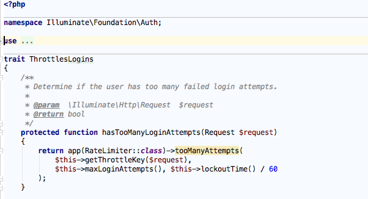

# 知识储备（三）—— Trait

Trait 是 PHP 5.4 引入的新概念，看上去既像类又像接口，其实都不是，Trait 可以看做类的部分实现，可以混入一个或多个现有的 PHP 类中，其作用有两个：表明类可以做什么；提供模块化实现。Trait 是一种代码复用技术，为 PHP 的单继承限制提供了一套灵活的代码复用机制。

## 为什么使用 Trait

PHP 语言使用一种典型的单继承模型，在这种模型中，我们先编写一个通用的根类，实现基本的功能，然后扩展这个根类，创建更具体的子类，直接从父类继承实现。这叫做继承层次结构，很多编程语言都使用这个模式。大多数时候这种典型的继承模型能够良好运作，但是如果想让两个无关的 PHP 类具有类似的行为，应该怎么做呢？

Trait 就是为了解决这种问题而诞生的。Trait 能够把模块化的实现方式注入多个无关的类中，从而提高代码复用，符合 DRY（Don’t Repeat Yourself）原则。比如 Laravel 底层用户认证相关逻辑以及软删除实现等地方都使用了 Trait 来实现。以 Laravel 自带的 `AuthController` 为例，其中的登录、注册以及登录失败尝试次数都是通过 Trait 实现：

## 如何创建 Trait

创建Trait很简单，跟创建类有点类似，只不过使用的关键字是 `trait `而不是 `class`，以上述 `ThrottlesLogin `为例：

我们通过 `trait` 声明定义的是一个 Trait，然后我们可以在这个 Triat 中像类一样定义要使用的属性和方法。

此外 Trait 支持嵌套和组合，即通过一个或多个 Trait （多个用, 分隔）组合成一个 Trait，例如：

使用多个Trait可能会引起命名冲突问题，上面的代码给出了解决方案：使用 `insteadof` 关键字，如果 `AuthenticatesUsers `和 `RegistersUsers `中都定义了 `redirectPath` 和 `getGuard` 方法，那么将从 `AuthenticatesUsers` 中获取对应方法而不是 `RegistersUsers`。另外还可以使用 `as` 关键字为方法起个别名，这样也可以避免命名冲突。

此外，这里可能没有完整列出，Trait 中还支持定义抽象方法和静态方法，其中抽象方法必须在使用它的类中实现。

这里还需要声明的一点是调用方法的优先级：调用类 > Trait > 父类（如果有的话），方法可以覆盖，但属性不行，如果 Trait 中定义了一个属性，如果调用类中也定义这个属性则会报错。

## 如何使用 Trait

Trait 的使用方法也很简单，上面已经显示的很清楚明了，即使用`use`关键字。

可能你已经注意到，命名空间和 Trait 使用的都是 `use` 关键字，不同之处在于导入位置，命名空间在类的定义体外导入，而 Trait 在类的定义体内导入。

> 注：PHP 解释器在编译时会把 Trait 复制到类的定义体中，但是不会处理这个操作引入的不兼容问题，如果 Trait 假定类中有特定的属性或方法，需要先确保类中确实有相应的属性或方法。