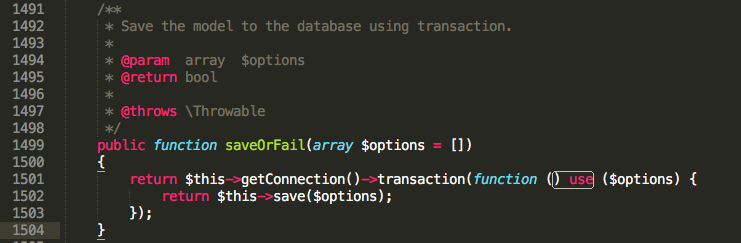
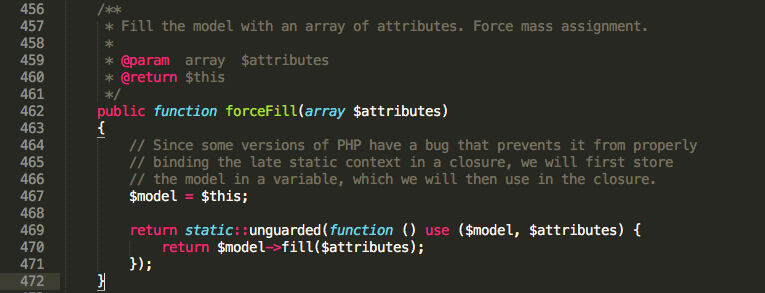

# 知识储备（四）—— 闭包和匿名函数


## 1、概述

闭包和匿名函数在 PHP 5.3.0 中引入，这两个特性非常有用，每个PHP开发者都应该掌握。

闭包是指在创建时封装周围状态的函数，即使闭包所在的环境的不存在了，闭包中封装的状态依然存在。

匿名函数其实就是没有名称的函数，匿名函数可以赋值给变量，还能像其他任何 PHP 函数对象那样传递。不过匿名函数仍然是函数，因此可以调用，还可以传入参数，适合作为函数或方法的回调。

> 注：理论上讲闭包和匿名函数是不同的概念，不过PHP将其视作相同的概念（匿名函数在PHP中也叫作闭包函数），所以下面提到闭包时指的也是匿名函数；反之亦然。


## 2、创建闭包

创建闭包很简单：

```php
<?php
$greet = function ($name) {
    return sprintf("Hello %s\r\n", $name);
};

echo $greet('LaravelAcademy.org');
```

结果打印：

```
Hello LaravelAcademy.org
```

闭包和普通的 PHP 函数很像：常用的句法相同，也接受参数，而且能返回值。不过闭包没有函数名。

> 注：我们之所以能调用 `$greet `变量，是因为这个变量的值是一个闭包，而且闭包对象实现了 `__invoke()` 魔术方法，只要变量名后有()，PHP就会查找并调用 `__invoke` 方法。

我们通常把 PHP 闭包当做函数会方法的回调使用，事实上，很多PHP函数都会用到闭包，比如 `array_map` 和 `preg_replace_callback`，这是使用 PHP 匿名函数的绝佳时机。记住，闭包和其他值一样，可以作为参数传入其他 PHP 函数：

```php
<?php
$numberPlusOne = array_map(function ($number) {
    return $number += 1;
}, [1, 2, 3]);

print_r($numberPlusOne);
```

在闭包出现之前，要实现这样的功能，PHP 开发者只能单独创建具名函数，然后使用名称引用这个函数：

```php
<?php
function incrementNumber ($number) {
    return $number += 1;
}

$numberPlusOne = array_map(‘incrementNumber’,  [1, 2, 3]);
print_r($numberPlusOne);
```

这样做把回调的实现和使用场所隔离开了，而且使用闭包实现代码更加简洁。


## 3、从父作用域继承变量

在 PHP 中必须手动调用闭包对象的 `bindTo` 方法或使用 `use` 关键字把父作用域的变量及状态附加到PHP闭包中。而实际应用中，又以使用`use`关键字实现居多。

### use 关键字

实际上，Laravel 框架中也是用了大量的闭包，最常见的比如路由定义：

```php
Route::group(['domain' => '{account}.myapp.com'], function () {
    Route::get('user/{id}', function ($account, $id) {
        //
    });
});
```

这里面的两个 function 都是闭包。而从父作用域继承变量的使用场景在 Laravel 底层源码中也是俯拾即是，比如Model.php（`Illuminate\Database\Eloquent`）的 `saveOrFail` 方法：



该方法的作用是使用事务将模型数据保存到数据库，这里面我们使用闭包返回保存状态，同时使用 use 关键字将父作用域的 `$options` 传递给该闭包以便其能够访问这个数据。

此外，还支持传递多个父作用域变量到闭包，比如还是在 `Model` 类中的 `forceFill` 方法：



多个变量用逗号隔开。

### bindTo 方法

我们前面已经提到，闭包是一个对象，所以我们可以在闭包中使用 $this 关键字获取闭包的内部状态，闭包对象的默认状态没什么用，需要注意的是其中的 `__invoke` 魔术方法和 `bindTo` 方法。

`__invoke `的作用前面已经说过，当尝试以调用函数的方式调用一个对象时，`__invoke()` 方法会被自动调用。

接下来我们来看看 `bindTo` 方法，通过该方法，我们可以把闭包的内部状态绑定到其他对象上。这里 `bindTo` 方法的第二个参数显得尤为重要，其作用是指定绑定闭包的那个对象所属的PHP类，这样，闭包就可以在其他地方访问邦定闭包的对象中受保护和私有的成员变量。

你会发现，PHP 框架经常使用 `bindTo` 方法把路由 URL 映射到匿名回调函数上，框架会把匿名回调函数绑定到应用对象上，这样在匿名函数中就可以使用 `$this` 关键字引用重要的应用对象：

```php
<?php
class App {
    protected $routes = [];
    protected $responseStatus = '200 OK';
    protected $responseContentType = 'text/html';
    protected $responseBody = 'Laravel学院';

    public function addRoute($routePath, $routeCallback) {
        $this->routes[$routePath] = $routeCallback->bindTo($this, __CLASS__);
    }

    public function dispatch($currentPath) {
        foreach ($this->routes as $routePath => $callback) {
            if( $routePath === $currentPath) {
                $callback();
            }
        }
        header('HTTP/1.1 ' . $this->responseStatus);
        header('Content-Type: ' . $this->responseContentType);
        header('Content-Length: ' . mb_strlen($this->responseBody));
        echo $this->responseBody;
    }
}
```

这里我们需要重点关注 `addRoute` 方法，这个方法的参数分别是一个路由路径和一个路由回调，`dispatch` 方法的参数是当前 HTTP 请求的路径，它会调用匹配的路由回调。第 9 行是重点所在，我们将路由回调绑定到了当前的 App实例上。这么做能够在回调函数中处理 App 实例的状态：

```
$app = new App();
$app->addRoute('user/nonfu', function() {
  $this->responseContentType = 'application/json;charset=utf8';
  $this-?responseBody = '{"name": "LaravelAcademy"}';
});
$app->dispatch('user/nonfu')
```

在 Larval 底层也有用到 `bindTo` 方法，详见 `Illuminate\Support\Traits\Macroable` 的 `__call` 方法：