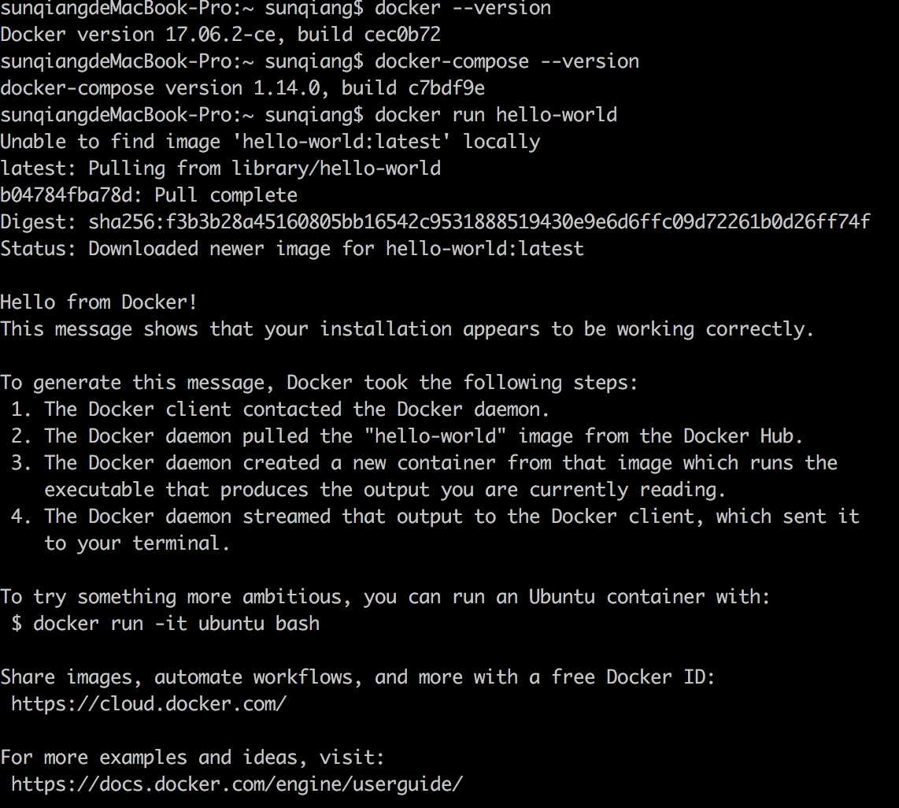
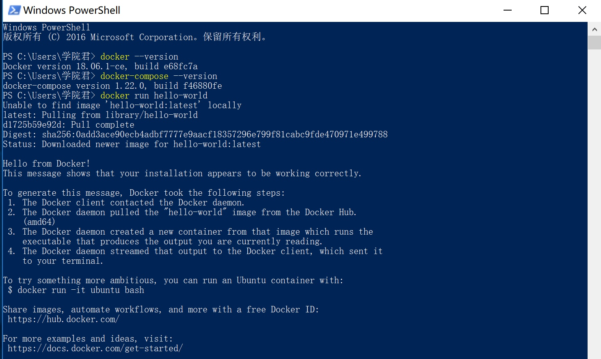
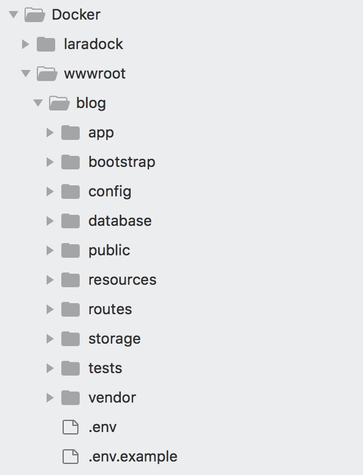
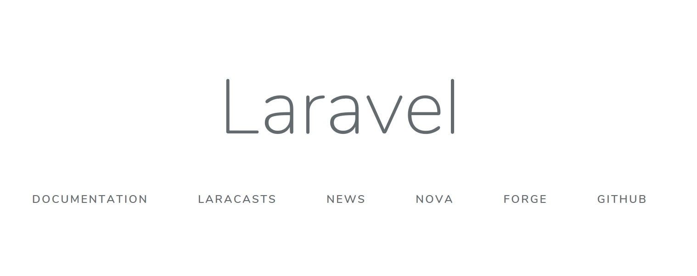

# 使用 Laradock 搭建基于 Docker 的 Laravel 开发环境

### 简介

Laradock 是为 Docker 提供的完整 PHP 本地开发环境，和 Homestead 一样提供了一系列打包好（包括配置）的 Docker Image。Laradock 早期专注为 Laravel 打造 Docker 开发环境，因而最早在 Laravel 社区中出名，后来随着影响力的扩大，逐渐被 PHP 社区接纳和采用，目前支持的 PHP 项目除了 Laravel 之外，还有 Symfony、CodeIgniter、WordPress、Drupal 等等。

### Docker 扫盲

在学习和使用 Laradock 之前，我们有必要先学习和了解 Docker，而在使用 Docker 之前，又有必要搞清楚下面两个问题：

**Docker 是什么**

Docker 基于 Go 语言开发，是一个基于 LXC 技术之上构建的 Container 容器引擎。容器是一种以固定格式打包软件的方式，以便让软件可以在共享的操作系统中运行，不同于虚拟机，容器并不需要捆绑这个操作系统，只需要软件正常工作所必须的库和设置即可，这使得容器更加高效、轻量级、可以自成系统并且不管部署在什么地方都可以保证运行结果一致。

Docker提供了一种在安全、可重复的环境中自动部署软件的方式，它的出现拉开了基于云计算平台发布产品方式的变革序幕。开发者使用 Docker 可以解决当需要和同事共享代码时"只能在我的机器工作"的问题；操作者使用 Docker 可以在关联容器中边运行边管理以便获取更好的计算密度；企业使用 Docker 可以用来构建敏捷的软件分发管道以便可以更快处理新特性。

**为什么要使用 Docker**

Docker 的出现就是为了解决以下问题：

- 环境管理复杂: 从各种 OS 到各种中间件再到各种 App，一款产品能够成功发布，作为开发者需要关心的东西太多，且难于管理，这个问题在软件行业中普遍存在并需要直接面对。Docker 可以简化部署多种应用实例工作，比如Web应用、后台应用、数据库应用、大数据应用比如 Hadoop 集群、消息队列等等都可以打包成一个 Image 部署。
- 云计算时代的到来: AWS 的成功, 引导开发者将应用转移到云上, 解决了硬件管理的问题，然而软件配置和管理相关的问题依然存在。Docker 的出现正好能帮助软件开发者开阔思路，尝试新的软件管理方法来解决这个问题。
- 虚拟化手段的变化: 云时代采用标配硬件来降低成本，采用虚拟化手段来满足用户按需分配的资源需求以及保证可用性和隔离性。然而无论是 KVM 还是 Xen，在 Docker 看来都在浪费资源，因为用户需要的是高效运行环境而非 OS, GuestOS 既浪费资源又难于管理, 更加轻量级的 LXC 更加灵活和快速。
- LXC的便携性: LXC在 Linux 2.6 的 Kernel 里就已经存在了，但是其设计之初并非为云计算考虑的，缺少标准化的描述手段和容器的可便携性，决定其构建出的环境难于分发和标准化管理。Docker就在这个问题上做出了实质性的创新方法。

Docker 通常用于如下场景：

- Web 应用的自动化打包和发布；
- 自动化测试和持续集成、发布；
- 在服务型环境中部署和调整数据库或其他的后台应用；
- 从头编译或者扩展现有的 OpenShift 或 Cloud Foundry 平台来搭建自己的 PaaS 环境。

本教程不将那么多高大上的东西了，我们专注于通过 Docker 构建一个可移植的本地开发环境。

#### Docker 安装使用

首先我们需要在系统安装 Docker 的免费社区版，官方提供 Windows、Mac 及 Linux 等版本下载：[下载地址](https://www.docker.com/community-edition#/download)。下载操作系统对应版本后，按照引导流程安装，最后打开 Docker 应用，即可在命令行检查是否安装成功：

**Mac**



**Windows**



> 注：Windows 系统下使用 Docker 需启用 Hyper-V 组件（推荐在原生系统中使用），如果是在 VMware 或 Parallels 虚拟机中使用 Windows，需要在设置里面启用嵌套的虚拟化支持（设置->处理器和内存->高级选项->启用虚拟化管理程序），如果虚拟机不支持此配置或 Hyper-V，可以尝试额外安装 Docker ToolBox 来支持使用 Docker（详情参考[官方文档](https://docs.docker.com/toolbox/toolbox_install_windows/)）。我这里的环境就是 Mac + VMware Fusion + Windows 10（虚拟机）。

### 快速上手

深入了解 Laradock 之前让我们先见识下如何在 Laradock 中快速安装 Nginx、PHP、Composer、MySQL、Redis 和 Beanstalkd 吧，有了这些开发 Laravel 必备的工具组件也就差不离了。

1、首先将 Laradock 项目代码克隆到本地：

```
git clone https://github.com/Laradock/laradock.git
```

2、进入 `laradock` 目录将 `env-example` 重命名为 `.env`：

```
cp env-example .env
```

3、运行容器：

```
docker-compose up -d nginx mysql redis workspace
```

如果指定端口已经被占用，运行上述命令会报错，关闭相应的服务再重新运行上述命令即可。

> 注：安装过程中，由于某些资源需要翻墙才能下载，建议安装并启用 VPN 后再执行上述命令。如果出现需要认证的下载资源无权下载，可以通过 Docker ID/密码 登录到 Docker 应用（点击状态栏 Docker 应用小图标就能看到登录菜单），注意这里必须用 Docker ID，不能用注册邮箱。在 Windows 下如果出现目录挂载失败，可以尝试在 Docker 设置中重新设置 Shared Drives。

4、打开项目的 `.env` 文件并添加如下配置：

```
DB_HOST=mysql
REDIS_HOST=redis
QUEUE_HOST=beanstalkd
```

5、要测试配置访问域名指向 Docker 环境目录，我们先在 `laradock` 父级目录下创建一个与 `laradock` 同级的 `wwwroot` 目录，然后在 `wwwroot` 目录下运行 `composer create-project laravel/laravel blog --prefer-dist` 命令创建一个新的 Laravel 应用，相应的层级目录关系如下所示：



然后我们需要到 `laradock` 下编辑 `.env` 中的 `APPLICATION` 配置项：

```
APPLICATION=../wwwroot/
```

这样就相当于为 `wwwroot` 与 Docker 的 `/var/www` 目录建立了软链接，然后我们在 `laradock/nginx/sites` 目录下新增一个 `blog.conf` 配置，设置虚拟域名为 `blog.test`：

```
server {

    listen 80;
    listen [::]:80;

    server_name blog.test;
    root /var/www/blog/public;
    index index.php index.html index.htm;

    location / {
         try_files $uri $uri/ /index.php$is_args$args;
    }

    location ~ \.php$ {
        try_files $uri /index.php =404;
        fastcgi_pass php-upstream;
        fastcgi_index index.php;
        fastcgi_buffers 16 16k;
        fastcgi_buffer_size 32k;
        fastcgi_param SCRIPT_FILENAME $document_root$fastcgi_script_name;
        #fixes timeouts
        fastcgi_read_timeout 600;
        include fastcgi_params;
    }

    location ~ /\.ht {
        deny all;
    }

    location /.well-known/acme-challenge/ {
        root /var/www/letsencrypt/;
        log_not_found off;
    }
}
```

接下来需要在 `/etc/hosts` （Windows 下对应文件路径是 `C:\Windows\System32\drivers\etc\hosts`）文件中新增如下这行配置：

```
127.0.0.1      blog.test
```

最后，需要重启 Docker 的 Nginx：

```
docker-compose up -d nginx 
```

这样，我们就可以在浏览器中通过 `http://blog.test` 访问这个应用了：



以上就是 Laradock 的简单上手指南。这里我们设置的场景是新建一个应用，如果是多个应用的话要怎么办呢？也很简单，就是在上述 `wwwroot` 目录下创建多个应用目录，然后在 `laradock/nginx/sites` 下对应创建多个配置文件，最后不要忘记在系统 `/etc/hosts` 中配置相关域名绑定 IP 即可。

> 注：更多使用细节请参考官方文档：<http://laradock.io/documentation/>

### 功能特性

最后，我们来捋一下 Laradock 的功能特性：

- 可轻松在不同版本 PHP 之间切换: 7.2、7.1、5.6 等
- 自由选择数据库: MySQL、Postgres、MariaDB 等
- 运行自己的软件: Memcached、HHVM、Beanstalkd 等
- 每个软件都运行在隔离的容器中: PHP-FPM、NGINX、PHP-CLI 等
- 轻松自定义容器，只需编辑 `Dockerfile` 文件即可
- 所有的镜像都扩展自官方的镜像
- 预配置的 NGINX
- 可以在每个项目中使用 Laradock, 也可以让所有项目共享一个 Laradock
- 使用环境变量在容器中轻松安装/卸载软件
- 干净、结构良好的 `Dockerfile`
- 最新版本的 `docker-compose` 文件
- 一切均可见、可编辑
- 快速构建镜像

除此之外，目前为止，Laradock 支持的软件包括但不限于：

- 数据库引擎: MySQL - MariaDB - Percona - MongoDB - Neo4j - RethinkDB - MSSQL - PostgreSQL - Postgres-PostGIS.
- 数据库管理工具: PhpMyAdmin - Adminer - PgAdmin
- 缓存工具: Redis - Memcached - Aerospike
- Web 服务器: NGINX - Apache2 - Caddy
- PHP 编译器: PHP-FPM - HHVM
- 消息队列: Beanstalkd - RabbitMQ - PHP Worker
- 队列管理器: Beanstalkd Console - RabbitMQ Console
- 大国重器: HAProxy - Certbot - Blackfire - Selenium - Jenkins - ElasticSearch - Kibana - Mailhog - Minio - Varnish - Swoole - Laravel Echo 等
- Laradock 还引入了 Workspace 镜像作为开发环境，里面包含了丰富且实用的工具集：PHP CLI - Composer - Git - Linuxbrew - Node - V8JS - Gulp - SQLite - xDebug - Envoy - Deployer - Vim - Yarn - SOAP - Drush 等

### Docker 还是 Vagrant

最后，我们绕不开的话题是作为开发环境，选择 Docker（Laradock） 还是 Vagrant（Homestead），Mac 系统上官方还提供了 Valet，尝鲜的话、做Demo或者快速学习为目的当然 Valet 还是不二之选，因为它最小巧、最轻量级，上手最快，天下武功，唯快不破。

至于 Laradock 还是 Homestead，就是见仁见智了，Laradock 相对 Homestead 而言更加轻量级，因为正如前面所言，Homestead 是 VM 级别的虚拟化解决方案，依赖一个完整的操作系统，虽然功能很全，但是很重，而 Laradock 是容器，只依赖那些它必需的软件，更加灵活，更加高效。

还有一点需要提及的是 Docker 可以用于本地也可以用于线上，所谓 same environment everywhere，而 Vagrant 部署的开发环境只能用于本地，这一点也可以作为重要考量因素。

> 注：学院君日常开发使用的本地开发环境就是 Laradock。