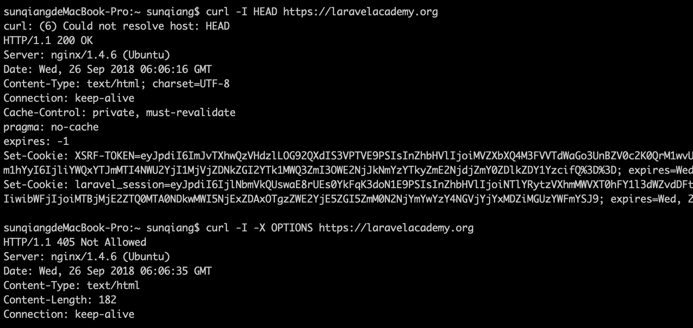

# 表单方法伪造与跨站请求伪造（CSRF）攻击防护

# 表单方法伪造

有时候，我们可能需要手动定义发送表单数据所使用的 HTTP 请求方式，而 HTML 表单仅支持 `GET` 和 `POST` 两种方式，如果要使用其他的方式，则需要自己来定义实现。

### HTTP 请求方式概述

最常见的 HTTP 请求方式自然是 GET 和 POST，相信你已经很熟悉，除此之外，HTTP 协议还定义了很多其他的请求方式，可以在 [HTTP/1.1: Method Definitions](https://www.w3.org/Protocols/rfc2616/rfc2616-sec9.html) 中查看 HTTP/1.1 协议支持的所有请求方式，不同的请求方式用于不同类型的请求：

- OPTIONS：允许客户端查看服务器的性能。这个方法会请求服务器返回该资源所支持的所有 HTTP 请求方法，该方法会用'*'来代替资源名称，向服务器发送 OPTIONS 请求，可以测试服务器功能是否正常。JavaScript 的 XMLHttpRequest 对象进行 CORS 跨域资源共享时，就是使用 OPTIONS 方法发送嗅探请求，以判断是否有对指定资源的访问权限。
- GET：请求指定的页面信息，并返回响应实体。一般来说 GET 方法应该只用于数据的读取，而不应当用于会产生副作用的非幂等的操作中。
- HEAD：与GET方法一样，都是向服务器发出指定资源的请求，但是服务器在响应 HEAD 请求时不会回传资源的内容部分（即响应实体），这样我们在不传输全部内容的情况下，就可以获取服务器的响应头信息。HEAD方法常被用于客户端查看服务器的性能。
- POST：向指定资源提交数据，请求服务器进行处理，如：表单数据提交、文件上传等，请求数据包含在请求体中。POST 方法是非幂等的方法，因为这个请求可能会创建新的资源或修改现有资源。
- PUT：向指定资源位置上传其最新内容，PUT 方法是幂等的方法。通过该方法客户端可以将指定资源的最新数据传送给服务器取代指定的资源的内容，常用于修改指定资源。
- DELETE：请求服务器删除所请求 URI 所标识的资源。DELETE 请求后指定资源会被删除，DELETE 方法也是幂等的。
- TRACE：请求服务器回显其收到的请求信息，该方法主要用于 HTTP 请求的测试或诊断。
- CONNECT：该方法是 HTTP/1.1 协议预留的，能够将连接改为管道方式的代理服务器。通常用于 SSL 加密服务器的链接与非加密的 HTTP 代理服务器的通信。
- PATCH：出现的较晚，它在 2010 年的 RFC 5789 标准中被定义。PATCH 请求与 PUT 请求类似，同样用于资源的更新。二者有以下两点不同：1、PATCH 一般用于资源的部分更新，而 PUT 一般用于资源的整体更新；2、当资源不存在时，PATCH 会创建一个新的资源，而 PUT 只会对已在资源进行更新。

我们可以在命令行中通过 `curl` 进行一些简单的测试：



### Laravel 中的 HTTP 请求方式

Laravel 路由支持通过上面的大部分常用请求方式：

```php
/**
 * Laravel 路由支持的 HTTP 请求方式
 *
 * @var array
 */
public static $verbs = ['GET', 'HEAD', 'POST', 'PUT', 'PATCH', 'DELETE', 'OPTIONS'];
```

并为其提供了相应的路由定义方法：

```php
Route::get($uri, $callback);
Route::post($uri, $callback);
Route::put($uri, $callback);
Route::patch($uri, $callback);
Route::delete($uri, $callback);
Route::options($uri, $callback);
```

在浏览器地址栏访问某个 URL 采用的是 GET 请求，对于其他请求方式要怎么实现呢，一种方法是通过 HTML 表单元素的 `method` 属性，另一种方法是在 JavaScript 脚本中发起 HTTP 请求。对于 HTML 表单属性而言，有一个问题是 HTML 表单仅支持 GET 和 POST 请求，如果要使用其他请求方式怎么办？答案是通过表单方法伪造，下面我们就来介绍如何在 Laravel 中进行表单方法伪造。

### 表单请求方法伪造

要告知 Laravel 当前提交的表单使用的是 GET/POST 之外的其他请求方式，需要在表单中添加一个名为 `_method` 的隐藏字段，字段值是「PUT」、「DELETE」或 「PATCH」。Laravel 在处理提交表单请求时，会将字段值作为请求方式匹配对应的路由。比如下面这个表单：

```
<form action="/task/1" method="POST"> 
    <input type="hidden" name="_method" value="DELETE"> 
</form>
```

Laravel 会将其看作是 DELETE 请求，并将其匹配到对应的 `Route::delete` 路由进行处理，而不是 `Route::post` 路由。

其他请求方式实现方式也是一样，不再赘述。


## CSRF 保护

在开始之前让我们来实现上述表单访问伪造的完整示例，为简单起见，我们在路由闭包中实现所有业务代码：

```
Route::get('task/{id}/delete', function ($id) {
    return '<form method="post" action="' . route('task.delete', [$id]) . '">
                <input type="hidden" name="_method" value="DELETE"> 
                <button type="submit">删除任务</button>
            </form>';
});

Route::delete('task/{id}', function ($id) {
    return 'Delete Task ' . $id;
})->name('task.delete');
```

在 `http://blog.test/task/1/delete` 点击「删除任务」按钮提交表单，会显示 419 异常页面：


初学者可能会困惑，这是什么原因呢？

不得不说，Laravel 5.7 引入的错误提示页面虽然好看，但是错误提示信息太少，这其实是因为默认情况下，为了安全考虑，Laravel 期望所有路由都是「只读」操作的（对应请求方式是 GET、HEAD、OPTIONS），如果路由执行的是「写入」操作（对应请求方式是 POST、PUT、PATCH、DELETE），则需要传入一个隐藏的 Token 字段（`_token`）以避免[跨站请求伪造攻击]（CSRF）。在我们上面的示例中，请求方式是 DELETE，但是并没有传递 `_token` 字段，所以会出现异常。

> 注：跨站请求伪造是一种通过伪装授权用户的请求来攻击授信网站的恶意漏洞，关于跨站请求伪造攻击可以参考维基百科了解明细：<https://zh.wikipedia.org/wiki/%E8%B7%A8%E7%AB%99%E8%AF%B7%E6%B1%82%E4%BC%AA%E9%80%A0>。

避免跨站请求伪造攻击的措施就是对写入操作采用非 GET 方式请求，同时在请求数据中添加校验 Token 字段，Laravel 也是这么做的，这个 Token 值会在渲染表单页面时通过 Session 生成，然后传入页面，在每次提交表单时带上这个 Token 值即可实现安全写入，因为第三方站点是不可能拿到这个 Token 值的，所以由第三方站点提交的请求会被拒绝，从而避免 CSRF 攻击。

在 Laravel 中，和表单方法伪造一样，支持通过 HTML 表单隐藏字段传递这个值：

```
Route::get('task/{id}/delete', function ($id) {
    return '<form method="post" action="' . route('task.delete', [$id]) . '">
                <input type="hidden" name="_method" value="DELETE"> 
                <input type="hidden" name="_token" value="' . csrf_token() . '">
                <button type="submit">删除任务</button>
            </form>';
});
```

这样我们再次访问 `http://blog.test/task/1/delete` 页面点击「删除任务」按钮，即可成功提交表单。

当然，如果你是在 JavaScript 脚本中执行 HTTP 请求，也可以很方便的传递这个 Token 值执行写入操作，首先需要在 HTML `<head>` 标签内新增一个 `<meta>` 元素来存储 Token 值：

```
<meta name="csrf-token" content="<?php echo csrf_token(); ?>" id="csrf-token">
```

然后我们在 JavaScript 脚本中将这个 Token 值放到一个全局请求头设置中，以便每个 HTTP 请求都会带上这个头信息，避免每次发起请求都要添加这个字段。如果你使用的是 jQuery 的话，可以这么做：

```
$.ajaxSetup({
    headers: {
        'X-CSRF-TOKEN': $('meta[name="csrf-token"]').attr('content')
    } 
});
```

如果你使用的是 Vue 的话，可以这么做：

```
Vue.http.interceptors.push((request, next) => {
    request.headers['X-CSRF-TOKEN'] = document.querySelector('#csrf-token').getAttribute('content');
    next();
});
```

Laravel 会在每次请求都检查请求头中是否包含 `X-CSRF-TOKEN`，并检查其值是否和 Session 中的 Token 值是否一致。

> 注：如果你使用了 Laravel 自带的 `assets/js/bootstrap.js`， 则上述 Vue 请求头设置不需要自己编写，因为 `bootstrap.js` 中已经包含了这个逻辑。

#### 排除指定 URL 不做 CSRF 保护

对于应用中某些第三方回调路由，如第三方登录或支付回调，无法做 Token 校验，需要将这些授信路由排除在 CSRF 校验之外，这个功能可以参考[官方文档](https://laravelacademy.org/post/9540.html#toc_1)实现，很简单，就不再做额外的补充了。

有时候我们需要从 CSRF 保护中间件中排除一些 URL，例如，如果你使用了第三方支付系统（如支付宝或微信支付）来处理支付并用到他们提供的回调功能，这时候就需要从 Laravel 的 CSRF 保护中间件中排除回调处理器路由，因为第三方支付系统并不知道要传什么 token 值给我们定义的路由。

通常我们需要将这种类型的路由放到文件 `routes/web.php` 之外，比如 `routes/api.php`。不过，如果必须要加到 `routes/web.php` 中的话，你也可以在 `VerifyCsrfToken` 中间件中将要排除的 URL 添加到 `$except` 属性数组：

```
<?php

namespace App\Http\Middleware;

use Illuminate\Foundation\Http\Middleware\VerifyCsrfToken as Middleware;

class VerifyCsrfToken extends Middleware
{
    /**
     * 从 CSRF 验证中排除的 URL
     *
     * @var array
     */
    protected $except = [
        'alipay/*',
        'http://example.com/foo/bar',
        'http://example.com/foo/*',
    ];
}
```

> 注：运行测试时 CSRF 中间件会自动禁止。