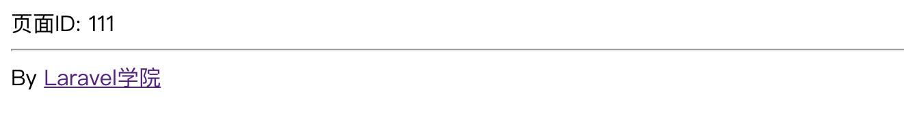

# 基本使用与数据传递

## Laravel 视图概述

我们在之前几篇教程中定义的路由大多数返回的都是纯字符串文本或者字符串拼接的 HTML，这主要是为了测试方便，在实际开发中，除了 API 路由返回指定格式数据对象外，大部分 Web 路由返回的都是视图，以便实现更加复杂的页面交互，我们在前面已经看到过了视图的定义方式：

```php
return view('以.分隔的视图模板路径');
```

我们将在这篇教程中具体讨论试图实现技术。

视图是 [MVC 模式](https://laravelacademy.org/post/9614.html#toc_0)中的 View 部分，大部分视图都应该是 HTML 格式文本，在 Laravel 中，支持三种格式的视图文件解析：CSS 文件，原生 PHP 和 Blade 模板（下一篇教程将会讨论）。从文件名扩展就可以区分它们，CSS 文件后缀是 `.css`，通过文件引擎解析，原生 PHP 文件后缀是 `.php`，通过 PHP 引擎解析，Blade 模板文件后缀是 `.blade.php`，通过 Blade 引擎解析（底层实现逻辑可参考 `vendor/laravel/framework/src/Illuminate/View/ViewServiceProvider.php` 中的 `registerEngineResolver`方法）。

Laravel 在解析视图时是通过实时解析文件后缀名再调用相应的引擎进行处理的，视图文件位于 `resources/views` 目录下，对于多级子目录以「.」号分隔，并且引用时不带文件后缀名。我们可以定义三个路由进行简单的测试：

```php
// php 
Route::get('user/{id?}', function ($id = 1) {
    return view('user.profile', ['id' => $id]);
})->name('user.profile');

// blade
Route::get('page/{id}', function ($id) {
    return view('page.show', ['id' => $id]);
})->where('id', '[0-9]+');

// css
Route::get('page/css', function () {
    return view('page.style');
});
```

然后在 `resources/views` 目录下创建 `user/profile.php` 文件：

```
用户ID: <?php echo $id;?>
```

在 `resources/views` 目录下创建 `page/show.blade.php` 文件：

```
页面ID: {{ $id }}
```

最后在 `resources/views` 目录下创建 `page/style.css` 文件：

```
body {
    background: gray;
}
```

当我们按照路由在浏览器中查看返回视图时，都可以正常解析。在实际开发过程中，我们大多会使用 Blade 模板，因为其提供了丰富的语法从而简化了视图文件的编写。

## 视图返回与参数传递

Laravel 提供了多个语法糖在路由中返回视图，如辅助函数 `view` 或 `View::make` 方法，还可以注入 `Illuminate\View\View Factory` 类（最底层实现），通常我们使用辅助函数 `view`，因为最简洁：

```
// 使用 view 辅助函数
Route::get('/', function () { 
    // 该函数会在 resources/views 目录下查找 home.blade.php 或 home.php 视图文件，
    // 加载文件内容并解析 PHP 变量或语句，然后传递给响应，最终呈现给用户
    return view('home'); 
});
```

如果要传递数据给视图，可以这么做（多个数据以数组方式传递），这样就可以将 `tasks` 数据变量传递到视图以便在视图中进行引用：

```
return view('home')->with('tasks', Task::all());
```

还可以这么做：

```
return view('home', ['tasks' => Task:all()]);
```

推荐使用后者，因为简单。

## 在视图间共享变量

有时候在不同视图间传递同一个数据变量很麻烦，是否可以做到一次定义，多处使用呢？答案是可以，通过视图对象提供的 `share` 方法即可实现，我们可以在某个服务提供者如 `AppServiceProvider` 的 `boot` 方法中定义共享的视图变量：

```
view()->share('siteName', 'Laravel学院');
view()->share('siteUrl', 'https://laravelacademy.org');   
```

然后就可以在各个视图中使用 `$siteName` 和 `$siteUrl` 这两个变量了（其它变量定义方式类似），而无需每次传递这个数据变量，比如我们在不修改路由定义的前提下修改上述 `resources/views/page/show.blade.php` 文件：

```
页面ID: {{ $id }}
<hr>
By <a href="{{ $siteUrl }}">{{ $siteName }}</a>
```

这样，在浏览器中访问 `http://blog.test/page/111`，就能看到如下输出了：



对于那些位于页头、页尾、面包屑或导航条中的数据变量，使用共享变量的方式定义将会很方便。

> 注：本教程是视图官方文档的补充，更多关于视图的使用可以参考[官方文档](https://laravelacademy.org/post/9544.html)，比较简单，这里就不赘述了。

