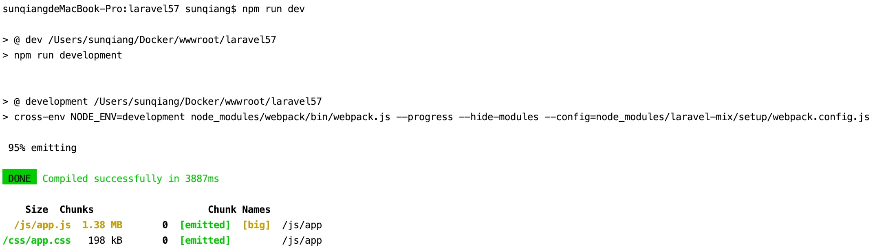

# 在 Laravel 项目中使用 Bootstrap 框架

## Laravel 如何引入 Bootstrap

如官方文档所言，Laravel 并不强制你使用 CSS 框架，但是开箱提供了对 [Bootstrap](http://www.bootcss.com/) 的支持，在 `resources/js/bootstrap.js`（在 Laravel 5.7 之前的版本位于 `resources/assets/js/bootstrap.js`）中，我们可以看到对 `bootstrap` js库的引入：

```js
try {
    window.$ = window.jQuery = require('jquery');

    require('bootstrap');
} catch (e) {}
```

然后在 `resources/js/app.js` 中又引入了这个 `bootstrap.js` 文件：

```
require('./bootstrap'); 
```

这样我们在编译前端资源的时候就会将 Bootstrap 相关 js 文件加载进来。对于 Bootstrap 所需 CSS 文件，会在 `resources/sass/app.scss` 中引入：

```
@import '~bootstrap/scss/bootstrap';
```

从 Laravel 5.5 开始 Laravel 使用的 Bootstrap 版本就是 `4.*`，这个可以在项目根目录下的 `package.json` 中查看：

```
"devDependencies": {
    "axios": "^0.18",
    "bootstrap": "^4.0.0",
    "cross-env": "^5.1",
    "jquery": "^3.2",
    "laravel-mix": "^2.0",
    "lodash": "^4.17.5",
    "popper.js": "^1.12",
    "vue": "^2.5.7"
}
```

## 运行 npm install 安装 Bootstrap 库

上述 `package.json` 可类比为前端的 `composer.json`，我们通过 `npm install` 安装该文件中定义的依赖，就好比运行 `composer install` 安装 `composer.json` 中定义的依赖，只不过一个是安装的是 JavaScript 库，一个是安装的是 PHP 库。

如果你还没有在项目根目录下运行过 `npm install` 初始化项目依赖的前端资源，现在可以运行它，当然在此之前，需要在你的系统中安装最新版本的 [Node.js](https://nodejs.org/en/)。如果你使用的开发环境是 Homestead 的话，那么系统已经为你安装好了，去 Homestead 中执行即可；如果你使用的是 Laradock 的话，需要在 `laradock/.env` 中设置 `WORKSPACE_INSTALL_NODE` 选项为 `true`：

```
WORKSPACE_INSTALL_NODE=true
```

然后重新构建 `workspace` 容器，具体可参考[Laradock文档](https://laradock.io/documentation/#install-node-nvm)。如果你是在 Windows 或 Mac 原生环境下使用 `npm`命令，需要去[官网](https://nodejs.org/en/download/)选择对应系统的最新版本安装，安装完 Node 后，`npm` 也会随之安装，不必再单独安装。

运行 `npm install` 会在项目根目录下新增一个 `node_modules` 目录，并将项目依赖的所有 JavaScript 库安装到该目录下，其中就包括 `bootstrap`：


## 运行 npm run dev 编译前端资源

接下来，我们就可以运行 `npm run dev` 命令通过 Laravel Mix 来编译前端资源了，该命令定义在 `package.json`中：


该命令最终运行的是 `npm run development` 命令，意为在开发环境对前端资源进行编译，如果需要的话你可以在这里对命令参数进行修改，如果是在生产环境，需要运行 `npm run prod` 命令，如果在开发环境中想要修改文件后自动编译资源可以运行 `npm run watch` 命令。

Laravel Mix 是对 [Webpack](https://www.webpackjs.com/) 进行封装后提供给 Laravel 项目使用的前端打包工具，Webpack 是目前最新的、广泛使用的前端资源打包工具（之前还有 Grunt、Gulp 等），能够以模块方式处理所有前端资源，Laravel Mix 对其提供的功能进行了封装从而避免后端开发人员大量编写 Webpack 配置命令，大多数时候我们需要在 `resources/js/app.js` 和 `resources/sass/app.scss` 中编写代码，引入其它模块，然后运行 `npm run dev` 就可以了，无需任何额外配置。后面我们会专门讲一下 Laravel Mix 的各种使用，现在你只需要知道它是怎么回事就好了。

Laravel Mix 的配置文件就是项目根目录下的 `webpack.mix.js`：

```
const mix = require('laravel-mix');

mix.js('resources/js/app.js', 'public/js')
   .sass('resources/sass/app.scss', 'public/css');
```

目前，它非常之简洁，从 `node_modules` 中引入 `laravel-mix` 库，然后运用它提供的 `js` 和 `sass` 方法将 `resources/js/app.js` 编译打包后输出到 `public/js/app.js`，将 `resources/sass/app.scss` （Sass文件）编译打包后输出到 `public/css/app.css`：



这样，我们就可以项目的前端文件下引入 `/css/app.css` 和 `/js/app.js` 使用 Bootstrap 提供的样式和 JavaScript 组件了。后面我们将在多个地方基于 Bootstrap 实现前端 CSS 视觉效果优化。