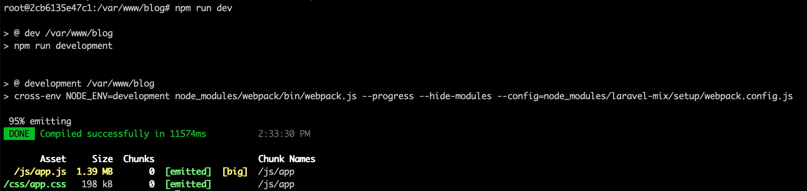
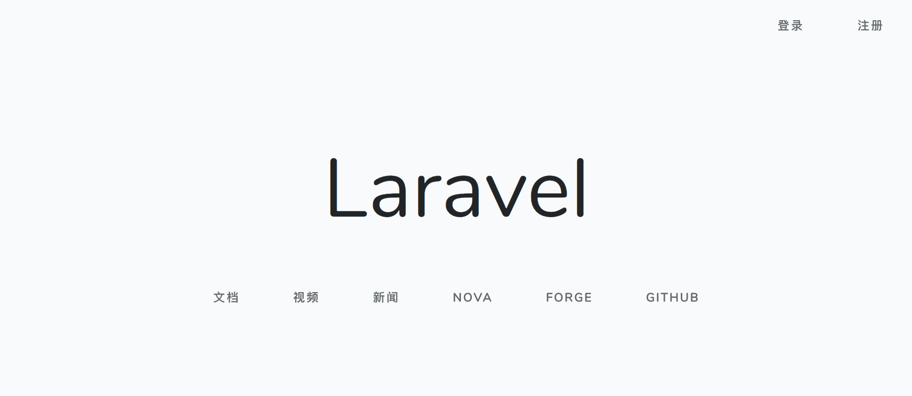

# 在 Laravel 项目中编写第一个 Vue 组件

和 CSS 框架一样，Laravel 不强制你使用什么 JavaScript 客户端框架，但是开箱对 Vue.js 提供了良好的支持，如果你更熟悉 React 的话，也可以将默认的脚手架代码替换成 React，实现细节参考[官方文档](https://laravelacademy.org/post/9552.html#toc_4)。

学院拥抱的是 Vue.js 框架，所以后续前端相关教程都会基于 Vue.js 编写，有关 Vue.js 的入门教程，可以阅读[官方文档](https://cn.vuejs.org/v2/guide/)，值得一提的是，Vue.js 的作者尤雨溪是中国人，所以该框架从文档角度对中文很友好，关于如何快速入门 Vue.js 框架，作者在知乎上也有建议的学习路线：<https://zhuanlan.zhihu.com/p/23134551>，可以说是很贴心了，大家遵循这个路线，相信很快可以入门 Vue.js 的开发。

既然已经有这么丰富的资源，关于 Vue.js 的介绍和使用，我这里就不赘述了，我们重点来介绍如何在 Laravel 中通过 Vue 组件构建前端页面和功能。学习过 Vue.js 之后，你会知道通过 [Vue Loader](https://vue-loader.vuejs.org/zh/#vue-loader-%E6%98%AF%E4%BB%80%E4%B9%88%EF%BC%9F) 我们可以在前端通过单文件组件的格式编写 Vue 组件，然后注册、引用，在 Laravel 中我们也是这么干的，这可以极大提高前端代码的复用性、可读性和可维护性，下面我们以 Laravel 默认的欢迎页面为例，将其改为通过 Vue 组件来实现，希望可以帮助你快速入门如何在 Laravel 中编写 Vue 组件。

首先我们在 `resources/js/components` 目录下新增一个 Vue 组件文件 `WelcomeComponent.vue`，初始化代码如下：

```vue
<style scoped>
</style>

<template>
</template>

<script>
    export default {}
</script>
```

我们会将该组件的样式代码定义在 `<style>` 标签中（指定 `lang="scss"` 可支持 Sass 语法），`scoped` 表示这段 CSS 样式代码只对当前组件有效。

在 `<template>` 标签中定义 HTML 模板代码，以及在 `<script>` 中定义组件的 JavaScript 代码以及导出模块。

然后我们将默认欢迎视图中的样式和 HTML 代码迁移过来，这样，最终的 `WelcomeComponent.vue` 组件代码看起来是这样的：

```vue
<style scoped>
    html, body {
        background-color: #fff;
        color: #636b6f;
        font-family: 'Nunito', sans-serif;
        font-weight: 200;
        height: 100vh;
        margin: 0;
    }

    .full-height {
        height: 100vh;
    }

    .flex-center {
        align-items: center;
        display: flex;
        justify-content: center;
    }

    .position-ref {
        position: relative;
    }

    .top-right {
        position: absolute;
        right: 10px;
        top: 18px;
    }

    .content {
        text-align: center;
    }

    .title {
        font-size: 84px;
    }

    .links > a {
        color: #636b6f;
        padding: 0 25px;
        font-size: 12px;
        font-weight: 600;
        letter-spacing: .1rem;
        text-decoration: none;
        text-transform: uppercase;
    }

    .m-b-md {
        margin-bottom: 30px;
    }
</style>

<template>
    <div class="flex-center position-ref full-height">
        <div class="top-right links">
            <a href="/login">登录</a>
            <a href="/register">注册</a>
        </div>

        <div class="content">
            <div class="title m-b-md">
                Laravel
            </div>

            <div class="links">
                <a href="https://laravel.com/docs">文档</a>
                <a href="https://laracasts.com">视频</a>
                <a href="https://laravel-news.com">新闻</a>
                <a href="https://nova.laravel.com">Nova</a>
                <a href="https://forge.laravel.com">Forge</a>
                <a href="https://github.com/laravel/laravel">GitHub</a>
            </div>
        </div>
    </div>
</template>

<script>
    export default {}
</script>
```

注意，Vue 组件只支持 JavaScript 代码，不支持 Blade 语法，所以我们将对应的语法和指令做了移除和更新处理。

然后我们在 `resources/js/app.js` 中全局注册这个组件以便可以在视图文件中应用：

```vue
...

Vue.component('welcome-component', require('./components/WelcomeComponent.vue'));

const app = new Vue({
    el: '#app'
});
```

我们通过 `Vue.component()` 方法全局注册了 `welcome-component` 组件，第一个参数是组件名，第二个参数是引入组件文件的位置，这样我们就可以在 `resources/views/welcome.blade.php` 视图文件中通过组件名使用这个组件了，修改 `welcome.blade.php` 代码如下：

```vue
<!doctype html>
<html lang="{{ app()->getLocale() }}">
    <head>
        <meta charset="utf-8">
        <meta name="viewport" content="width=device-width, initial-scale=1">

        <title>Laravel</title>

        <link href="{{ asset('css/app.css')  }}" rel="stylesheet">
    </head>
    <body>
        <div id="app">
            <welcome-component></welcome-component>
        </div>
        <script src="{{ asset('js/app.js') }}"></script>
    </body>
</html>
```

移除了之前的 CSS 代码，将其改为通过编译后的外部文件引入（Laravel Mix 会自动识别 Vue 组件中的 CSS 代码并将其编译到 `app.css` 文件中）。移除了之前的 HTML 代码，将其改为通过 `welcome-component` 组件引入，并且将组件挂载到 `id="app"` 的 `div` 容器内，这是我们在 `app.js` 中定义的 Vue 容器，如果组件不挂载到这个容器将不会生效。最后我们引入了编译后的 `app.js` 文件，完成 Vue 组件的挂载和渲染。

这样，我们就将之前默认实现的欢迎页面改写为了通过 Vue 组件构建的页面，在项目根目录下运行 `npm run dev` 重新编译前端资源（如果之前没有运行过 `npm install` 的话，需要先运行这个命令）：



编译完成后，再次访问应用首页，就可以看到新的由 Vue 组件驱动的欢迎页面：



如果你的 Chrome 浏览器安装过 Vue DevTools 扩展，F12 就可以看到页面包含了 `WelcomeComponent` 组件：


好了，我们已经完成了在 Laravel 中编写第一个 Vue 组件，很简单吧，有了 Vue 组件，以后前端开发和维护会更加高效，想要在 Laravel 中结合 Vue 构建更加复杂的前后端分离应用，可以阅读学院提供的《[基于 Laravel + Vue 构建 API 驱动的前后端分离应用系列](https://laravelacademy.org/api-driven-development-laravel-vue)》教程深入工程实践。