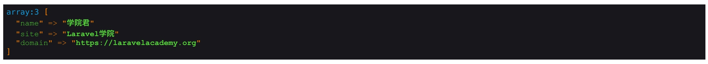

# 通过 Request 对象实例获取用户请求数据

到目前为止，我们在教程中所提供的大部分是静态页面。作为一门主要用于构建 Web 网站的动态语言，PHP 不仅可以处理静态页面，更重要的功能是处理用户动态请求，这才是一个 Web 2.0 网站最灵动的部分，从留言板到博客评论、到形形色色的社交网站、问答网站，无不是用户创造的内容让互联网更加绚烂多姿、五彩缤纷。而作为最流行的 PHP 框架，Laravel 自然也是为处理用户请求提供了丰富的工具集，从收集、验证、到过滤、编排，可谓是一应俱全，接下来，我们将通过三四篇教程的篇幅来为你详细介绍如何在 Laravel 项目中处理用户请求，首先，我们从收集用户请求数据开始。

## 注入请求对象

在 Larvavel 中，访问用户输入数据最常用的方式，就是通过注入到控制器方法中的 `Illuminate\Http\Request` 对象实例，通过该实例，我们可以访问所有用户请求数据，不管是什么方式，什么格式：

```php
<?php

namespace App\Http\Controllers;

use Illuminate\Http\Request;

class RequestController extends Controller
{
  public function form(Request $request)
  {
    // 通过 $request 实例获取请求数据
  }
}
```

然后在路由文件中定义一个指向该控制器方法的路由：

```php
Route::post('form', 'RequestController@form');
```

> 注：除此之外，Laravel 还提供了 `Request` 门面和全局辅助函数 `request()` ，本质都是调用 `Illuminate\Http\Request` 对象实例，只不过形式不一样而已，所以我们一般就是用 `Request` 对象实例。 

接下来，我们就可以在控制器方法中通过 `$request` 对象实例获取用户请求了，`Request` 类提供了多种方法来访问用户请求数据。

## 获取用户请求数据

### 获取所有请求数据

我们可以通过 `$request->all()` 获取所有请求数据：

```php
public function form(Request $request)
{
  // 通过 $request 实例获取请求数据
  dd($request->all());
}
```

为了测试这段代码，我们可以在 Postman 中模拟请求数据，不过在测试前需要在 `app/Http/Middleware/VerifyCsrfToken.php` 中间件中将测试路由排除在外，否则会因为 POST 请求触发 CSRF 攻击防护验证而导致请求失败：

```php
protected $except = [
    '/form*'
];
```

然后我们在 Postman 中模拟发起对 `/form` 路由的请求，同时在 URL 和请求表单中传入请求数据：


可见，不管是 URL 路径中的 GET 请求数据，还是表单中的 POST 请求数据，`$request->all()` 都可以获取到。

### 只获取部分请求数据

如果只想获取部分请求数据，可以通过 `$request` 实例上的 `except` 或 `only` 方法，这两个方法是相反的，一个用于排除指定字段，一个用于获取指定字段：

```php
$request->except('id');
$request->only(['name', 'site', 'domain']);
```

上面这两个写法获取的结果是一样的：



### 判断是否包含指定字段

除此之外，我们还可以通过 $request 实例上的 `has` 或 `exists` 方法判断某个字段是否存在：

```php
$id = $request->has('id') ? $request->get('id') : 0;
```

`exists` 方法是 `has` 方法的别名，两者调用方式一样，功能完全等效。

### 获取指定请求字段值

上面我们已经给出了获取指定字段值的一个方法 `get` ，该方法只能获取通过 GET 请求传递的参数，同理，如果是 POST 请求的话，我们可以通过 `post` 方法获取对应字段值，此次之外，我们还可以通过 `input` 方法值，该方法可以从所有请求方式中获取给定字段的值，所以更加通用：

```php
$id = $request->input('id');
$name = $request->input('name');
```

我们还可以为 `input` 方法传递第二个参数作为默认值，如果请求字段为空的话，则使用该默认值：

```php
$site = $request->input('site', 'Laravel学院');
```

### 获取数组输入字段值

有的时候，我们在表单中传递给后端的可能是一个数组，比如一些复选框选中项，这些表单输入框的 `name` 值通常是 `name[]`，如 `books[]` ，这个时候传递给后端的 `books` 数据就是数组格式：


我们可以通过「.」来分别获取每个数组元素：

```
$request->input('books.0');
$request->input('books.1');
```

甚至还支持更深层级的嵌套：

```
dump($request->input('books.0.author'));
dump($request->input('books.1'));
```

此时我们可以这样设置请求数据：


### 获取 JSON 输入字段值

随着基于 JavaScript 的单页面应用（SPA）应用的流行，除了传统表单请求提交的 POST/GET 数据之外，JSON 格式的请求数据也越来越常见，Laravel 支持对 JSON 格式请求数据的处理，我们还是在 Postman 中模拟提交 JSON 请求：


获取 JSON 请求数据中的字段值和正常表单请求并无二致：

```
dump($request->input('site'));
dump($request->input('books.0.author'));
dump($request->input('books.1'));
```

最终发起请求后打印数据如下：


所以说，`$request->input()` 确实足够智能，无愧于「获取任何请求输入字段值」的称号。

> 注：需要注意的是，如果发起 POST 请求提交 JSON 格式请求数据时，请求头没有设置为 `application/json` 的话，`$request->input()` 方法将不会以 JSON 格式解析数据。这个时候，我们需要显式地通过 `$request->json()` 来获取 JSON 格式数据。

## 获取路由参数值

除了 URL 查询字符串以及表单提交数据之外，你可能会忽视还有一种形式的输入参数，就是[路由参数](https://laravelacademy.org/post/9611.html#toc_3)，我们一般显式将其作为控制器方法参数或者定义路由的匿名函数参数传入，以便在代码中获取。作为定义路由的匿名函数参数之间已经见过很多了，这里我们来演示下作为控制器方法参数传入，以及如何通过 `Request` 对象实例获取。

首先改写 `/form` 路由定义如下：

```
Route::post('form/{id}', 'RequestController@form');
```

然后我们在对应控制器方法中传入这个路由参数（要放到 `$request` 注入参数后面）：

```
public function form(Request $request, $id)
{
    // ...
}
```

这样，我们就可以在控制器方法中使用这个 `$id` 参数了，它的值会随着路由参数值传递过来。除此之外，我们还可以通过 `$request->segment()` 方法获取 `$id` 的值：

```
dump($request->segments());
dump($id == $request->segment(2));  # 索引基数从1开始
```

我们通过 `$request->segments()` 可以看到 `$id` 对应索引值，然后将该索引值+1传入 `$request->segment()`函数即可获取到路由参数 `$id` 的值。上面的代码输出结果如下：

