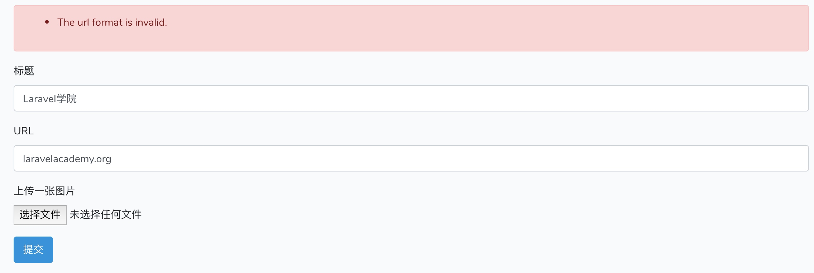
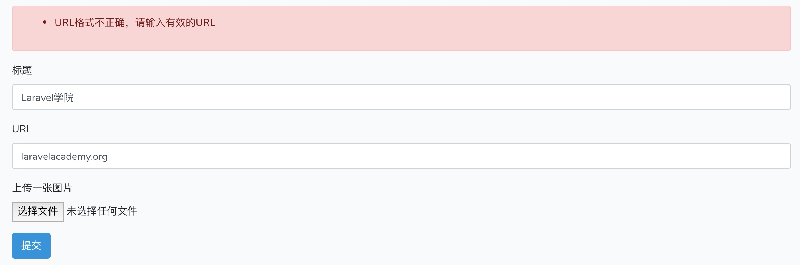
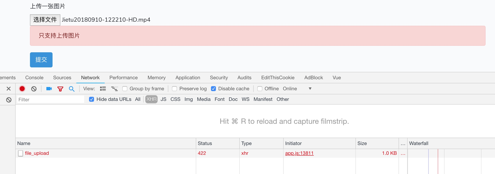

# 在 Laravel 控制器中进行表单请求字段验证

在 Web 应用中，用户提交的数据往往是不可预测的，因此一个非常常见的需求是对用户提交的表单请求进行验证，以确保用户输入的是我们所期望的数据格式。很多 Web 框架都对此功能专门提供了工具集，Laravel 也不例外，而且这个工具集异常丰富，基本上涵盖了目前主流的所有验证规则，即使是一些非常个性化的验证，也可以基于 Laravel 验证类的扩展功能来自定义验证规则，非常强大。接下来，我们就一起来看看如何在 Laravel 中对表单请求进行验证。

作为一个灵活的框架，Laravel 提供了多种方式对表单请求进行验证，你可以在控制器中通过 `$this->validate()` 方法验证用户请求，也可以通过单独的表单验证类定义验证规则，再将其注入到相应的控制器方法，我们由简入繁，先从 `validate()` 方法说起。

## 通过 validate 方法进行验证

### 在控制器中编写验证逻辑

通过 `php artisan make:controller` 生成的所有控制器默认都继承自基类 `App\Http\Controllers\Controller` ，因此所有这些控制器都使用了 `validatesRequests` Trait，进而可以使用该 Trait 中提供的 `validate()` 方法对请求字段进行验证。

首先我们调整下 `routes/web.php` 中的表单提交路由，将其命名为 `form.submit` ：

```php
Route::post('form', 'RequestController@form')->name('form.submit');
```

然后，修改 `resources/views/request/form.blade.php` 视图中的表单，新增两个字段，并将表单提交 URL 修改为上面定义的路由：

```html
<form action="{{ route('form.submit') }}" method="POST">
    <div class="form-group">
        <label>标题</label>
        <input type="text" name="title" class="form-control" placeholder="输入标题">
    </div>
    <div class="form-group">
        <label>URL</label>
        <input type="text" name="url" class="form-control" placeholder="输入URL">
    </div>
    <fileupload-component></fileupload-component>
    <button type="submit" class="btn btn-primary">提交</button>
</form>
```

然后到控制器 `RequestController` 修改 `form` 方法如下：

```php
public function form(Request $request, $id)
{
    $this->validate($request, [
        'title' => 'bail|required|string|between:2,32',
        'url' => 'sometimes|url|max:200',
        'picture' => 'nullable|string'
    ]);

    return response('表单验证通过');
}
```

在该方法中，第一个参数是用户请求实例，第二个参数是以数组形式定义的请求字段验证规则，关于所有字段验证规则及其说明你可以在[验证规则文档](https://laravelacademy.org/post/9547.html#toc_17)中查看，这里我们定义 `title` 字段是必填的，格式是字符串，且长度介于2~32之间，并且通过`bail` 指定任何一个验证规则不通过则立即退出，不再做后续校验；`url` 字段通过 `sometimes` 指定为存在时验证，如果填写了的话格式必须是 URL，且长度不能超过 200，每填写的话则不验证；最后图片路径允许为空。不同的验证规则之间通过 `|` 分隔。

如果表单验证通过，则继续向下执行，如果表单验证不通过，会抛出 `ValidationException` 异常，具体怎么处理这个异常要看请求方式，如果是 Ajax 请求的话，将会返回包含错误信息的 JSON 响应（错误码为 `422`），如果是正常的 POST 表单请求的话，会重定向到表单提交页，并包含所有用户输入和错误信息，以便重新渲染已填写表单并显示错误信息。

下面我们分别以 POST 提交表单和 Ajax 请求为例简单演示下验证错误信息的读取，首先来看 POST 提交表单。

### 在表单页面显示错误信息

我们需要修改下 `form.blade.php` 中的表单代码，在 Blade 模板中可以通过 `$errors` 获取验证错误信息，通过 `old()` 辅助函数可以获取用户上次输入数据：

```
<div id="app">
   <div class="container">
       @if ($errors->any())
           <div class="alert alert-danger">
               <ul>
                   @foreach ($errors->all() as $error)
                       <li>{{ $error }}</li>
                   @endforeach
               </ul>
           </div>
       @endif
       <form action="{{ route('form.submit') }}" method="POST">
           <div class="form-group">
               <label>标题</label>
               <input type="text" name="title" class="form-control" placeholder="输入标题" value="{{ old('title') }}">
           </div>
           <div class="form-group">
               <label>URL</label>
               <input type="text" name="url" class="form-control" placeholder="输入URL" value="{{ old('url') }}">
           </div>
           <fileupload-component></fileupload-component>
           <button type="submit" class="btn btn-primary">提交</button>
       </form>
   </div>
</div>
```

这样，刷新表单页面后，提交数据，验证失败的情况下，就可以回显用户上次输入数据和验证错误信息了：



感觉提示不友好？我们可以在 $this->validate() 方法中的设置第三个参数来自定义错误消息：

```
$this->validate($request, [
   'title' => 'bail|required|string|between:2,32',
   'url' => 'sometimes|url|max:200',
   'picture' => 'nullable|string'
], [
   'title.required' => '标题字段不能为空',
   'title.string' => '标题字段仅支持字符串',
   'title.between' => '标题长度必须介于2-32之间',
   'url.url' => 'URL格式不正确，请输入有效的URL',
   'url.max' => 'URL长度不能超过200',
]);
```

这样，再次提交数据，错误信息就更加友好了：



### AJAX 请求错误信息提示

接下来我们来看 Ajax 请求验证错误信息的获取和提示，我们以[上一篇教程](https://laravelacademy.org/post/9677.html)中的文件上传为例。

首先在 `RequestController` 中修改 `fileUpload` 方法，设置上传文件字段的验证规则：

```
$this->validate($request, [
    'picture' => 'bail|required|image|mimes:jpg,png,jpeg|max:1024'
],[
    'picture.required' => '请选择要上传的图片',
    'picture.image' => '只支持上传图片',
    'picture.mimes' => '只支持上传jpg/png/jpeg格式图片',
    'picture.max' => '上传图片超过最大尺寸限制(1M)'
]);
```

然后到 `FileUploadComponent.vue` 中修改错误提示代码：

```
axios.post(
      '/form/file_upload',
      formData,
      {
          headers: {
              'Content-Type': 'multipart/form-data'
          }
      }
  ).then(function (response) {
      $('#picture-path').val(response.data.path);
      $('#picture-preview').html('')
  }).catch(function (error) {
      if (error.response.status === 422) {
          $.each(error.response.data.errors, function (field, errors) {
              $('#picture-preview').append('<div class="alert alert-danger">' + errors[0] + '</div>');
          });
      }
      console.log(error);
});
```

这样当我们上传不符合条件的文件时，就会进行错误提示了：



如果你使用的时 jQuery 的话，处理逻辑也是类似，根据错误码 422 进行处理。

## 通过 Validator::make 方法进行验证

如果你使用过 Laravel 自带脚手架代码实现登录认证的话，你可能会留意到 `RegisterController` 中对用户注册请求进行验证的时候，使用的是这样的验证代码：

```
protected function validator(array $data)
{
    return Validator::make($data, [
        'name' => 'required|string|max:255',
        'email' => 'required|string|email|max:255|unique:users',
        'password' => 'required|string|min:6|confirmed',
    ]);
} 
```

这其实是通过 `Validator` 门面实现的验证，原理和上面通过 `$this->validate()` 一样，这是形式不同，这样做的一个好处是在非控制器类中也可以对字段进行验证，因为 `validate` 毕竟是 `ValidatesRequests` 中的方法，没有使用这个 Trait 的话就不能在代码中这么调用。如果我们将上面的表单请求改写为 `Validator::make` 来实现的话，代码是这样的：

```
Validator::make($request->all(), [
   'title' => 'bail|required|string|between:2,32',
   'url' => 'sometimes|url|max:200',
   'picture' => 'nullable|string'
], [
   'title.required' => '标题字段不能为空',
   'title.string' => '标题字段仅支持字符串',
   'title.between' => '标题长度必须介于2-32之间',
   'url.url' => 'URL格式不正确，请输入有效的URL',
   'url.max' => 'URL长度不能超过200',
])->validate();
```

除了第一个参数和最后要手动调动 `validate()` 方法外，其它参数都是一模一样的，底层的处理方式也是一样，所以其它地方的代码都不需要做任何更改。如果是在控制器中进行请求验证都可以，具体使用哪种方式，看你个人偏好了，如果是在其它地方比如服务类，可能 `Validator::make` 更合适些。

对于大量请求字段，或者复杂的请求验证，都写到控制器方法中显然会导致控制器的代码变得臃肿，可维护性也比较差，所以我们下一篇教程将讨论如何将验证代码移出控制器这一话题，并且根据项目需求灵活实现自定义验证规则。