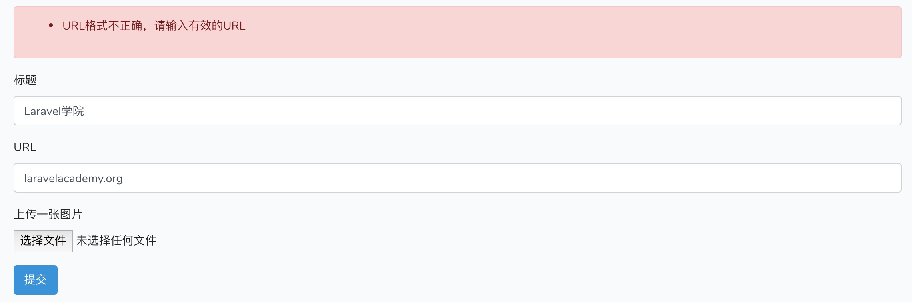

# 通过表单请求类实现请求字段验证和错误提示

在[上一篇教程](https://laravelacademy.org/post/9680.html)中，我们已经演示了如何在控制器方法中对表单请求字段进行验证，并且提到如果请求字段很多很复杂，都写到控制器方法里面会导致控制器臃肿，从单一职责原则来说需要将表单请求验证拆分出去，然后通过类型提示的方式注入到控制器方法。今天，我们就来实现这个拆分，Laravel 提供了表单请求类的功能帮助我们快速完成这一架构调整。

## 定义表单请求类

首先，我们需要需要创建一个表单请求类，这可以通过 Artisan 命令来完成：

```
php artisan make:request SubmitFormRequest
```

该命令会在 `app/Http/Requests` 目录下新增一个 `SubmitFormRequest.php` 文件，并且初始化代码如下：

```php
namespace App\Http\Requests;

use Illuminate\Foundation\Http\FormRequest;

class SubmitFormRequest extends FormRequest
{
    /**
     * Determine if the user is authorized to make this request.
     *
     * @return bool
     */
    public function authorize()
    {
        return false;
    }

    /**
     * Get the validation rules that apply to the request.
     *
     * @return array
     */
    public function rules()
    {
        return [
            //
        ];
    }
}
```

`authorize()` 方法用于检查用户权限，如果返回 `false` 则表示用户无权提交表单，会抛出权限异常中止请求，现在我们将其调整为返回 `true` 即可，然后我们在 `rules()` 方法中定义请求字段验证规则，比如我们可以将上一篇教程中的字段验证规则移到该方法中：

```php
public function rules()
{
    return [
        'title' => 'bail|required|string|between:2,32',
        'url' => 'sometimes|url|max:200',
        'picture' => 'nullable|string'
    ];
}
```

然后你可能要问那自定义错误提示消息在哪里定义呢？既然是在类中，自然可以通过方法来实现，我们只需重写父类的 `messages()` 方法即可：

```php
public function messages()
{
    return [
        'title.required' => '标题字段不能为空',
        'title.string' => '标题字段仅支持字符串',
        'title.between' => '标题长度必须介于2-32之间',
        'url.url' => 'URL格式不正确，请输入有效的URL',
        'url.max' => 'URL长度不能超过200',
    ];
}
```

这样，我们就将控制器方法中的表单请求字段验证逻辑全部迁移过来了。

## 表单请求类的执行

接下来，问题又来了，这段表单请求字段验证逻辑放在哪里执行呢？答案是将其以类型提示的方式注入到请求路由对应的控制器方法即可，在本例中，就是 `RequestController` 的 `form` 方法：

```
public function form(SubmitFormRequest $request)
{
    return response('表单验证通过');
}
```

Laravel 底层在解析这个控制器方法的参数时，如果发现这个请求是一个表单请求类，则会自动执行其中定义的字段验证规则对请求字段进行验证，如果验证成功则继续执行控制器中的方法，否则会抛出验证失败异常，和我们上一篇在控制器方法中实现验证逻辑的处理一样。由于该表单请求类也是 `Illuminate\Http\Request` 的子类，所以后续获取请求字段值也可以通过 `$request` 来获取，将表单请求验证和请求实例参数合二为一，非常方便。

我们测试下表单请求，会发现和在控制器方法中通过 `$this->validate()` 验证字段的结果一样：



这样一来，以后我们就可以在表单请求类中维护字段验证逻辑了，完成了请求验证和控制器的解耦。

## 数组请求字段验证

某些场合下，我们的表单请求中可能会包含数组字段，比如 `books[]` 或者 `books[author]`，甚至可能是更加复杂的 `books[test][author]`，对于这种数组字段的验证，在 Laravel 中也不在话下：

```
'books' => 'required|array',   # 验证 books[]
'books.author' => 'required|max:10',  # 验证 books[author]
'books.*.author' => 'required|max:10',  # 验证 books[test][author]
```

更多请求验证字段规则，请查看[官方文档](https://laravelacademy.org/post/9547.html)，里面很全，我就不一一列举了。