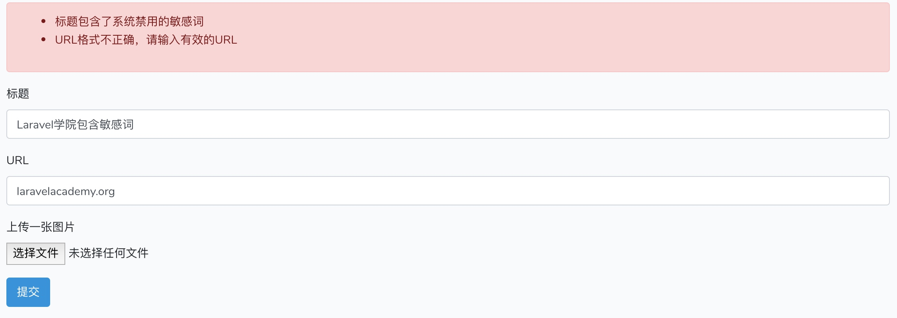
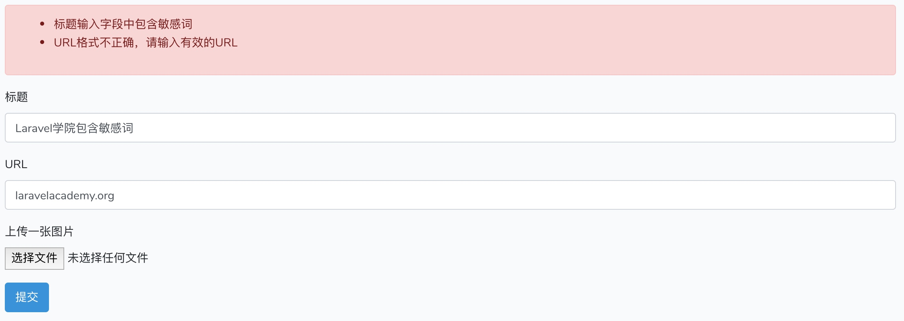

# 通过匿名函数和验证规则类自定义字段验证规则

Laravel 验证器的强大之处不仅在于提供前面提到的多种请求验证方式，以及非常丰富的字段验证规则（不同规则可以组合形成新的验证规则），从 5.5 版本开始，还支持自定义字段验证规则。我们可以通过匿名函数和验证规则类两种方式来自定义验证规则。

## 通过匿名函数实现自定义规则

我们先演示下如何在控制器方法中调用 `$this->validate()` 时自定义验证规则，以 `title` 字段为例，除了系统提供的字段验证规则之外，有时候我们还会禁止用户输入包含敏感词的字段，在我们国家，这也是司空见惯的事情，那要如何实现这个 Laravel 办不到的事情呢，通过自定义验证规则：

```php
$this->validate($request, [
   'title' => [
       'bail',
       'required',
       'string',
       'between:2,32',
       function($attribute, $value, $fail) {
           if (strpos($value, '敏感词') !== false) {
               return $fail('标题包含了系统禁用的敏感词');
           }
       },
   ],
   'url' => 'sometimes|url|max:200',
   'picture' => 'nullable|string'
], [
   'title.required' => '标题字段不能为空',
   'title.string' => '标题字段仅支持字符串',
   'title.between' => '标题长度必须介于2-32之间',
   'url.url' => 'URL格式不正确，请输入有效的URL',
   'url.max' => 'URL长度不能超过200',
]);
```

要为某个字段自定义验证规则，原来通过 `|` 分隔多个规则的组合规则字符串已经实现不了了，需要将其改成数组的方式，然后将自定义规则以匿名函数的方式添加到数组最后，如上面的代码所示，该匿名函数第一个参数是字段名，第二个参数是字段值，第三个参数是校验失败用于返回的函数名。如果检查到输入标题包含敏感词，则认为验证不通过，返回错误信息（我这里的主要目的是演示如何自定义验证规则，实际环境中不要这样校验敏感词哈，效率太低）。

这样，我们在提交表单时输入包含敏感词的数据时，就会校验出来了：



如果你使用的是 `Validator::make` 进行请求字段验证的话，实现方式完全一样，不再赘述，即使是在表单请求类 `SubmitFormRequest` 中，也是一样的，把代码迁移过去就好了：

```
public function rules()
{
    return [
        'title' => [
            'bail',
            'required',
            'string',
            'between:2,32',
            function($attribute, $value, $fail) {
                if (strpos($value, '敏感词') !== false) {
                    return $fail('标题包含了系统禁用的敏感词');
                }
            },
        ],
        'url' => 'sometimes|url|max:200',
        'picture' => 'nullable|string',
    ];
}
```

## 通过创建规则类自定义验证规则

除了通过匿名函数之外，还可以通过创建一个规则类来实现验证规则的自定义：

```
php artisan make:rule SensitiveWordRule
```

该命令会在 `app` 目录下创建一个 `Rules` 子目录，并在这个子目录下新增 `SensitiveWordRule.php` 文件，我们可以将验证通过条件定义到该类的 `passes` 方法中：

```
public function passes($attribute, $value)
{
    return strpos($value, '敏感词') === false;
}
```

如果输入值中包含敏感词，则认为验证失败，然后在 `message` 方法中修改验证失败的错误消息，由于我们这个规则类是通用的，所以将字段名通过 `:attribute` 动态注入：

```
public function message()
{
    return ':attribute输入字段中包含敏感词';
}
```

最后，将自定义验证规则的匿名函数修改为实例化自定义规则类即可：

```
public function rules()
{
    return [
        'title' => [
            'bail',
            'required',
            'string',
            'between:2,32',
            new SensitiveWordRule()
        ],
        'url' => 'sometimes|url|max:200',
        'picture' => 'nullable|string',
    ];
}
```

此外，再抛一个知识点，我们可以在表单请求类中通过重写父类 `attributes()` 方法自定义字段名：

```
public function attributes()
{
    return [
        'title' => '标题',
        'url' => 'URL',
        'picture' => '图片'
    ];
}
```

这样，在验证规则类 `SensitiveWordRule` 验证失败时返回错误提示时，就可以将 `:attribute` 替换为 `标题`，而不是默认的 `title` 了。

再次提交表单，就可以看到通过规则类自定义的验证规则也生效了：



很显然，匿名函数虽然方便，但是解决不了代码复用的问题，通过自定义验证规则类则可以很好的解决，一次定义，多处复用。