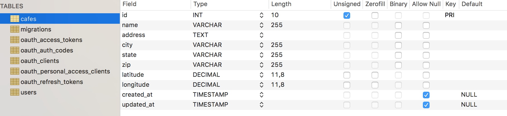

# 配置后端 API 接口 by Laravel

上一篇教程，我们通过 Vue Router 为 Roast 应用添加了前端路由，现在我们需要为对应的页面提供数据以便渲染。需要注意的是，在 API 驱动的单页面应用中，所有数据都是通过 AJAX 异步加载的，因此，我们需要先在 Laravel 后端提供 API 接口，然后根据接口返回数据通过 Vue 进行渲染。

## Step 1：设计路由

在提供 API 接口之前，需要先明确提供哪些路由，之前我们通过 Vue Router 为前端配置了四个路由：

- `/`
- `/cafes`
- `/cafes/new`
- `/cafes/:id`

在 Laravel 后端，我们要为这些前端路由定义相应的后端独立 API 接口。

- 在 `/cafes` 路由中，我们需要获取系统的咖啡店列表；
- 在 `/cafes/new` 路由，前端是一个 GET 请求（显示提交表单），但是 API 是一个 POST 去请求；
- 在 `/cafes/:id` 路由，用于加载某家咖啡店的信息。

## Step 2：添加路由到 routes/api.php

明确要提供的 API 路由之后，首先打开 `routes/api.php` 文件，该文件包含应用的所有 API 路由，我们也将在其中定义我们自己的 API 路由，在 [Laravel Passport 配置教程](http://laravelacademy.org/post/9501.html)中，我们为所有 API 路由添加了 `v1` 前缀，以方便后续支持多版本 API 扩展。

#### 首先添加 `cafes` 路由：

```php
Route::get('/cafes', 'API\CafesController@getCafes');
```

我们还没有一个 `CafesController` 控制器，没事，我们很快就会添加的。

然后，添加一个 POST 路由：

```php
Route::post('/cafes', 'API\CafesController@postNewCafe');
```

该路由用于处理前端通过表单提交过来的咖啡店。

最后，我们还需要一个获取咖啡店详情的路由：

```php
Route::get('/cafes/{id}', 'API\CafesController@getCafe');
```

添加完以上三个路由之后，现在 `routes/api.php` 文件内容如下：

```php
<?php

use Illuminate\Http\Request;

/*
|--------------------------------------------------------------------------
| API Routes
|--------------------------------------------------------------------------
|
| Here is where you can register API routes for your application. These
| routes are loaded by the RouteServiceProvider within a group which
| is assigned the "api" middleware group. Enjoy building your API!
|
*/

Route::group(['prefix' => 'v1', 'middleware' => 'auth:api'], function(){
    Route::get('/user', function( Request $request ){
        return $request->user();
    });

    /*
     |-------------------------------------------------------------------------------
     | Get All Cafes
     |-------------------------------------------------------------------------------
     | URL:            /api/v1/cafes
     | Controller:     API\CafesController@getCafes
     | Method:         GET
     | Description:    Gets all of the cafes in the application
    */
    Route::get('/cafes', 'API\CafesController@getCafes');

    /*
     |-------------------------------------------------------------------------------
     | Get An Individual Cafe
     |-------------------------------------------------------------------------------
     | URL:            /api/v1/cafes/{id}
     | Controller:     API\CafesController@getCafe
     | Method:         GET
     | Description:    Gets an individual cafe
    */
    Route::get('/cafes/{id}', 'API\CafesController@getCafe');

    /*
     |-------------------------------------------------------------------------------
     | Adds a New Cafe
     |-------------------------------------------------------------------------------
     | URL:            /api/v1/cafes
     | Controller:     API\CafesController@postNewCafe
     | Method:         POST
     | Description:    Adds a new cafe to the application
    */
    Route::post('/cafes', 'API\CafesController@postNewCafe');
});
```

## Step 3：构建控制器 API/CafesController.php

定义好路由之后，接下来需要创建 `app/Http/Controllers/API/CafesController.php` 控制器了：

```php
<?php

namespace app\Http\Controllers\API;

use App\Http\Controllers\Controller;
use Request;

class CafesController extends Controller
{
  
}
```

然后根据路由定义填充相应的控制器动作：

```php
class CafesController extends Controller
{
    /*
     |-------------------------------------------------------------------------------
     | Get All Cafes
     |-------------------------------------------------------------------------------
     | URL:            /api/v1/cafes
     | Method:         GET
     | Description:    Gets all of the cafes in the application
    */
    public function getCafes(){

    }

    /*
     |-------------------------------------------------------------------------------
     | Get An Individual Cafe
     |-------------------------------------------------------------------------------
     | URL:            /api/v1/cafes/{id}
     | Method:         GET
     | Description:    Gets an individual cafe
     | Parameters:
     |   $id   -> ID of the cafe we are retrieving
    */
    public function getCafe($id){

    }

    /*
     |-------------------------------------------------------------------------------
     | Adds a New Cafe
     |-------------------------------------------------------------------------------
     | URL:            /api/v1/cafes
     | Method:         POST
     | Description:    Adds a new cafe to the application
    */
    public function postNewCafe(){

    }
}
```

目前所有的方法都留空，待后续创建完数据表和模型类后编写具体的实现代码。

## Step 4：构建模型类 Cafe.php

我们将通过 [Eloquent ORM](http://laravelacademy.org/post/8855.html) 来管理数据模型，所以需要创建咖啡店对应模型类。在项目根目录下通过如下 Artisan 命令来创建这个模型类：

```
php artisan make:model Models/Cafe -m 
```

该命令会将模型类 `Cafe` 创建到 `app/Models` 目录下，同时会在 `databases/migrations` 目录下创建对应的数据库迁移文件 `{timestamp}_create_cafes_table`。

## Step 5：构建 Cafe 对应的迁移文件

上一步中，我们已经创建了[数据库迁移](http://laravelacademy.org/post/8845.html)文件，接下来我们需要编写该迁移文件定义要生成的数据表的数据结构，打开 `create_cafes_table` 文件，编辑 `up()` 方法：

```php
public function up() 
{
  Schema::create('cafe', function( Blueprint $table ) {
  	$table->increments('id');
  	$table->string('name');
  	$table->text('address');
  	$table->string('city');
  	$table->string('state');
  	$table->string('zip');
		$table->decimal('latitude', 11, 8);
		$table->decimal('longitude', 11, 8);
		$table->timestamps();
  });
}
```

然后运行 `php artisan migrate` 命令创建这个数据表：



## Step 6：完成 /api/cafes 路由（GET）

模型类和数据表都已经定义好了，接下来就可以编写具体的业务逻辑代码了。

回到 `app/Http/Controllers/API/CafesController.php` 文件，在控制器顶部引入模型类：

```php
use App\Models\Cafe;
```

首先编写 `getCafes()` 方法，目前该方法只是简单返回所有的咖啡店：

```php
public function getCafes(){
    $cafes = Cafe::all();
    return response()->json($cafes);
}
```

我们将以 JSON 格式返回 API 请求数据，后面也是这样。

## Step 7：完成 /api/cafes/:id 路由

获取某个咖啡店的信息也很简单，编辑 `getCafe($id)` 方法如下：

```php
public function getCafe($id) {
  $cafe = Cafe::where('id', '=', $id)->first();
  return response()->json($cafe);
}
```

## Step 8：完成 /app/cafes 路由（POST）

相比前两个路由而言，这个路由对应的业务逻辑稍微复杂一点：首先我们需要验证用户提交数据是否有效，如果验证通过则将其保存到数据库，否则返回错误信息。

我们先来看下需要用户提交哪些字段的数据：

- `name` - 咖啡店的名字
- `address` - 咖啡店的详细地址
- `city` - 咖啡店所在城市
- `state` - 咖啡店所在的省份
- `zip` - 邮政编码

`cafes` 表的其他字段都是动态添加的，无需用户手动提交。关于经度和纬度字段的获取，后续在地图 API 中会提到。

为了简化业务逻辑，我们假定用户提交的数据都是可靠的，将数据验证逻辑省略掉，只留下数据保存逻辑，所以编写 `postNewCafe()` 方法如下：

```php
public function postNewCafe(){
    $cafe = new Cafe();

    $cafe->name     = Request::get('name');
    $cafe->address  = Request::get('address');
    $cafe->city     = Request::get('city');
    $cafe->state    = Request::get('state');
    $cafe->zip      = Request::get('zip');

    $cafe->save();

    return response()->json($cafe, 201);
}
```

创建成功后，我们将遵循 RESTful 原则返回 `201` 状态码，表示实体已创建。

至此，Laravel 后端 API 接口已经全部实现了，在下一篇教程中我们将在前端通过 Vue 发起异步请求来访问这些接口。