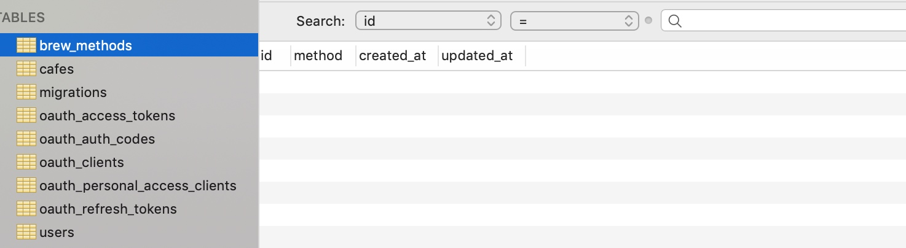
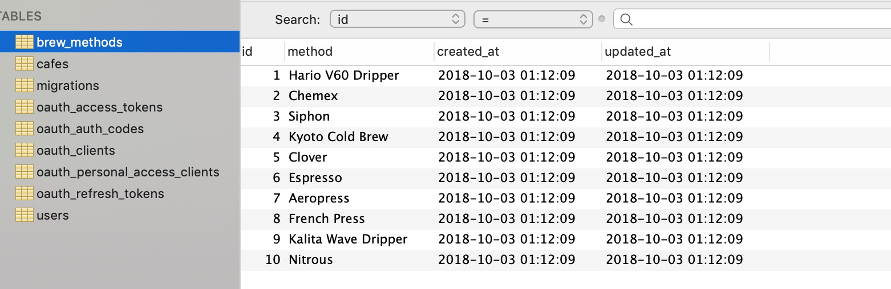
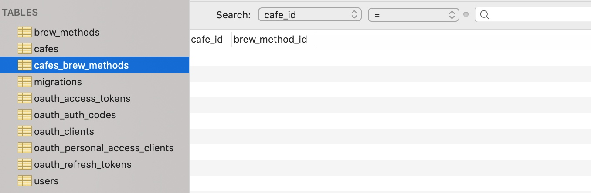
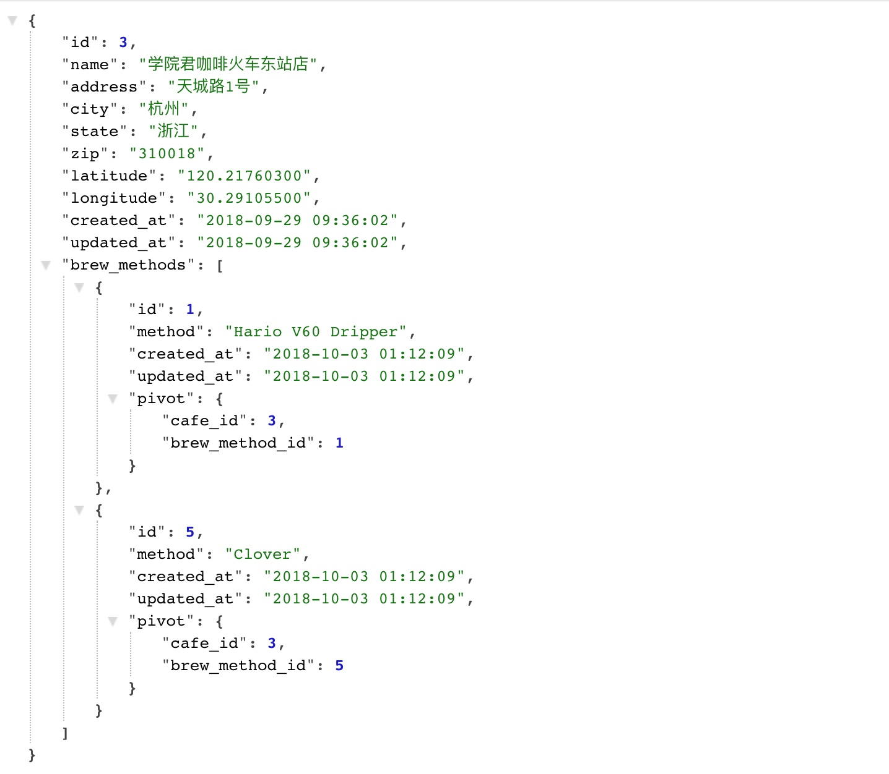
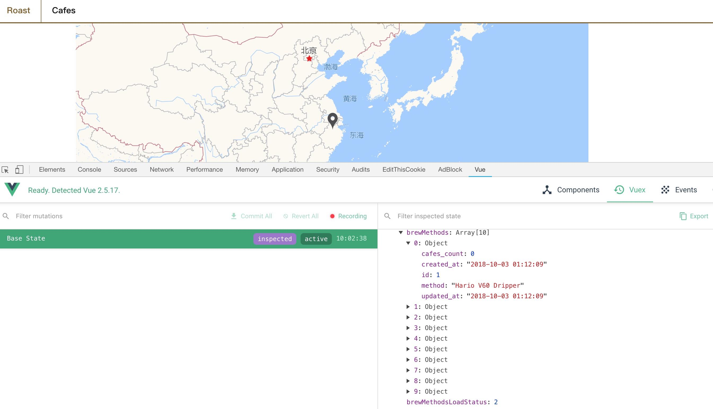

# 实现 Laravel 模型类之间的多对多关联及冲泡方法前端查询 API


前面的教程中，我们已经陆续完成了咖啡店的添加和在高德地图上的标记，接下来我们会实现一些更加复杂的功能，实现这些功能之前，需要先准备好数据结构，因为一个咖啡店可能会提供多种冲泡方法，单个冲泡方法也不隶属于任何咖啡店。所以在本章中，我们将通过 Laravel Eloquent 模型类的多对多关联构建咖啡店会和对应冲泡方法之间的关联关系，有关多对多关联，建议阅读一下[官方文档](https://laravelacademy.org/post/8867.html#toc_5)。

## Step 1：创建冲泡方法数据表

首先，需要为用于存放冲泡方法的数据表 `brew_methods` 创建对应迁移类：

```shell
php artisan make:migration create_brew_methods_table
```

该命令会在 `database/migrations` 目录下生成一个新的数据库迁移文件，修改这个新增迁移类 `CreateBrewMethodsTable` 的 `up` 方法，在数据表中新增一个 `method` 字段：

```php
public function up()
{
  Schema::create('brew_methods', function ( Blueprint $table ) {
    $table->increaments('id');
    $table->string('methods');
    $table->timestamps();
  });
}
```

然后运行数据库迁移命令在数据库中创建这个数据表：

```shell
php artisan migrate
```

这样就可以在数据库中看到数据表 `brew_methods` 了：



接下来我们为 `brew_methods` 填充一些数据，运行下面这个命令创建数据表填充类：

```shell
php artisan make:seeder BrewMethodsSeeder
```

该命令会在 `database/seeds` 目录下生成一个新的 `BrewMethodsSeeder.php` 文件，打开这个文件，编辑代码如下：

```php
<?php

use Illuminate\Database\Seeder;
use Illuminate\Support\Facades\DB;

class BrewMethodsSeeder extends Seeder
{
  /**
   * Run the database seeds.
   *
   * @return void
   */
  public function run()
  {
    DB::table('brew_methods')->insert([
      [
        'method' => 'Hario V60 Dripper',
        'created_at' => \Carbon\Carbon::now(),
        'updated_at' => \Carbon\Carbon::now()
      ],
      [
        'method' => 'Chemex',
        'created_at' => \Carbon\Carbon::now(),
        'updated_at' => \Carbon\Carbon::now()
      ],
      [
        'method' => 'Siphon',
        'created_at' => \Carbon\Carbon::now(),
        'updated_at' => \Carbon\Carbon::now()
      ],
      [
        'method' => 'Kyoto Cold Brew',
        'created_at' => \Carbon\Carbon::now(),
        'updated_at' => \Carbon\Carbon::now()
      ],
      [
        'method' => 'Clover',
        'created_at' => \Carbon\Carbon::now(),
        'updated_at' => \Carbon\Carbon::now()
      ],
      [
        'method' => 'Espresso',
        'created_at' => \Carbon\Carbon::now(),
        'updated_at' => \Carbon\Carbon::now()
      ],
      [
        'method' => 'Aeropress',
        'created_at' => \Carbon\Carbon::now(),
        'updated_at' => \Carbon\Carbon::now()
      ],
      [
        'method' => 'French Press',
        'created_at' => \Carbon\Carbon::now(),
        'updated_at' => \Carbon\Carbon::now()
      ],
      [
        'method' => 'Kalita Wave Dripper',
        'created_at' => \Carbon\Carbon::now(),
        'updated_at' => \Carbon\Carbon::now()
      ],
      [
        'method' => 'Nitrous',
        'created_at' => \Carbon\Carbon::now(),
        'updated_at' => \Carbon\Carbon::now()
      ],
    ]);
  }
}
```

 我们为 `brew_methods` 提供了十条初始化数据，编写好之后运行下面的 Artisan 命令，填充数据到数据表：

```shell
php artisan db:seed --class=BrewMethodsSeeder
```

这样，打开 `brew_methods` 就可以看到插入的数据了：



> 注：关于数据填充的更多细节，可以查看[官方文档](https://laravelacademy.org/post/8851.html)。

## Step 2：创建关联关系中间表

要实现多对多关联，还要一张中间表 `cafes_brew_methods` 来存储咖啡店与冲泡方法之间的映射关系：

```shell
php artisan make:migration create_cafes_brew_methods_table
```

编辑这个新生成的迁移类 `CreateCafesBrewMethodsTable` 的 `up` 方法如下，这张中间表只有两个字段，`cafe_id` 用于保存咖啡店 ID，`brew_method_id` 用于保存冲泡方法 ID：

```php
public function up()
{
    Schema::create('cafes_brew_methods', function ($table) {
        $table->integer('cafe_id')->unsigned();
        $table->integer('brew_method_id')->unsigned();
    });
}
```

然后运行迁移命令在数据库中创建数据表：

```
php artisan migrate
```

查看数据库，对应的数据表 `cafes_brew_methods` 已创建：



## Step 3：创建冲泡方法模型类

接下来要为 `brew_methods` 数据表创建对应的 `BrewMethods` 模型类：

```shell
php artisan make:model Models/BrewMethods
```

该命名会在 `app/Models` 目录下创建新的模型类文件 `BrewMethod.php` ，然后定义 `BrewMethod` 模型类与 `Cafe` 模型类间的多对多关联：

```php
<?php

namespace App\Models;

use Illuminate\Database\Eloquent\Model;

class BrewMethod extends Model
{
    // 定义与 Cafe 模型间的多对多关联
    public function cafes()
    {
        return $this->belongsToMany(Cafe::class, 'cafes_brew_methods', 'brew_method_id', 'cafe_id');
    }
}
```

## Step 4：定义咖啡店与冲泡方法间的关联关系

相对的，还要定义 `Cafe` 模型类与 `BrewMethod` 模型类之间的多对多关联：

```php
public function brewMethods()
{
    return $this->belongsToMany(BrewMethod::class, 'cafes_brew_methods', 'cafe_id', 'brew_method_id');
}
```

## Step 5：多对多关联查询

定义好模型类之间的关联关系后，就可以在查询的时候使用关联查询了，有关关联查询的使用方法，可以参考[官方文档](https://laravelacademy.org/post/8867.html#toc_9)，我们将改写控制器 `app/Http/Controllers/API/CafesController.php` 中咖啡店的获取逻辑为关联查询，编辑 `getCafes()` 方法如下：

```php
public function getCafes()
{
  $cafes = Cafe::with('brewMethods')->get();
  return response()->json($cafe);
}
```

编辑 `getCafe()` 方法如下：

```php
public function getCafe($id)
{
  $cafe = Cafe::where('id', '=', $id)->with('brewMethods')->first();
  return response()->json($cafe);
}
```

我们使用 `with` 方法，将模型类中的关联关系方法名作为参数传入，这样对应的关联数据会以属性的方式出现在查询结果中，属性名就是 `with` 方法传入的字符串参数。

我们还可以在 `routes/web.php` 中定义一个测试路由对上面改写的 `getCafe` 方法进行测试：

```php
Route::get('/cafe/{id}', 'API\CafeController@getCafe');
```

在浏览器中访问 `http://roast.test/cafe/3`，返回的结果如下：



> 注：如果 `cafes_brew_methods` 数据表中没有数据，可以插入一些测试数据。

## Step 6：实现冲泡方法查询 API

最后，我们为冲泡方法提供查询 API，首先创建控制器类 `BrewMethodsController`：

```shell
php artisan make:controller API/BrewMethodsController
```

然后编写新生成的控制器代码如下，我们为其定义了一个 `getBrewMethods` 方法用于获取所有冲泡方法：

```php
<?php

namespace App\Http\Controllers\API;

use App\Models\BrewMethod;
use Illuminate\Http\Request;
use App\Http\Controllers\Controller;

class BrewMethodsController extends Controller
{
  /**
   * 获取所有冲泡方法以及拥有该冲泡方法的咖啡店数目
   *
   * 请求API: /api/v1/brew-methods
   * 请求方法: GET
   */
  public function getBrewMethods()
  {
    // 获取所有包含咖啡店数目的冲泡方法
    $brewMethods = BrewMethod::withCount('cafes')->get();
    // 以 JSON 格式返回数据
    return response()->json($brewMethods);
  }
}
```

在 `routes/api.php` 中新增下面这个查询路由：

```php
/*
 |-------------------------------------------------------------------------------
 | 获取所有冲泡方法
 |-------------------------------------------------------------------------------
 | 请求URL: /api/v1/brew-methods
 | 控制器:  API\BrewMethodsController@getBrewMethods
 | 请求方法: GET
 | API描述: 获取应用中的所有冲泡方法
*/
Route::get('/brew-methods', 'API\BrewMethodsController@getBrewMethods');
```

至此，后端 API 已经编写完成，下面来编写前端查询代码。

首先，在 `resources/assets/js/api` 目录下创建 `brewMethod.js` ，编写代码如下：

```js
/**
 * Imports the Roast API URL from the config.
 */
import {ROAST_CONFIG} from '../config.js';

export default {
    /*
     GET   /api/v1/brew-methods
     */
    getBrewMethods: function () {
        return axios.get(ROAST_CONFIG.API_URL + '/brew-methods');
    }
}
```

然后创建 `resources/assets/js/modules/brewMethods.js`，编写代码如下：

```js
/*
|-------------------------------------------------------------------------------
| VUEX modules/brewmethods.js
|-------------------------------------------------------------------------------
| The Vuex data store for the brew methods
*/
import BrewMethodAPI from '../api/brewMethod.js';

export const brewMethods = {
    /**
     * Defines the state being monitored for the module
     */
    state: {
        brewMethods: [],
        brewMethodsLoadStatus: 0
    },

    /**
     * Defines the actions used by the Vuex module.
     */
    actions: {
        // Loads all of the brew methods.
        loadBrewMethods({commit}) {
            commit('setBrewMethodsLoadStatus', 1);

            // Calls the API to load the brew methods.
            BrewMethodAPI.getBrewMethods()
                .then(function (response) {
                    // Sets the brew methods on a successful response.
                    commit('setBrewMethods', response.data);
                    commit('setBrewMethodsLoadStatus', 2);
                })
                .catch(function () {
                    // Clears the brew methods on failure.
                    commit('setBrewMethods', []);
                    commit('setBrewMethodsLoadStatus', 3);
                });
        }
    },

    /**
     * Defines the mutations used by the module.
     */
    mutations: {
        // Sets the brew method load status.
        setBrewMethodsLoadStatus(state, status) {
            state.brewMethodsLoadStatus = status;
        },

        // Sets the brew methods.
        setBrewMethods(state, brewMethods) {
            state.brewMethods = brewMethods;
        }
    },

    /**
     * Defines the getters used by the module.
     */
    getters: {
        // Returns the brew methods.
        getBrewMethods(state) {
            return state.brewMethods;
        },

        // Returns the brew methods load status.
        getBrewMethodsLoadStatus(state) {
            return state.brewMethodsLoadStatus;
        }
    }
};
```

接下来在 `resources/assets/js/store.js` 中引入 `brewMethods` 模块：

```js
/**
 * Imports all of the modules used in the application to build the data store.
 */
import {cafes} from './modules/cafes.js';
import {users} from './modules/users.js';
import {brewMethods} from './modules/brewMethods';

/**
 * Export our data store.
 */
export default new Vuex.Store({
    modules: {
        cafes,
        users,
        brewMethods
    }
});
```

最后在 `resources/assets/js/pages/Layout.vue` 中实现在页面加载后获取咖啡冲泡方法：

```js
this.$store.dispatch('loadBrewMethods');
```

最后在 `resources/assets/js/pages/Layout.vue` 中实现在页面加载后获取咖啡冲泡方法：

```js
this.$store.dispatch('loadBrewMethods');
```

运行 `npm run dev` 重新编译前端资源，在浏览器中访问 `http://roast.test` 就可以在 Vuex 中看到 `brewMethods` 数据了：



