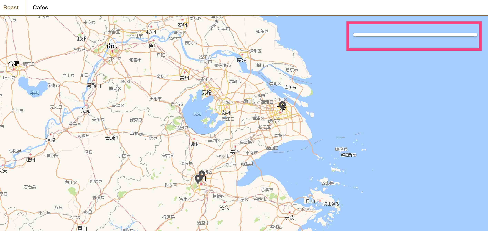
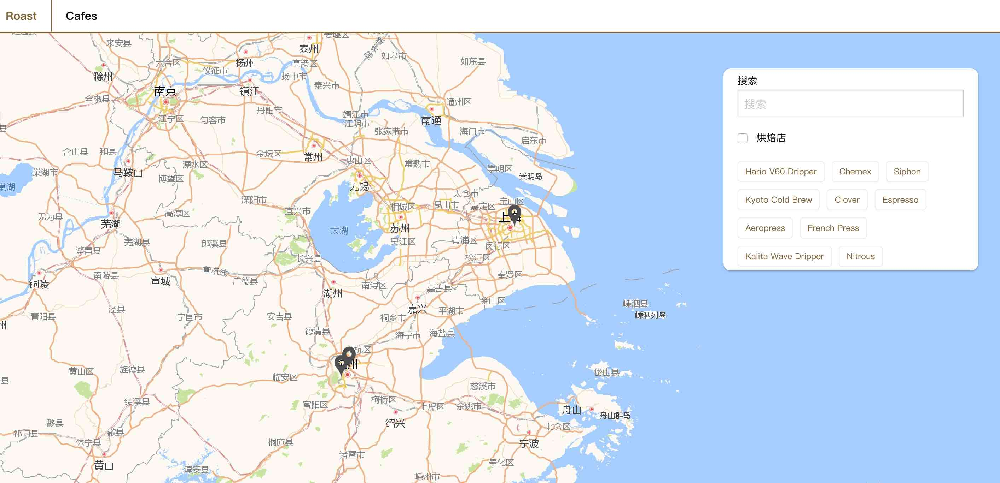
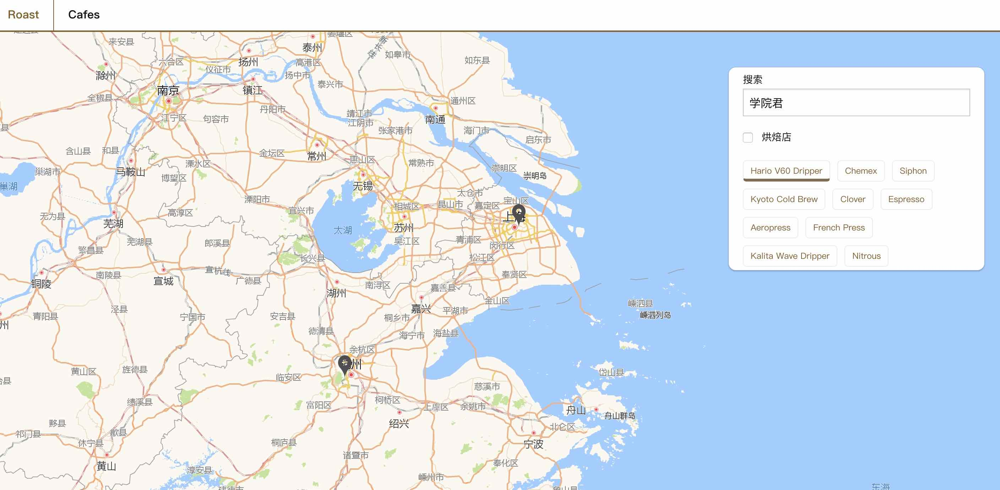

# 使用 Vue Mixins 在高德地图上对咖啡店点标记进行筛选过滤

在[上一篇教程](https://laravelacademy.org/post/9633.html)中我们在应用首页通过 Vue Mixins 实现了对咖啡店的筛选过滤，在这篇教程中，我们将**复用**上一篇教程中的过滤处理函数通过 Vue Mixins 实现在高德地图上对咖啡店点标记进行筛选过滤的功能，实现思路和上篇教程类似，只不过前者是对列表数据进行过滤，而本篇教程是在地图上对点标记进行过滤。

## Step 1：创建高德地图组件

和之前我们所写的 `CafeFilter` 组件类似，我们首先需要为地图上的咖啡店**创建过滤组件**。

我们新建文件 `cafeMapFilter.vue` 作为高德地图的过滤组件，并且初始化代码。

`resources/assets/js/components/cafes` :

```js
<style lang="scss">
	@import '~@/abstracts/_varibles.scss';
</style>

<template>
	<div id="cafe-map-filter">
	</div>
</template>

<script>
	export default {
    
	}
</script>
```

然后我们修改 `resources/assets/js/components/cafes/CafeMap.vue` 的模板代码如下：

```html
<div id="cafe-map-container">
	<div id="cafe-map">
	
	</div>
</div>
```

同时在 `style` 中为 `div#cafe-map-container` 添加样式代码：

```scss
<style lang="scss">
    div#cafe-map-container {
        position: absolute;
        top: 50px;
        left: 0px;
        right: 0px;
        bottom: 50px;

        div#cafe-map {
            position: absolute;
            top: 0px;
            left: 0px;
            right: 0px;
            bottom: 0px;
        }
    }
</style>
```

接下来，我们在 `cafeMap.vue` 组件中引入 `CafeMapFilter.vue` 组件：

```js
import CafeMapFilter from './CafeMapFilter.vue';
```

定义相应的 `components` 属性：

```js
components: {
  CafeMapFilter
},
```

并且在 `template` 模板中紧随 `cafe-map` 之后引入地图过滤组件：

```html
<div id="cafe-map">

</div>
<cafe-map-filter></cafe-map-filter>
```

在 `CafeMapFilter.vue` 组件中添加样式代码如下：

```scss
<style lang="scss">
    @import '~@/abstracts/_variables.scss';

    div#cafe-map-filter{
        background-color: white;
        border-radius: 10px;
        box-shadow: 0 2px 2px 0 rgba(0, 0, 0, 0.16), 0 0 0 1px rgba(0, 0, 0, 0.08);
        padding: 5px;
        z-index: 999999;
        position: absolute;
        right: 45px;
        top: 50px;
        width: 25%;
    }
</style>
```

这样，运行 `npm run dev` 重新编译前端资源后，在咖啡店列表（`http://roast.test/#/cafes`）页面右上角就可以看到组件了：



## Step 2：添加文本过滤器到组件

接下来我们就来为地图过滤组件填充内容，和 `CafeFilter.vue` 组件类似。

首先，我们将文本搜索框添加到 `CafeMapFilter.vue` 文件的模板代码中作为文本过滤器：

```html
<div id="cafe-map-filter">
    <div class="grid-container">
        <div class="grid-x grid-padding-x">
            <div class="large-12 medium-12 small-12 cell">
                <label>搜索</label>
                <input type="text" v-model="textSearch" placeholder="搜索"/>
            </div>
        </div>
    </div>
</div>
```

## Step 3：是否是烘焙店过滤器

在地图过滤组件中，为了简单起见，我们省略了标签过滤器，接下来，将是否是烘焙店勾选为过滤条件添加到 `CafeMapFilter.vue` 中，紧跟随上一步的文本搜索框之后：

```html
<div class="is-roaster-container">
    <input type="checkbox" v-model="isRoaster"/> <label>烘焙店</label>
</div>
```

同样的，在 `data` 返回数据模型中添加 `isRoaster` 属性，默认值为 `false`：

```js
data () {
  return {
    textSearch: '',
    isRoaster: false
  }
}
```

## Step 4：添加冲泡方法过滤器到组件

再然后是冲泡方法过滤器，我们现在 `data` 返回数据模型中添加相应的 `brewMethods` 属性，并将其初始化为空数组：

```js
data () {
  return {
    textSearch: '',
    isRoaster: false,
    brewMethods: []
  }
},
```

然后通过计算属性 `cafeBrewMethods` 从 Vuex 中获取全局支持的所有冲泡方法，以便作为筛选条件：

```js
computed: {
  cafeBrewMethods() {
    return this.$store.getters.getBrewMethods;
  },
},
```

在模板代码中紧跟随是否是烘焙店勾选框之后，添加如下冲泡方法选择组件：

```html
<div class="brew-methods-container">
  <div class="filter-brew-method" 
		v-on:click="toggleBrewMethodFilter( method.method )" 
		v-bind:class="{'active' : brewMethods.indexOf( method.method ) > -1 }" 
		v-for="method in cafeBrewMethods"
  >
    {{ method.method }}
  </div>
</div>
```

在 `methods` 方法中定义冲泡方法选中/取消选中处理函数 `toggleBrewMethodFilter`：

```js
methods: {
  toggleBrewMethodFilter(method) {
    if (this.brewMethods.indexOf(method) > -1) {
      this.BrewMethods.splice(this.brewMethods.indexOf(method), 1);
    } else {
      this.brewMethods.push(method);
    }
  },
}
```

最后在 `style` 中添加冲泡方法选择元素样式：

```scss
div.filter-brew-method{
  display: inline-block;
  height: 30px;
  text-align: center;
  border: 1px solid #ededed;
  border-radius: 5px;
  padding-left: 10px;
  padding-right: 10px;
  padding-top: 5px;
  padding-bottom: 5px;
  margin-right: 10px;
  margin-top: 10px;
  cursor: pointer;
  color: #7F5F2A;
  font-family: 'Josefin Sans', sans-serif;
  font-size: 12px;

  &.active{
    border-bottom: 4px solid $primary-color;
  }
}
```

## Step 5：完成地图过滤功能

最后，我们还要在 `CafeMapFilter.vue` 中引入事件总线，以便监听并触发过滤条件变更事件：

```js
import { EventBus } from '../../event-bus.js';
```

 通过 `watch` 监听过滤条件字段的变动并进行处理：

```js
watch: {
   textSearch() {
       this.updateFilterDisplay();
   },

   isRoaster() {
       this.updateFilterDisplay();
   },

   brewMethods() {
       this.updateFilterDisplay();
   }
},
```

最后在 `methods` 中定义过滤条件变更处理函数 `updateFilterDisplay`：

```js
updateFilterDisplay(){
  EventBus.$emit('filters-updated', {
    text: this.textSearch,
    tags: [],
    roaster: this.isRoaster,
    brew_methods: this.brewMethods
  });
}
```

过滤条件变更后触发全局事件 `filter-updated` ，这样监听该事件的代码就会立即执行相应的回调函数进行处理。这里，需要注意的是，我们在设置事件属性时传入了 `tags` 属性，以免我们在上一篇教程中定义的监听代码在执行回调函数的时候报错。

以上 `CafeMapFilter.vue` 组件的实现思路和 `CafeFilter.vue` 完全一致，不做过多赘述。接下来我们在 `CafeMap.vue` 中实现在高德地图上根据过滤组件中的过滤条件对咖啡店点标记进行筛选过滤的功能。

## Step 6：在 CafeMap 中监听过滤条件变更

在 `CafeMap.vue` 中引入事件总线，以便对过滤条件变更进行监听和处理：

``` js
import { EventBus } from '../../event-bus.js'
```

```js
mounted() {
   this.map = new AMap.Map('cafe-map', {
       center: [this.latitude, this.longitude],
       zoom: this.zoom
   });
   this.clearMarkers();
   this.buildMarkers();

   // 监听 filters-updated 事件过滤点标记
   EventBus.$on('filters-updated', function (filters) {
       this.processFilters(filters);
   }.bind(this));
},
```

当过滤条件变更时，会调用 `processFilters` 方法对地图上的咖啡店点标记进行过滤。

## Step 7：实现 processFilter 方法

最后，我们需要在 `CafeMap.vue` 的 `methods` 中实现 `processFilters` 方法。在此之前，需要先引入上篇教程创建的若干过滤处理函数：

```
import { CafeIsRoasterFilter } from '../../mixins/filters/CafeIsRoasterFilter.js';
import { CafeBrewMethodsFilter } from '../../mixins/filters/CafeBrewMethodsFilter.js';
import { CafeTextFilter } from '../../mixins/filters/CafeTextFilter.js';
```

并定义 `mixins` 数组：

```
mixins: [
   CafeIsRoasterFilter,
   CafeBrewMethodsFilter,
   CafeTextFilter
],
```

在 `buildMarkers` 方法中新建点标记 `marker` 对象时传入额外的咖啡店模型数据以便在点标记过滤时从点标记对象中获取相应的咖啡店数据，进而实现过滤功能：

```js
// 遍历所有咖啡店创建点标记
for (var i = 0; i < this.cafes.length; i++) {

     // 为每个咖啡店创建点标记并设置经纬度
     var marker = new AMap.Marker({
         position: new AMap.LngLat(parseFloat(this.cafes[i].latitude), parseFloat(this.cafes[i].longitude)),
         title: this.cafes[i].location_name,
         icon: icon,
         extData: { 
             'cafe': this.cafes[i]
         }
     });

     ...
```

做好以上准备工作后，就可以编写 `processFilters` 方法了：

```js
processFilters(filters) {
  for (var i = 0; i < this.markers.length; i++) {
      if (filters.text === ''
          && filters.roaster === false
          && filters.brew_methods.length === 0) {
          this.markers[i].setMap(this.map);
      } else {
          var textPassed = false;
          var brewMethodsPassed = false;
          var roasterPassed = false;

          if (filters.roaster && this.processCafeIsRoasterFilter(this.markers[i].getExtData().cafe)) {
              roasterPassed = true;
          } else if (!filters.roaster) {
              roasterPassed = true;
          }

          if (filters.text !== '' && this.processCafeTextFilter(this.markers[i].getExtData().cafe, filters.text)) {
              textPassed = true;
          } else if (filters.text === '') {
              textPassed = true;
          }

          if (filters.brew_methods.length !== 0 && this.processCafeBrewMethodsFilter(this.markers[i].getExtData().cafe, filters.brew_methods)) {
              brewMethodsPassed = true;
          } else if (filters.brew_methods.length === 0) {
              brewMethodsPassed = true;
          }

          if (roasterPassed && textPassed && brewMethodsPassed) {
              this.markers[i].setMap(this.map);
          } else {
              this.markers[i].setMap(null);
          }
      }
  }
},
```

至此，我们已经完成了所有编码工作。运行 `npm run dev` 重新编译前端资源，访问咖啡店列表页 `http://roast.test/#/cafes`，页面显示如下：



选择适当的过滤条件，即可在地图上对咖啡店点标记进行过滤筛选：

