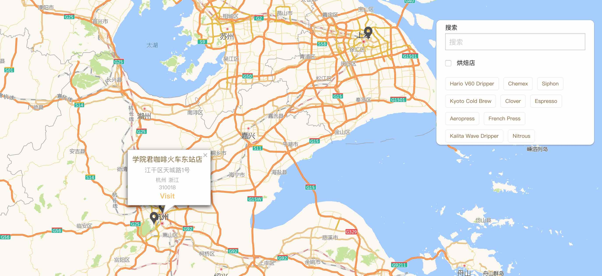

### 优化多点标记高德地图信息窗体显示

我们在之前实现了在高德地图上点击点标记显示信息窗体的功能，不过那个窗体有点太简陋了，只显示了咖啡店的名称，我们可以通过编写 HTML 内容片段为信息窗体提供更加丰富的显示信息，打开 `assets/js/components/cafes/CafeMap.vue` 文件，修改 `buildMarkers` 方法代码如下：

```
// 为所有咖啡店创建点标记
buildMarkers() {
    // 初始化点标记数组
    this.markers = [];

    // 自定义点标记
    var image = ROAST_CONFIG.APP_URL + '/storage/img/coffee-marker.png';
    var icon = new AMap.Icon({
        image: image,  // Icon的图像
        imageSize: new AMap.Size(19, 33)
    });

    // 遍历所有咖啡店创建点标记
    var infoWindow = new AMap.InfoWindow();
    for (var i = 0; i < this.cafes.length; i++) {

        // 为每个咖啡店创建点标记并设置经纬度
        var marker = new AMap.Marker({
            position: new AMap.LngLat(parseFloat(this.cafes[i].latitude), parseFloat(this.cafes[i].longitude)),
            title: this.cafes[i].location_name,
            icon: icon,
            extData: {
                'cafe': this.cafes[i]
            }
        });

        // 自定义信息窗体
        var contentString = '<div class="cafe-info-window">' +
            '<div class="cafe-name">' + this.cafes[i].name + this.cafes[i].location_name + '</div>' +
            '<div class="cafe-address">' +
            '<span class="street">' + this.cafes[i].address + '</span>' +
            '<span class="city">' + this.cafes[i].city + '</span> ' +
            '<span class="state">' + this.cafes[i].state + '</span>' +
            '<span class="zip">' + this.cafes[i].zip + '</span>' +
            '<a href="/#/cafes/' + this.cafes[i].id + '">Visit</a>' +
            '</div>' +
            '</div>';
        marker.content = contentString;

        // 绑定点击事件到点标记对象，点击打开上面创建的信息窗体
        marker.on('click', mapClick);

        // 将点标记放到数组中
        this.markers.push(marker);
    }

    function mapClick(mapEvent) {
        infoWindow.setContent(mapEvent.target.content);
        infoWindow.open(this.getMap(), this.getPosition());
    }

    // 将所有点标记显示到地图上
    this.map.add(this.markers);
},
```

与之前相比，我们优化了针对多个点标记的信息窗体显示问题（之前的实现导致点击不同点标记显示的始终是最后一个点标记的信息窗体），以及信息窗体内容丰富度的问题。编写 HTML 代码之后，还要为 HTML 元素定义样式，修改 `<style>` 中的样式代码如下：

```
 <style lang="scss">
    @import '~@/abstracts/_variables.scss';

    div#cafe-map-container {
        position: absolute;
        top: 50px;
        left: 0px;
        right: 0px;
        bottom: 50px;

        div#cafe-map {
            position: absolute;
            top: 0px;
            left: 0px;
            right: 0px;
            bottom: 0px;
        }

        div.cafe-info-window {
            div.cafe-name {
                display: block;
                text-align: center;
                color: $dark-color;
                font-family: 'Josefin Sans', sans-serif;
            }
            div.cafe-address {
                display: block;
                text-align: center;
                margin-top: 5px;
                color: $grey;
                font-family: 'Lato', sans-serif;
                span.street {
                    font-size: 14px;
                    display: block;
                }
                span.city {
                    font-size: 12px;
                }
                span.state {
                    font-size: 12px;
                }
                span.zip {
                    font-size: 12px;
                    display: block;
                }
                a {
                    color: $secondary-color;
                    font-weight: bold;
                }
            }
        }
    }
</style>                   
```

运行 `npm run dev` 重新编译前端资源，访问咖啡店列表页 `http://roast.test/#/cafes`，点击摸某个点标记，就可以看到新的信息窗体显示内容了，在不同点标记之间切换，也可以正确显示相应的信息窗体：

