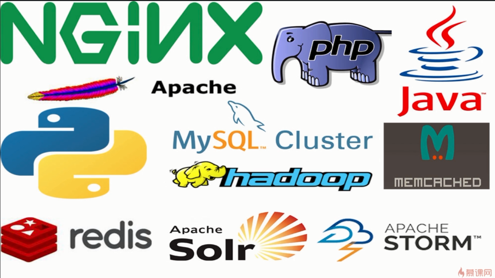

## Vagrant 是什么

虚拟机：

- VisualBox
- VMWare

通过镜像文件手动创建虚拟环境

### 虚拟机的优点

---

- 演示环境，可以安装各种演示环境，便于做各种例子
- 保证主机的快速运行，减少不必要的来及安装程序
- 避免每次重新安装
- 像测试一下不熟悉的应用，在虚拟机中随便安装和彻底删除
- 体验不同的操作系统

### Vagrant 是什么

---

- Vagrant 是构建在**虚拟化技术之上**的**虚拟机运行环境管理工具**
  - 建立和删除虚拟机
  - 配置虚拟机运行参数
  - 管理虚拟机运行状态
  - 自动化配置和安装开发环境
  - 打包和分发虚拟环境
- Vagrant 的运行，需要**依赖**某项具体的**虚拟化技术**
  - VisualBox
  - VMWare

### Vagrant 的作用

---

#### 个人角度

> 工欲善其事必先利其器

- 跨平台
- 可移动（相对于虚拟机，vagrant 体积小）
- 自动化部署，无需人工参与
- 面试加分项

公司角度

- 减少人力培训成本
- 统一开发环境

vagrant + visualbox + ubuntu 打造一个成批的 ubuntu 开发项目

### Vagrant 适用范围

---

- 开发环境（生产环境我们使用 docker 来配置）
- 项目配置比较复杂

### 内容概述

---

- Vagrant 介绍

- 实战

