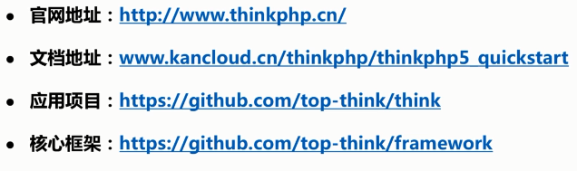
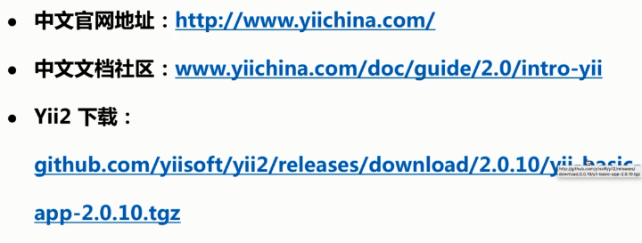
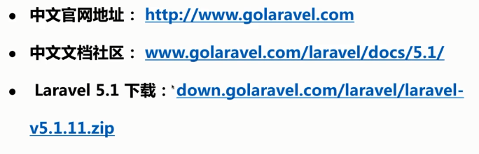

# 目录

[TOC]

# 目标成果

1. 成果是一个 box
2. box 镜像默认配置好了 LAMP 和 LNMP 环境
3. Yii2，Laravel，ThinkPHP 可以直接运行

> 20分钟建立好我们的开发环境！！！！

查看已有的 box

```shell
vagrant box list
```

添加到我们自己的镜像

```
vagrant box add new_box my_box.box
```

查看

```
vagrant box list
```

可以看到镜像已经在列表当中。

新建一个文件目录：

```
mkdir demo
cd demo
vagrant init new_box
```

我们去 vagrantfile 添加配置

启动一个虚拟机：

```
vagrant up
```


## 初始化&启动虚拟机

- 源代码 https://github.com/apanly/mooc/tree/master/vagrant
- 镜像 Ubuntu Server ，我们可以使用 https://app.vagrantup.com/boxes/search 来查找官方 box
- 添加镜像 vagrant box add
- 初始化迅疾配置 vagrant init
- 启动虚拟机 vagrant up


## 配置 LAMP 和 LNMP

#### LAMP 环境配置

| 缩写 | 解释                         |
| ---- | ---------------------------- |
| L    | Linux 操作系统 Ubuntu/CentOS |
| A    | Apache WebServer             |
| M    | MySQl                        |
| P    | FPM + PHP                    |

#### LNMP 环境配置

| 缩写 | 解释                         |
| ---- | ---------------------------- |
| L    | Linux 操作系统 Ubuntu/CentOS |
| A    | Nginx WebServer              |
| M    | MySQl                        |
| P    | FPM + PHP                    |

打开命令行，进入到虚拟机：

```shell
cd D:/vagrant/demo
ls
```

可以看到 vagrantfile 文件。

我们启动虚拟机并登录：

```shell
vagrant up
vagrant ssh
```

此时已经进入到虚拟机内部。


安装 nginx 及 apache2：

```
sudo 
```


### 替换源

---

默认的 ubuntu 系统里面使用的源地址是国外的，我们将它替换成国内的。

备份本身的源文件：

```
sudo cp /etc/apt/sources.list /etc/apt/sources.list.bak
```

对文件内容全部删除：

```
# vim 命令删除全部代码
:%d
```

替换成我们国内的源：

```
deb http://mirrors.aliyun.com/ubuntu/ trusty main restricted universe multiverse
deb http://mirrors.aliyun.com/ubuntu/ trusty-security main restricted universe multiverse
deb http://mirrors.aliyun.com/ubuntu/ trusty-updates main restricted universe multiverse
deb http://mirrors.aliyun.com/ubuntu/ trusty-proposed main restricted universe multiverse
deb http://mirrors.aliyun.com/ubuntu/ trusty-backports main restricted universe multiverse
deb-src http://mirrors.aliyun.com/ubuntu/ trusty main restricted universe multiverse
deb-src http://mirrors.aliyun.com/ubuntu/ trusty-security main restricted universe multiverse
deb-src http://mirrors.aliyun.com/ubuntu/ trusty-updates main restricted universe multiverse
deb-src http://mirrors.aliyun.com/ubuntu/ trusty-proposed main restricted universe multiverse
deb-src http://mirrors.aliyun.com/ubuntu/ trusty-backports main restricted universe multiverse
```

更新列表：

```shell
sudo apt-get update
```


### 安装 L（A/N）MP

---

#### **第一步，我们先来安装 nginx 软件。**

1. 检查 nginx 是否存在：

   - ```shell
     apt-cache search nginx
     ```

     我们可以看到很多信息，说明是存在的。

2. 安装 nginx 软件：

   - 安装：

      ```
      apt-get install nginx
      ```

   - 发现出现提示，权限不够，我们这样：

     ```
     sudo apt-get install nginx
     ```

   - 安装完毕后，查看版本号，检查是否安装成功：

     ```
     nginx -v
     ```

   - 测试一下 nginx：

     ```shell
     nginx -v
     ```

3. 测试 nginx 是否能够响应请求并正确反映过来：

   - ```shell
     curl -I 'http://127.0.0.1'
     ```

#### **第二步，我们来安装 apache**

1. 检查 nginx 是否存在：

   - ```shell
     apt-cache search apache2
     ```

     我们可以看到很多信息，说明是存在的。

2. 安装 apache 软件：

   - 安装：

     ```shell
     sudo apt-get install apache2
     ```

   - 安装完毕后，查看版本号，检查是否安装成功：

     ```
     apache2 -v
     ```

   - 测试一下 apache：

     ```shell
     apache2 -v
     ```

3. 测试 apache 是否能够响应请求并正确反映过来：

   - ```shell
     curl -I 'http://127.0.0.1'
     ```

     我们可以发现提示，端口被占用。

   - 因为默认的 80 端口已经被 nginx 占用掉，所以我们先要将 nginx 停掉：

     ```shell
     sudo /etc/init.d/nginx stop
     ```

   - 此时 80 端口仍然是不可以访问的，如果我们访问百度：

     ```shell
     curl -I 'http://www.baidu.com'
     ```

     是可以访问的。

   - 现在我们将 apache 启动起来：

     ```shell
     sudo /etc/init.d/apache2 start
     curl -I 'http://127.0.0.1'
     ```

     这时候访问成功了。

   - 更改端口，因为 80 端口冲突，所以我们将它重新设置：

     ```shell
     vim /etc/apache2/
     ls
     sudo vim ports.conf
     ```

     将端口 Listener 更改为 8888。

#### **第三步，安装 mysql**

1. 安装 mysql 服务：

   ```shell
   sudo apt-get install mysql-server
   ```

   因为是本地环境，所以我们可以跳过密码设置，线上环境必须设置~

2. 安装 mysql 客户端：

   ```shell
   sudo apt-get install mysql-client
   ```

3. 登录以下，看看是否安装成功：

   ```shell
   mysql -h127.0.0.1 -uroot -p
   ```

   这时候我们进入 mysql，我们查看一下版本：

   ```mysql
   select version();
   ```

   安装完毕！

#### **第四步，安装 PHP**

1. 检查 php 是否存在：

   ```
   php
   ```

   提示不存在~

2. 安装命令行的 php：

   ```
   sudo apt-get install php5-cli
   ```

3. 检查版本：

   ```
   php -v
   ```

4. 安装 php 扩展：

   - php5-mcrypt     加密扩展
   - php5-mysql       客户端和服务端链接的扩展
   - php5-gd             关于图像处理    

   ```shell
   sudo apt-get install php5-mcrypt php5-mysql php5-gd
   ```

5. 安装 apache2 的 php 扩展：

   ```shell
   sudo apt-get install libapache2-mod-php5
   ```

   它会重启 web-server

6. 安装 nginx 的 fastcgi：

   ```shell
   sudo apt-get install php5-cgi php5-fpm
   ```

7. 查询服务：

   ```shell
   ps -ef | grep apache
   ps -ef | grep nginx
   ```

   端口更改后我们这两个服务器都应该是启动的~

   我们可以用端口方式测试：

   ```shell
   curl -I 'http://127.0.0.1:8888'
   ```

#### **第五步，手动端口转发**

1. 退出虚拟机，挂起虚拟机：

   ```shell
   exit
   vagrant suspend
   ```

2. 手动设置：

   点开虚拟机页面的端口，点击高级，对端口进行新建。分别设置为 Host 的 8888 和 8889 端口。

   这样，我们就可以在本机上访问我们虚拟机的地址了。

3. 启动虚拟机：

   ```shell
   vagrant up
   vagrant ssh
   ```

4. 浏览器访问我们的自定义端口，测试一下~


## Vagrant 高级知识

| 操作     | 解释                               |
| -------- | ---------------------------------- |
| 端口转发 | 将本机具体端口转发到指定虚拟机端口 |
| 共享目录 | 将本机具体目录和虚拟机共享         |
| 网络配置 | 三种网络配置方式                   |

配置文件实现端口转发

> 之前我们实现了手动实现端口转发，现在我们用配置文件实现。

我们重启虚拟机：

```
vagrant reload
```

发现我们的端口设置木有了，这是因为每次启动 vagrant 都会按照自己的配置文件进行设置。

我们使用编辑器打开我们的 vagrantfile 文件进行编辑：

```
  # Every Vagrant development environment requires a box. You can search for
  # boxes at https://vagrantcloud.com/search.
  config.vm.box = "ubuntu/trusty64"
  config.vm.network "forwarded_port", guest: 80,   host: 8888
  config.vm.network "forwarded_port", guest: 8888, host: 8889
```

然后我们重启 vagrant，这时候我们的文件配置端口转发就完成了~

### 配置共享目录

我们先进行文件配置编辑：

```
  config.vm.box = "ubuntu/trusty64"
  config.vm.network "forwarded_port", guest: 80,   host: 8888
  config.vm.network "forwarded_port", guest: 8888, host: 8889
  config.vm.synced_folder "D:/vagrant/code", "/home/www"
  config.vm.network "private_network", ip: "192.168.101.101"
```

> 前提是我们本机上的文件夹要存在，nfs 等需要配置好私有网络

然后我们重启 vagrant：

```shell
vagrant reload
vagrant ssh
ll /home/www
```

这时候我们发现是有文件夹存在的，然后里面的内容是和本机共享文件夹中的文件夹一样的。

配置好共享目录，以后我们就可以在本机上进行代码的编写。

### 网络设置

**私有网络设置**

```
  config.vm.network "private_network", ip: "192.168.101.101"
```

可以直接访问目标地址，不需要进行端口转发。

**共有网络设置**

```
  config.vm.network "public_network", ip: "192.168.0.101"
```

共有 ip 的好处：家里面或者公司局域网下面，ip 给别人是可以直接访问的，我们一般使用私有 ip。

#### 总结

共享目录一般是将本机里面的 code 目录挂载到虚拟机当中去，这样本机代码可以实时同步到虚拟机中去。

我们一般使用私有 ip 设置，最后端口转发，我们使用的不多，除非有多个服务的时候~


## 三大框架配置

- ThinkPHP 5
- Yii 2
- Laravel 5

**我们先在本机中设置我们的 hosts：**

```shell
192.168.101.101 tp5.test laravel5.test yii2.test
```


### ThinkPHP 5 运行环境配置

---



我们先新建一个文件夹：

```shell
cd /home/www
mkdir php-frames
cd php-frames
```

这时候我们需要用到 git 命令来完成我们的代码克隆复制，我们安装 git：

```shell
sudo apt-get install git
```

安装完成，执行我们的 clone 命令：

```shell
git clone https://github.com/top-think/think tp5
```

这时候我们就得到了 tp5 的文件夹。

切换到 tp5 目录，再克隆核心框架仓库：

```shell
cd tp5 && git clone https://github.com/top-think/framework thinkphp
```

或者我们可以通过共享目录进行操作：

1. 从官网上下载我们所需要的 thinkphp 版本
2. 将下载文件解压
3. 将解压得到的文件全部复制到本机的 /vagrant/code/php-frames/tp5 中去

#### 配置 Nginx

我们打开 nginx 的所在文件夹及其配置文件：

```shell
cd /etc/nginx/
vim nginx.conf
```

我们找到这段代码：

```conf
        ##
        # Virtual Host Configs
        ##

        include /etc/nginx/conf.d/*.conf;
        include /etc/nginx/sites-enabled/*;
}


```

以上是虚拟机的配置代码段，我可以得知在这两个文件夹中会加载我们的配置文件。

我们进入 conf.d 文件夹新建 tp5 的配置文件：

```shell
cd conf.d
sudo touch tp5.conf
```

进入文件进行编辑：

```shell
sudo vim tp5.conf
```

```c
server{

  server_name tp5.test;
  root /home/www/php-frames/tp5/public;
  index index.php index.html;

  location / {
    if ( -f $request_filename ){
      break;
    }
    if ( !-e $request_filename ){
      rewrite ^/(.*)$ /index.php/$1 last;
      break;
    }
  }

  location1 ~ \.php {
    include fastcgi_params;
    fastcgi_pass 127.0.0.1:9000;
    try_files $uri = 404;
  }
  
}
```

Nginx 的完整配置代码：

```c
// thinkphp5配置
-- -- -- -- -- -- -- -- -- -- -

server {
  charset utf - 8;
  client_max_body_size 128 M;
  listen 80;
  server_name tp5.imooc.test;

  root / home / www / mooc / vagrant / phpmvc / tp5 / public;
  index index.php;

  location~ * \.(eot | otf | ttf | woff) $ {
    add_header Access - Control - Allow - Origin * ;
  }

  location / {
    index index.html index.php;
    if (-f $request_filename) {
      break;
    }

    if (!-e $request_filename) {
      rewrite ^ /(.*)$ /index.php / $1 last;
      break;
    }
  }

  location ~ \.php {
    set $script $uri;
    set $path_info "";
    if ($uri ~ "^(.+\.php)(/.+)") {
      set $script $1;
      set $path_info $2;
    }
    include fastcgi_params;
    fastcgi_index index.php?IF_REWRITE=1;
    fastcgi_pass 127.0.0.1:9000;
    fastcgi_param PATH_INFO $path_info;
    fastcgi_param SCRIPT_FILENAME $document_root$fastcgi_script_name;
    fastcgi_param SCRIPT_NAME $script;
    try_files $uri = 404;
  }

}
```

我们配置好我们的文件之后，先进行配置文件语法检查：

```shell
sudo nginx -t
```

然后重启 nginx 服务器：

```shell
sudo /etc/init.d/nginx restart
```

上面我们配置好了我们的域名，`tp5.test`，这个域名是一个虚拟域名，不是互联网上常见的那种域名，也就是没有 DNS 服务，我们需要自己做一个 DNS 转发的功能。

下面我们来在 hosts 中绑定这个域名：

```shell
sudo vim /etc/hosts
```

```c
192.168.101.101 tp5.test
```

打开浏览器，访问这个域名，我们发现会出现 502 错误。

这是一个比较常见的 nginx 错误，属于后端错误，我们来定位错误：

```shell
cd /etc/nginx/
cat nginx.conf
```

我们可以看到配置文件中规定了日志文件的位置：

```c
access_log /var/log/nginx/acces.log;
error_log /var/log/nginx/error.log;
```

我们来查看日志看一看有没有记录我们的错误：

```shell
tail -f /var/log/nginx/acces.log
```

我们发现权限不够，需要 chmod 进行权限授予在进行访问：

```shell
sudo chmod 777 /var/log/nginx/acces.log
tail -f /var/log/nginx/acces.log
```

然后刷新页面，看到请求出来了，我们再来看错误日志：

```shell
sudo chmod 777 /var/log/nginx/error.log
tail -f /var/log/nginx/error.log
```

我们定位到错误显示连接被拒绝，信息传给了 fastcgi 的 9000 端口。

```shell
cd /etc/php5/fpm/
cd pool.d
sudo vim www.conf
```

使用 `:/listen` 来搜索端口监听相关的信息，发现这段代码：

```c
listen = /var/run/php-fpm.sock
```

这里监听的是域模式，我们改成端口方式（实际使用中端口方式更加稳定一点）：

```
listen = 127.0.0.1:9000
```

重启 php-fpm 服务：

```shell
sudo service php5-fpm restart
```

这时候再来访问 tp ，就可以访问了。

#### 配置 Apache2

我们打开 apache 的目录并打开配置文件：

```shell
cd /etc/apache
cat apache.conf
```

可以看到文件最下面的配置项目：

```c
# Include generic snippets of statements
IncludeOptional conf-enabled/*.conf

# Include the virtual host configurations
IncludeOptional sites-enabled/*.conf

```

我们可以通过这个得知配置文件的位置。

我们打开 sites-enabled/ 目录，新建 tp5 的配置文件：

```shell
cd sites-enabled
sudo touch tp5.conf
sudo vim tp5.conf
```

```xml
<VirtualHost *:8888>
  ServerName tp5.test
  DocumentRoot /home/www/php-frames/tp5/public
</VirtualHost>
```

进行配置后，我们对 apache2 进行重启：

```shell
sudo service apache2 restart
```

重新启动后直接访问 tp5.test:8888 端口，我们发现无法访问 forbidden。

我们同样查看 apache 的错误日志：

```shell
sudo chmod -R 755 /var/log/apache2
cd /var/log/apache2
tail -f error.log
```

我们刷新浏览器，发现错误定位到配置错误。

我们来更改 apache2 的配置文件：

```shell
sudo vim /etc/apache2/apache2.conf
```

翻到最底下，然后看到 <Directory> 的 xml 配置项目，发现有 / 的时候 require all 是 denied 的，我们把它注释掉。重启 apache2：

```shell
sudo service apache2 restart
```

刷新页面，可以访问 tp 框架了。

现在我们在 tp 下面多增加一个内容，看看能不能访问。

我们使用编辑器打开 tp5 所在文件夹，然后寻找到 application 的 controller 的 index.php 这个入口文件，修改其中的内容：

```php
<?php
namespace app\index\controller;

class Index
{
    public function index()
    {
        return '<style type="text/css">*{ padding: 0; margin: 0; } .think_default_text{ padding: 4px 48px;} a{color:#2E5CD5;cursor: pointer;text-decoration: none} a:hover{text-decoration:underline; } body{ background: #fff; font-family: "Century Gothic","Microsoft yahei"; color: #333;font-size:18px} h1{ font-size: 100px; font-weight: normal; margin-bottom: 12px; } p{ line-height: 1.6em; font-size: 42px }</style><div style="padding: 24px 48px;"> <h1>:)</h1><p> ThinkPHP V5<br/><span style="font-size:30px">妮可妮可妮！！！</span></p><span style="font-size:22px;">[ V5.0 版本由 <a href="http://www.qiniu.com" target="qiniu">野生妮可保护协会</a> 独家赞助发布 ]</span></div><script type="text/javascript" src="https://tajs.qq.com/stats?sId=9347272" charset="UTF-8"></script><script type="text/javascript" src="https://e.topthink.com/Public/static/client.js"></script><think id="ad_bd568ce7058a1091"></think>';
    }

    public function hello()
    {
        echo "这是 、测试、数据";
    }
}

```

我们知道 thinkphp 的路由规则是这样的：

> http://serverName/index.php（或者其它应用入口文件）/模块/控制器/方法/[参数名/参数值...]

所以我们访问 http://tp5.test:8888/index.php/index/index/hello 如期显示，

但是我们访问 http://tp5.test/index.php/index/index/hello 则显示 404。

这个错误是 tp 路由解析的方式有些错误，主流框架已经不用这种解析方式了，这需要我们进入 nginx 进行更改：

```shell
sudo vim /etc/nginx/conf.d/tp5.conf
```

因为 tp 路由解析的时候使用了一个变量叫做 pathinfo，而这个变量在 nginx 和 fastcgi 进行信息传递的时候是不传的，所以我们要在 tp5.conf 文件中添加配置以兼容 thinkphp：

```c
server{

  server_name tp5.test;
  root /home/www/php-frames/tp5/public;
  index index.php index.html;

  location / {
    if ( -f $request_filename ){
      break;
    }
    if ( !-e $request_filename ){
      rewrite ^/(.*)$ /index.php/$1 last;
      break;
    }
  }

  location ~ \.php {
    set $script $uri;
    set $path_info "";
    if ( $uri ~ "^(.+\.php)(/.+)" ) {
      set $script $1;
      set $path_info $2;
    }
    include fastcgi_params;

    fastcgi_index index.php?IF_REWRITE=1;
    fastcgi_pass 127.0.0.1:9000;
    fastcgi_param PATH_INFO $path_info;
    fastcgi_param SCRIPT_FILENAME $document_root$fastcgi_script_name;
    fastcgi_param SCRIPT_NAME $script;

    try_files $uri = 404;
  }
}

```

然后我们重启 nginx 服务器：

```shell
sudo service nginx restart
```

此时再来访问是可以访问的。

> 由此，我们不要深入学习 thinkphp 的路由解决方式，以后可能会修改，没必要花时间在这上面。

如果我们将 url 中的 index.php 删掉之后，就访问不了原来的页面了。

我们打开 public 目录下的 .htaccess 文件，发现里面其实已经配置好了，那么我们可以得知文件并没有生效，为了使 apache 可以支持重定向规则，需要独立开启一个模块：

```shell
sudo a2enmod rewrite
```

开启后我们继续配置 apache2：

```shell
cd /etc/apache2/
sudo vim apache2.conf
```

```xml
<Directory />
  Options FollowSymLinks
  AllowOverride None #修改成AllowOverride ALL 打开rewrite
  #Require all denied #把这行屏蔽掉，拒绝一切链接
</Directory>
```

重启服务器：

```shell
sudo service apache2 restart
```

我们访问 http://tp5.test:8888/index/index/hello 发现可以访问。


#### 这样，tp 配置成功！


### Yii 2 运行环境配置

---



和 tp 一样，我们先打开我们的项目文件目录，然后使用 git clone：

```
cd /home/www/php-frames
git clone https://github.com/yiisoft/yii2/releases/download/2.0.14/yii-basic-app-2.0.14.tgz
```

或者我们手动下载安装包，然后解压移动到我们本机的共享目录上。

下载下来的文件夹名为 basic，我们改成 yii2~

#### Nginx 环境配置

配置相应的配置文件

```
cd /etc/nginx
cd conf.d
sudo touch yii2.conf
sudo vim yii2.conf
```

下面附上配置文件：

```
server {
    charset utf-8;
    client_max_body_size 128M;
    listen 80;
    server_name yii.test;

    root /home/www/php-frames/yii2/web;
    index index.php;

    location ~* \.(eot|otf|ttf|woff)$ {
        add_header Access-Control-Allow-Origin *;
    }

    location / {
        try_files $uri $uri/ /index.php?$args;
    }

    location ~ \.php$ {
        include fastcgi_params;
        fastcgi_pass 127.0.0.1:9000;
        try_files $uri =404;
    }

}
```

nginx 所有的虚拟主机都是以 server 开图头的配置。

配置完成之后我们检查配置文件并重启服务器：

```shell
sudo nginx -t
sudo service nginx restart
```

服务器配置完成后接着配置 hosts：

```
sudo vim /etc/hosts
```

#### apache2 配置

配置相应的配置文件：

```shell
cd /etc/apache2/sites-enabled
sudo touch yii2.conf
sudo vim yii2.conf
```

下面附上配置文件：

```xml
<VirtualHost *:8888>
        ServerName yii2.test
        DocumentRoot /home/www/php-frames/yii2/web
</VirtualHost>
```

重启服务器之后就可以访问了。


### Laravel5 运行环境配置

---



和 yii2 的配置步骤基本一样

- 首先，我们下载 laravel5.1 的源文件到共享文件夹。
- 然后，我们参照 yii2 的 nginx 配置步骤和代码配置 laravel。
- 最后，我们配置 laravel 的 apache 文件。

> 注意，laravel 各个版本之间支持的 php 版本是不同的，因为我们使用 php5，所以只能用 laravel5.1


#### 以上，我们的框架就配置完成了！


## Vagrant 虚拟机优化

- 虚拟机名字
- 虚拟机主机名
- 配置虚拟机内存和 CPU
- Nginx 优化
- Apache 优化

### 虚拟机名字

在 vagrantfile 文件中进行修改：

```
  config.vm.provider "virtualbox" do |vb|
  #   # Display the VirtualBox GUI when booting the machine
  #   vb.gui = true
  #
  #   # Customize the amount of memory on the VM:
  #   vb.memory = "1024"
    vb.name = "ubuntu_test"
  end
```

然后我们重启虚拟机：

```shell
vagrant reload
```

我们可以在电脑的 virtualbox 中看到虚拟机名字改变。

### 虚拟机主机名

我们进入主机：

```shell
vagrant ssh
```

我们可以看到 vagrant 后面的就是主机名，挺长的，我们来改变它：

```
  config.vm.hostname = "intern"
```

然后重启 vagrant，再登进去，发现名称改变。

### 配置内存和CPU

首先我们查看当前的内存和 CPU：

```
free -m
```

可以看到内存。

再来看 CPU：

```
top
```

按 1 快捷键，查看到只有一个 cpu，按 q 退出。

我们来编辑文档：

```
  config.vm.provider "virtualbox" do |vb|
  #   # Display the VirtualBox GUI when booting the machine
  #   vb.gui = true
  #
  #   # Customize the amount of memory on the VM:
  #   vb.memory = "1024"
    vb.name = "ubuntu_test"
    vb.memory = "1024"
    vb.cpus = 2
  end
```

然后重启 vagrant 登录后再一次查看，生效。

### nginx / apache2优化

我们主要配置的是同步文件命令：

```
cd /etc/nginx
sudo vim nginx.conf
```

将 sendfile 改为 off，然后重启服务器。

这样就可以将我们本机写的代码非常快地同步到虚拟机上，否则会出现延迟

因为我们使用的是 apache2 所以不需要额外配置。


## 打包分发环境

- 打包：将虚拟机及配置的东西统一打包，转为一个 box 镜像
- 分发：直接将我们的 box 给别人使用

#### 打包自己的 box

1. vagrant package --output xxx.box
2. vagrant package --output xxx.box --base 虚拟机名称

#### 升级 box 怎么办

> 比如我们在虚拟机中又安装了一个软件，redis

- 老用户使用 Vagrantfle 更新
- 新用户直接使用新打包的 box 文件新建虚拟机

### 打包

进行打包之前，我们先要将虚拟机关闭，然后进行默认打包：

```
vagrant halt
vagrant package
```

然后就可以看到 box 文件了，700MB，这样分享给别人，就可以通过 vagrant 运行配置环境了。

### 更新

我们通过 vagrantfile 进行配置

```
  config.vm.provision "shell", inline: <<-SHELL
  #   apt-get update
  #   apt-get install -y apache2
    apt-get install -y redis-server
  SHELL
```

然后重启 vagrant 进行安装